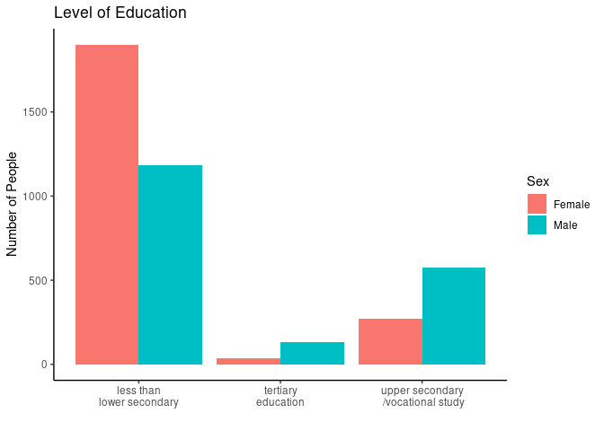
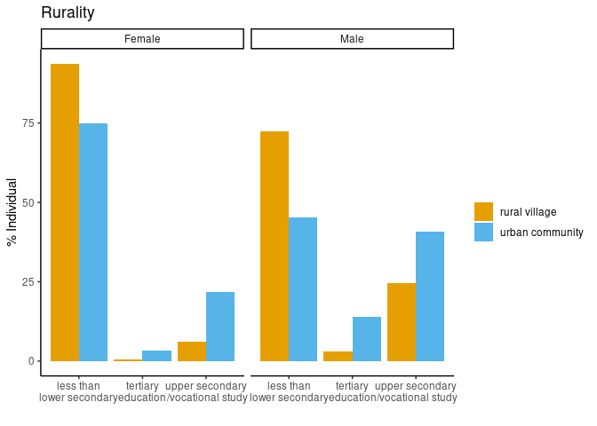
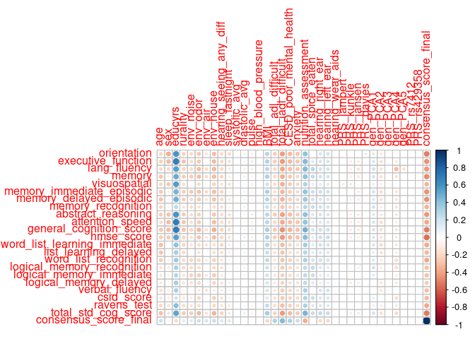

Exploratory\_Analysis\_Nabila
================
Nabila Rahman
1/14/2022

# Import data and libraries

``` r
# Libraries
library(data.table)
```

    ## data.table 1.14.0 using 10 threads (see ?getDTthreads).  Latest news: r-datatable.com

``` r
library(devtools)
```

    ## Loading required package: usethis

``` r
library(ggplot2)
library(scater)
```

    ## Loading required package: SingleCellExperiment

    ## Loading required package: SummarizedExperiment

    ## Loading required package: MatrixGenerics

    ## Loading required package: matrixStats

    ## 
    ## Attaching package: 'MatrixGenerics'

    ## The following objects are masked from 'package:matrixStats':
    ## 
    ##     colAlls, colAnyNAs, colAnys, colAvgsPerRowSet, colCollapse,
    ##     colCounts, colCummaxs, colCummins, colCumprods, colCumsums,
    ##     colDiffs, colIQRDiffs, colIQRs, colLogSumExps, colMadDiffs,
    ##     colMads, colMaxs, colMeans2, colMedians, colMins, colOrderStats,
    ##     colProds, colQuantiles, colRanges, colRanks, colSdDiffs, colSds,
    ##     colSums2, colTabulates, colVarDiffs, colVars, colWeightedMads,
    ##     colWeightedMeans, colWeightedMedians, colWeightedSds,
    ##     colWeightedVars, rowAlls, rowAnyNAs, rowAnys, rowAvgsPerColSet,
    ##     rowCollapse, rowCounts, rowCummaxs, rowCummins, rowCumprods,
    ##     rowCumsums, rowDiffs, rowIQRDiffs, rowIQRs, rowLogSumExps,
    ##     rowMadDiffs, rowMads, rowMaxs, rowMeans2, rowMedians, rowMins,
    ##     rowOrderStats, rowProds, rowQuantiles, rowRanges, rowRanks,
    ##     rowSdDiffs, rowSds, rowSums2, rowTabulates, rowVarDiffs, rowVars,
    ##     rowWeightedMads, rowWeightedMeans, rowWeightedMedians,
    ##     rowWeightedSds, rowWeightedVars

    ## Loading required package: GenomicRanges

    ## Loading required package: stats4

    ## Loading required package: BiocGenerics

    ## Loading required package: parallel

    ## 
    ## Attaching package: 'BiocGenerics'

    ## The following objects are masked from 'package:parallel':
    ## 
    ##     clusterApply, clusterApplyLB, clusterCall, clusterEvalQ,
    ##     clusterExport, clusterMap, parApply, parCapply, parLapply,
    ##     parLapplyLB, parRapply, parSapply, parSapplyLB

    ## The following objects are masked from 'package:stats':
    ## 
    ##     IQR, mad, sd, var, xtabs

    ## The following objects are masked from 'package:base':
    ## 
    ##     anyDuplicated, append, as.data.frame, basename, cbind, colnames,
    ##     dirname, do.call, duplicated, eval, evalq, Filter, Find, get, grep,
    ##     grepl, intersect, is.unsorted, lapply, Map, mapply, match, mget,
    ##     order, paste, pmax, pmax.int, pmin, pmin.int, Position, rank,
    ##     rbind, Reduce, rownames, sapply, setdiff, sort, table, tapply,
    ##     union, unique, unsplit, which.max, which.min

    ## Loading required package: S4Vectors

    ## 
    ## Attaching package: 'S4Vectors'

    ## The following objects are masked from 'package:data.table':
    ## 
    ##     first, second

    ## The following objects are masked from 'package:base':
    ## 
    ##     expand.grid, I, unname

    ## Loading required package: IRanges

    ## 
    ## Attaching package: 'IRanges'

    ## The following object is masked from 'package:data.table':
    ## 
    ##     shift

    ## Loading required package: GenomeInfoDb

    ## Loading required package: Biobase

    ## Welcome to Bioconductor
    ## 
    ##     Vignettes contain introductory material; view with
    ##     'browseVignettes()'. To cite Bioconductor, see
    ##     'citation("Biobase")', and for packages 'citation("pkgname")'.

    ## 
    ## Attaching package: 'Biobase'

    ## The following object is masked from 'package:MatrixGenerics':
    ## 
    ##     rowMedians

    ## The following objects are masked from 'package:matrixStats':
    ## 
    ##     anyMissing, rowMedians

    ## Loading required package: scuttle

``` r
library(corrplot)
```

    ## corrplot 0.90 loaded

``` r
workDir <- "/scratch/c.mpmnr/00_NEUROHACK"

# Import Raw LASI-DAD matrix
raw_LASIDAD <-read.table(paste0(workDir, "/H_DAD_w1a3.csv"), sep=",", header=T, row.names=1)  # Raw Data
imputed_LASIDAD <-read.table(paste0(workDir,"/processed_filled.csv"),sep=",", header = T)  # Imputed By Winnie (Cheng Wai) Lei
nNnames <- read.table(paste0(workDir,"/newColNames.txt"), header = F) # Features selected and annotated by me (Nabila Rahman)

# Import column meta data
phenoData<- data.frame(fread(paste0(workDir, "/colDesc.txt"), sep="\t"))
colnames(phenoData) <-c("wave", "variable", "label", "type")
phenoData$label <- gsub(" ", "_", phenoData$label)
```

# Processing column meta data

``` r
mainData <- raw_LASIDAD

# Add broad category to column meta_data
phenoData$desc <- NA
phenoData$desc[1:24] <- "Demographics"
phenoData$desc[25:396] <- "Cognition"
phenoData$desc[397:560] <- "Informant Report"
phenoData$desc[561:679] <- "Health And Physical Measures"
phenoData$desc[680:696] <- "Polygenic Risk Scores"
phenoData$desc[697:722] <- "Consensus Clinical Dementia Rating"
phenoData$variable <- tolower(phenoData$variable)

# Merge 
columnNames <- c( colnames(mainData)[!colnames(mainData) %in% phenoData$variable], phenoData$variable )
columnLabels <- c( colnames(mainData)[!colnames(mainData) %in% phenoData$variable], phenoData$label )
mainData <- mainData[,match(columnNames, colnames(mainData) )]
```

# Visualise Sex and Years of Education

``` r
educ <- mainData$raeducl 
educ[educ==1] <- "less than\nlower secondary"
educ[educ==2] <- "upper secondary\n /vocational study"
educ[educ==3] <- "tertiary\neducation"
mainData$educ <- educ
mainData$ragender[mainData$ragender==1] <- "Male"
mainData$ragender[mainData$ragender==2] <- "Female"

# Bar of Education based on Gender
data_education_gender <- data.frame(table(mainData[,c("ragender","educ")]))

plot_education_gender <- 
  ggplot(data=data_education_gender, aes(x=educ, y=Freq, fill=ragender)) +
  geom_bar(stat="identity", position=position_dodge()) + 
  xlab("") +
  ylab("Number of People") + 
  guides(fill=guide_legend(title="Sex")) + 
  ggtitle("Level of Education") + 
  theme_classic()

png(paste0(workDir, "/Figures/educ.png"), width = 1000, height=600, res=200)
print(plot_education_gender)
dev.off()
```

    ## png 
    ##   2

``` r
print(plot_education_gender)
```

<!-- -->

# Visualise Sex, Years of Education and Rurality

``` r
# Rural or not?
mainData$h1rural[mainData$h1rural==0] <- "urban community"
mainData$h1rural[mainData$h1rural==1] <- "rural village"

plotData <- data.frame(table(mainData[,c("h1rural","educ", "ragender")]))

# Convert Values to percentages 
plotData$Percentage <- NA
plotData$Percentage [plotData$h1rural=="rural village" & plotData$ragender == "Female" ] <- 100 * plotData$Freq[plotData$h1rural=="rural village" & plotData$ragender == "Female" ] / sum(plotData$Freq[plotData$h1rural=="rural village" & plotData$ragender == "Female" ]) 
plotData$Percentage [plotData$h1rural=="urban community" & plotData$ragender == "Female" ] <- 100 * plotData$Freq[plotData$h1rural=="urban community" & plotData$ragender == "Female" ] / sum(plotData$Freq[plotData$h1rural=="urban community" & plotData$ragender == "Female" ]) 
plotData$Percentage [plotData$h1rural=="rural village" & plotData$ragender == "Male" ] <- 100 * plotData$Freq[plotData$h1rural=="rural village" & plotData$ragender == "Male" ] / sum(plotData$Freq[plotData$h1rural=="rural village" & plotData$ragender == "Male" ]) 
plotData$Percentage [plotData$h1rural=="urban community" & plotData$ragender == "Male" ] <- 100 * plotData$Freq[plotData$h1rural=="urban community" & plotData$ragender == "Male" ] / sum(plotData$Freq[plotData$h1rural=="urban community" & plotData$ragender == "Male" ]) 

# Faceted Bar plot to Visualise Sex, Years of Education and Rurality
plot_education_gender_rurarlity <- 
  ggplot(data=plotData, aes(x=educ, y=Percentage, fill=h1rural)) +
  geom_bar(stat="identity", position=position_dodge()) + 
  xlab("") +
  ylab("% Individual") + 
  guides(fill=guide_legend(title="")) + 
  ggtitle("Rurality") + 
  theme_classic() + 
  scale_fill_manual(values=c("#E69F00", "#56B4E9")) +
  facet_wrap(plotData$ragender) 

png(paste0(workDir, "/Figures/rurality.png"), width = 1500, height=600, res=200)
print(plot_education_gender_rurarlity)
dev.off()
```

    ## png 
    ##   2

``` r
print(plot_education_gender_rurarlity)
```

<!-- -->

# Pre Processing

66 Feature Selection. Incorporating imputed data. Setting caregorical
variables. Scaling and normalisation.

``` r
rawMat <- raw_LASIDAD
imputed <- imputed_LASIDAD
imputed$prim_key <- NULL
 
# Filter for for 66 features selected (Nabila)
mat <- rawMat[,  nNnames[,1]]

# Combine imputed matrix with those present in rawMat
matching_mat_imputed <- colnames(imputed)[colnames(imputed) %in% colnames(mat)]
missing_mat_imputed <- colnames(mat)[!colnames(mat) %in% colnames(imputed) ]
imputed.filt <- cbind(mat[,missing_mat_imputed], imputed[,matching_mat_imputed])
imputed.filt <- imputed.filt[,  nNnames[,1]]
mat <- imputed.filt

# Set Column names to be descriptive for better readability
colnames(mat) <- nNnames[,2]

# Remove some repeated variables
unwanted <- c("weight_kg", "weight_base",  "height_m", "BMI_category")
mat <- mat[,!colnames(mat) %in% unwanted]

# Set categorical variables as factors
setfactor <- c("sex", "rurality", "hospitalised", "prim_key" )
for (coln in setfactor) {
  mat[,coln] <- factor(mat[,coln])
}

#Scale and normalise numerical variables
for (coln in colnames(mat)) {
  if (! class(mat[,coln]) %in% c("factor", "character") ) {
    mat[,coln] <- scale(mat[,coln])
  }
}
scaledMat <- mat
```

# Visualise features that best explain the variance in cognitive scores

``` r
# Identify Set of Cognitive Scores whose variance we will study
cogs <- c("orientation", "executive_function", "lang_fluency", "memory", "visuospatial", "memory_immediate_episodic", "memory_delayed_episodic", "memory_recognition", "abstract_reasoning", "attention_speed", "general_cognition_score", "hmse_score", "word_list_learning_immediate", "list_learning_delayed", "word_list_recognition", "logical_memory_recognition", "logical_memory_immediate", "logical_memory_delayed", "verbal_fluency", "csid_score", "ravens_test", "total_std_cog_score")
cogfeatures <- scaledMat[,cogs]
rownames(cogfeatures) <- scaledMat[,1]
cogfeatures <- t(cogfeatures)

# Identify Set of non Cognitive Variables whose importance will be studied to explain variance in cognitive score
pheno <-  scaledMat[,!colnames(scaledMat) %in% cogs]
rownames(pheno) <- scaledMat[,1]

# Summarized Experiment Object typically for gene expression analysis but can be applied easily no non gene data.
se <- SummarizedExperiment(assays=SimpleList(counts = cogfeatures), colData = pheno
      
) 

# Get variance explained in cognitive scores
topVars.vst <- scater::getVarianceExplained(
  se
  , exprs_values="counts"
)

# Plot explanatory Variables for Cognitive Scores
expPlot <- 
  plotExplanatoryVariables(
    topVars.vst
    , nvars_to_plot = ncol(topVars.vst)
  ) + 
  theme(legend.position = "bottom") + 
  ggtitle("Explanatory Variables for Cognitive function (ordered)")  


png(paste0(workDir, "/Figures/ExpVars.png"), width = 1300, height=1100, res=200)
print(expPlot)
```

    ## Warning: Removed 22 rows containing non-finite values (stat_density).

``` r
dev.off()
```

    ## png 
    ##   2

``` r
print(expPlot)
```

    ## Warning: Removed 22 rows containing non-finite values (stat_density).

<!-- -->

# Visualise Correlation Matrix of all features

``` r
# Everything needs to be numeric for correlation so setting factors back to numeric
setnumeric <- c("sex", "rurality", "hospitalised", "prim_key" )

for (coln in setnumeric) {
  scaledMat[,coln] <- as.numeric(as.character(scaledMat[,coln]))
}

# Cognitive scores on Y axis, other son X axis
unwanted <- c("weight_kg", "weight_base",  "height_m", "BMI_category", "consensus_inconsistencies", "hospitalised", "prim_key")
scaledMat <- scaledMat[,!colnames(scaledMat) %in% unwanted]
cogs <- c("orientation", "executive_function", "lang_fluency", "memory", "visuospatial", "memory_immediate_episodic", "memory_delayed_episodic", "memory_recognition", "abstract_reasoning", "attention_speed", "general_cognition_score", "hmse_score", "word_list_learning_immediate", "list_learning_delayed", "word_list_recognition", "logical_memory_recognition", "logical_memory_immediate", "logical_memory_delayed", "verbal_fluency", "csid_score", "ravens_test", "total_std_cog_score")
cogfeatures <- scaledMat[,c(cogs, "consensus_score_final")]
pheno <-  scaledMat[,!colnames(scaledMat) %in% cogs]

# Create a correlation matrix for each "pheno" feature against "cogs" features. 
# Also create a p-Value matrix
p <- matrix(nrow=ncol(cogfeatures), ncol=ncol(pheno))
r2 <- matrix(nrow=ncol(cogfeatures), ncol=ncol(pheno))
for (cogs in 1:ncol(cogfeatures)) {
  y <- cogfeatures[,cogs]
  for (phens in 1:ncol(pheno)) {
    x <- pheno[,phens]
    test <- cor.test(x, y)
    corRes <- test$estimate
    pVal <- test$p.value
    p[ cogs, phens]  <- pVal
    r2[cogs, phens ]  <- corRes
  }
}

# Restore feature names
rownames(p) = rownames(r2) = colnames(cogfeatures)
colnames(p) = colnames(r2) = colnames(pheno)

# Visualisation Correlation between pheno and cognitive features
corr_plot <- corrplot(r2, 
         p.mat = p, sig.level = 0.01, insig = "blank")
```

<!-- -->

``` r
png(paste0(workDir, "/Figures/corrPlot.png"), width = 1300, height=1100, res=120)
print(corr_plot)
```

    ## $corr
    ##                                     age          sex    educyrs    rurality
    ## orientation                  -0.2198822 -0.363607356  0.5887854 -0.22932845
    ## executive_function           -0.2377245 -0.318474930  0.6839113 -0.28773944
    ## lang_fluency                 -0.2052094 -0.204434424  0.5494166 -0.22558908
    ## memory                       -0.2781608 -0.085349135  0.4952058 -0.25805795
    ## visuospatial                 -0.2122253 -0.263195818  0.5549815 -0.17043413
    ## memory_immediate_episodic    -0.2632846 -0.070387797  0.4646769 -0.24108225
    ## memory_delayed_episodic      -0.2885316 -0.072914019  0.4811278 -0.24896361
    ## memory_recognition           -0.2190637 -0.062021860  0.2601590 -0.15369956
    ## abstract_reasoning           -0.2462819 -0.282347181  0.5806541 -0.25925624
    ## attention_speed              -0.1811136 -0.310811477  0.6906034 -0.27521243
    ## general_cognition_score      -0.2707818 -0.306015254  0.6996976 -0.28793047
    ## hmse_score                   -0.2520703 -0.260588713  0.5400265 -0.21716489
    ## word_list_learning_immediate -0.2922164 -0.030940629  0.4025770 -0.21890726
    ## list_learning_delayed        -0.2828268  0.006319676  0.3391212 -0.19625405
    ## word_list_recognition        -0.2495115 -0.093308560  0.3510825 -0.19139064
    ## logical_memory_recognition   -0.1504483 -0.111736821  0.3262489 -0.20142332
    ## logical_memory_immediate     -0.1354991 -0.072107375  0.2989492 -0.14455463
    ## logical_memory_delayed       -0.1273164 -0.044579943  0.3360270 -0.14972651
    ## verbal_fluency               -0.1745092 -0.107209203  0.3234796 -0.07425399
    ## csid_score                   -0.1466464 -0.106381894  0.2052519 -0.13260217
    ## ravens_test                  -0.2082641 -0.141324251  0.4179173 -0.18991862
    ## total_std_cog_score          -0.2991388 -0.142488873  0.5245138 -0.25423599
    ## consensus_score_final         0.2101598  0.056846823 -0.1979026  0.13312074
    ##                                env_noise   env_odor      env_air   env_house
    ## orientation                  -0.19810365 -0.2661486 -0.129631438 -0.30208101
    ## executive_function           -0.18863281 -0.2681355 -0.088932167 -0.31240250
    ## lang_fluency                 -0.18652392 -0.3042706 -0.189619121 -0.32059638
    ## memory                       -0.25764870 -0.2967798 -0.183969765 -0.31942527
    ## visuospatial                 -0.08420676 -0.1863764 -0.070483491 -0.22959800
    ## memory_immediate_episodic    -0.26191149 -0.2841862 -0.199937560 -0.30189068
    ## memory_delayed_episodic      -0.19421221 -0.2597672 -0.149172522 -0.28954034
    ## memory_recognition           -0.18019540 -0.1654744 -0.082681228 -0.18385023
    ## abstract_reasoning           -0.17552891 -0.2315709 -0.073200812 -0.26452074
    ## attention_speed              -0.16259109 -0.2477873 -0.087038377 -0.30334399
    ## general_cognition_score      -0.21764678 -0.3128843 -0.147474888 -0.35307726
    ## hmse_score                   -0.15965879 -0.2776352 -0.128132390 -0.30669824
    ## word_list_learning_immediate -0.14822342 -0.1808485 -0.149580369 -0.16883969
    ## list_learning_delayed        -0.09015502 -0.1474790 -0.078807490 -0.17603586
    ## word_list_recognition        -0.21478420 -0.2071359 -0.108991012 -0.22737888
    ## logical_memory_recognition   -0.19255332 -0.1845389 -0.071999348 -0.19462177
    ## logical_memory_immediate     -0.22235083 -0.2492776 -0.121618574 -0.26909286
    ## logical_memory_delayed       -0.16832348 -0.2024119 -0.090796956 -0.21620889
    ## verbal_fluency               -0.06426532 -0.1239342 -0.140192676 -0.09341722
    ## csid_score                   -0.09771779 -0.2114679 -0.078472049 -0.24007894
    ## ravens_test                  -0.14057978 -0.1852540 -0.003717506 -0.20455339
    ## total_std_cog_score          -0.24059987 -0.3166098 -0.156200611 -0.33731188
    ## consensus_score_final         0.14031104  0.2176358  0.182327962  0.22895652
    ##                              hearing_seeing_any_diff sleep_lastnight
    ## orientation                              -0.19354906     -0.19019719
    ## executive_function                       -0.20132030     -0.16605006
    ## lang_fluency                             -0.20561360     -0.11477921
    ## memory                                   -0.21543628     -0.09229209
    ## visuospatial                             -0.14850579     -0.16092747
    ## memory_immediate_episodic                -0.21177778     -0.06965934
    ## memory_delayed_episodic                  -0.19901726     -0.11002340
    ## memory_recognition                       -0.17053609     -0.06455169
    ## abstract_reasoning                       -0.18371082     -0.15192606
    ## attention_speed                          -0.18538323     -0.15194820
    ## general_cognition_score                  -0.22776328     -0.17578723
    ## hmse_score                               -0.21864268     -0.15733316
    ## word_list_learning_immediate             -0.21360727     -0.09406203
    ## list_learning_delayed                    -0.17472533     -0.08121097
    ## word_list_recognition                    -0.13714510     -0.07141584
    ## logical_memory_recognition               -0.15165639     -0.05864911
    ## logical_memory_immediate                 -0.11709078     -0.03300555
    ## logical_memory_delayed                   -0.14481609     -0.08820389
    ## verbal_fluency                           -0.09817137     -0.06957620
    ## csid_score                               -0.15324391     -0.07818492
    ## ravens_test                              -0.14214319     -0.11611464
    ## total_std_cog_score                      -0.22979983     -0.12558598
    ## consensus_score_final                     0.16356770      0.16526120
    ##                              systolic_avg diastolic_avg       pulse
    ## orientation                   0.014272187    0.07813026 -0.09805066
    ## executive_function           -0.016509418    0.05173924 -0.11535535
    ## lang_fluency                  0.024327701    0.08226285 -0.09435096
    ## memory                        0.010169696    0.07971632 -0.06849374
    ## visuospatial                 -0.020114146    0.03628826 -0.09965138
    ## memory_immediate_episodic     0.010124616    0.07021381 -0.07065733
    ## memory_delayed_episodic      -0.003613213    0.07410950 -0.06191412
    ## memory_recognition            0.022773922    0.08574047 -0.03966239
    ## abstract_reasoning           -0.019362246    0.05291179 -0.10286737
    ## attention_speed              -0.010611864    0.04099868 -0.10961604
    ## general_cognition_score      -0.002513860    0.07173418 -0.11603670
    ## hmse_score                    0.006686729    0.08173434 -0.08814550
    ## word_list_learning_immediate -0.001044041    0.06374115 -0.07194179
    ## list_learning_delayed        -0.019294777    0.06224966 -0.04507390
    ## word_list_recognition         0.002907951    0.07858686 -0.05318677
    ## logical_memory_recognition    0.021551195    0.06460115 -0.03694044
    ## logical_memory_immediate      0.014570096    0.05111064 -0.04155406
    ## logical_memory_delayed        0.011221083    0.04003160 -0.05329527
    ## verbal_fluency               -0.006086609    0.04774926 -0.07361108
    ## csid_score                    0.021153031    0.05381067 -0.05836145
    ## ravens_test                  -0.013009569    0.04148581 -0.06875969
    ## total_std_cog_score           0.005726336    0.08667644 -0.08753103
    ## consensus_score_final         0.045576003   -0.04768237  0.03385478
    ##                              high_blood_pressure        BMI total_adl_difficult
    ## orientation                         0.0095980127  0.2839779          -0.2438071
    ## executive_function                 -0.0113748840  0.3009883          -0.2464383
    ## lang_fluency                        0.0239934001  0.2725739          -0.2065885
    ## memory                              0.0070294875  0.3143265          -0.1923851
    ## visuospatial                       -0.0073985056  0.2001598          -0.1851761
    ## memory_immediate_episodic          -0.0015418859  0.3101528          -0.1746565
    ## memory_delayed_episodic             0.0002712192  0.2881233          -0.1941746
    ## memory_recognition                  0.0336486120  0.2213091          -0.1458142
    ## abstract_reasoning                 -0.0149119413  0.2765410          -0.2491583
    ## attention_speed                    -0.0041663194  0.2786718          -0.2036921
    ## general_cognition_score            -0.0003433381  0.3261546          -0.2584596
    ## hmse_score                          0.0059556347  0.3031157          -0.2484851
    ## word_list_learning_immediate        0.0003442145  0.2806263          -0.1655234
    ## list_learning_delayed              -0.0116851922  0.2389560          -0.1571042
    ## word_list_recognition               0.0286359690  0.2599245          -0.1291590
    ## logical_memory_recognition          0.0236211028  0.2158238          -0.1218508
    ## logical_memory_immediate            0.0031592387  0.2001647          -0.1284599
    ## logical_memory_delayed              0.0100646455  0.1853506          -0.1203615
    ## verbal_fluency                     -0.0066739231  0.1862653          -0.1248881
    ## csid_score                          0.0176906962  0.1593610          -0.1693152
    ## ravens_test                        -0.0255832967  0.2472198          -0.1723087
    ## total_std_cog_score                 0.0067446449  0.3372846          -0.2277576
    ## consensus_score_final               0.0270756735 -0.2171848           0.3064787
    ##                              total_iadl_difficult CESD_poor_mental_health
    ## orientation                            -0.4126708              -0.3157877
    ## executive_function                     -0.4223882              -0.3233722
    ## lang_fluency                           -0.3863946              -0.3091459
    ## memory                                 -0.3618654              -0.2626294
    ## visuospatial                           -0.3513787              -0.2503057
    ## memory_immediate_episodic              -0.3394380              -0.2481247
    ## memory_delayed_episodic                -0.3486897              -0.2398327
    ## memory_recognition                     -0.2747541              -0.2071098
    ## abstract_reasoning                     -0.4013185              -0.3049175
    ## attention_speed                        -0.3766544              -0.2907449
    ## general_cognition_score                -0.4593671              -0.3488376
    ## hmse_score                             -0.4224389              -0.3164453
    ## word_list_learning_immediate           -0.3123679              -0.2137066
    ## list_learning_delayed                  -0.2800801              -0.1753822
    ## word_list_recognition                  -0.2865383              -0.2300935
    ## logical_memory_recognition             -0.2527916              -0.1919296
    ## logical_memory_immediate               -0.2477674              -0.1879396
    ## logical_memory_delayed                 -0.2206304              -0.1671341
    ## verbal_fluency                         -0.2566488              -0.2025115
    ## csid_score                             -0.2634068              -0.2159884
    ## ravens_test                            -0.3006932              -0.2362314
    ## total_std_cog_score                    -0.4212137              -0.3166272
    ## consensus_score_final                   0.4348526               0.3164127
    ##                                 anxiety nutrition_assessment total_spice_eaten
    ## orientation                  -0.2756063            0.4032298        0.04619260
    ## executive_function           -0.2797190            0.4372291        0.14347493
    ## lang_fluency                 -0.2721350            0.4358126        0.27628726
    ## memory                       -0.2117104            0.4027800        0.24076953
    ## visuospatial                 -0.2041687            0.3091157        0.10360504
    ## memory_immediate_episodic    -0.1914450            0.3949904        0.22187189
    ## memory_delayed_episodic      -0.2044435            0.3656326        0.20035538
    ## memory_recognition           -0.1424485            0.2876693        0.23412706
    ## abstract_reasoning           -0.2419280            0.4063514        0.15635757
    ## attention_speed              -0.2796765            0.3986039        0.10419033
    ## general_cognition_score      -0.2964282            0.4752203        0.17584374
    ## hmse_score                   -0.2870911            0.4250357        0.12896795
    ## word_list_learning_immediate -0.1600742            0.3414911        0.13645013
    ## list_learning_delayed        -0.1515839            0.2890732        0.12505976
    ## word_list_recognition        -0.1750315            0.3175302        0.18522860
    ## logical_memory_recognition   -0.1590886            0.2584455        0.25684006
    ## logical_memory_immediate     -0.1412714            0.2657076        0.23699260
    ## logical_memory_delayed       -0.1581202            0.2520782        0.14309051
    ## verbal_fluency               -0.1447864            0.3116980        0.04682850
    ## csid_score                   -0.1987836            0.2917452        0.22336106
    ## ravens_test                  -0.1945597            0.3168201        0.14714248
    ## total_std_cog_score          -0.2622643            0.4547319        0.23968057
    ## consensus_score_final         0.2258954           -0.3608976        0.09395575
    ##                              hearing_right_ear hearing_left_ear
    ## orientation                          0.1788370       0.18553915
    ## executive_function                   0.1833605       0.18310546
    ## lang_fluency                         0.1983420       0.19659505
    ## memory                               0.2067475       0.19340753
    ## visuospatial                         0.1280165       0.13385569
    ## memory_immediate_episodic            0.2145130       0.20065495
    ## memory_delayed_episodic              0.1763782       0.16823632
    ## memory_recognition                   0.2024024       0.18535183
    ## abstract_reasoning                   0.1818100       0.17583718
    ## attention_speed                      0.1511437       0.15563190
    ## general_cognition_score              0.2113040       0.21145648
    ## hmse_score                           0.2195465       0.22304307
    ## word_list_learning_immediate         0.2086532       0.19761585
    ## list_learning_delayed                0.1667415       0.15313554
    ## word_list_recognition                0.2043561       0.19239116
    ## logical_memory_recognition           0.1515528       0.13077251
    ## logical_memory_immediate             0.1232039       0.11382189
    ## logical_memory_delayed               0.1005233       0.09483341
    ## verbal_fluency                       0.1877104       0.19612688
    ## csid_score                           0.1630120       0.16472470
    ## ravens_test                          0.1561724       0.14901773
    ## total_std_cog_score                  0.2490920       0.23931639
    ## consensus_score_final               -0.1964536      -0.20721476
    ##                              hearing_wear_aids   PRS_lambert  PRS_kunkle
    ## orientation                       -0.019805348 -5.108538e-02 -0.06266152
    ## executive_function                -0.011922451 -6.114528e-02 -0.09479016
    ## lang_fluency                      -0.018981313 -3.881933e-02 -0.08645578
    ## memory                            -0.016307523 -3.912020e-02 -0.09110239
    ## visuospatial                      -0.006270359 -9.102112e-02 -0.11644755
    ## memory_immediate_episodic         -0.021925303 -4.693492e-02 -0.08025345
    ## memory_delayed_episodic           -0.009161680 -2.847081e-02 -0.08472858
    ## memory_recognition                -0.027135043 -1.259959e-02 -0.06573462
    ## abstract_reasoning                -0.023262392 -4.998274e-02 -0.08612842
    ## attention_speed                    0.004098686 -6.724439e-02 -0.09420063
    ## general_cognition_score           -0.016921592 -6.300247e-02 -0.10063038
    ## hmse_score                        -0.028852327 -6.374814e-02 -0.08988677
    ## word_list_learning_immediate      -0.024777475 -2.976606e-02 -0.06183307
    ## list_learning_delayed             -0.006060397 -7.160640e-03 -0.05007130
    ## word_list_recognition             -0.017272139  4.448735e-03 -0.03825395
    ## logical_memory_recognition        -0.020575378 -1.891320e-02 -0.06787163
    ## logical_memory_immediate          -0.006673688 -6.230194e-05 -0.06155576
    ## logical_memory_delayed            -0.013062191 -3.856207e-02 -0.11003131
    ## verbal_fluency                    -0.029495254 -1.971960e-02 -0.04162678
    ## csid_score                        -0.042179117 -3.637272e-02 -0.08110801
    ## ravens_test                       -0.025336256 -1.898624e-02 -0.03459649
    ## total_std_cog_score               -0.031743902 -3.299765e-02 -0.09360036
    ## consensus_score_final              0.045509609 -2.520284e-01 -0.40160602
    ##                               PRS_jansen   PRS_davies    gen_PCA1    gen_PCA2
    ## orientation                  -0.04555003  0.110424111  0.13619690 -0.12782920
    ## executive_function           -0.10344533  0.053110765  0.16304052 -0.16056976
    ## lang_fluency                 -0.15076114  0.003614923  0.20281606 -0.16673026
    ## memory                       -0.11315392  0.051169494  0.18495930 -0.17616575
    ## visuospatial                 -0.06843703  0.050128825  0.10438149 -0.09792721
    ## memory_immediate_episodic    -0.10828514  0.033957813  0.18744254 -0.18149222
    ## memory_delayed_episodic      -0.09843036  0.060823511  0.14129646 -0.16443558
    ## memory_recognition           -0.07147273  0.069956786  0.19490762 -0.09145813
    ## abstract_reasoning           -0.10249917  0.050856873  0.13449780 -0.12059194
    ## attention_speed              -0.09101162  0.046527166  0.17256701 -0.18418615
    ## general_cognition_score      -0.11151035  0.069041094  0.18623669 -0.17777100
    ## hmse_score                   -0.08973862  0.077234394  0.16167039 -0.15594448
    ## word_list_learning_immediate -0.06564354  0.049472058  0.16727677 -0.20183448
    ## list_learning_delayed        -0.05305241  0.064445932  0.11826171 -0.16075872
    ## word_list_recognition        -0.06234389  0.077771447  0.15902025 -0.11973823
    ## logical_memory_recognition   -0.09837817  0.044583648  0.19627213 -0.10548809
    ## logical_memory_immediate     -0.07863722 -0.013369953  0.13520885 -0.03005008
    ## logical_memory_delayed       -0.09720259 -0.006787971  0.06471634 -0.13245343
    ## verbal_fluency               -0.07163779  0.068744286  0.06229693 -0.13407930
    ## csid_score                   -0.08245265 -0.017653276  0.10003753 -0.02023893
    ## ravens_test                  -0.06417523  0.065894571  0.09044272 -0.09449767
    ## total_std_cog_score          -0.11232225  0.060523394  0.18552778 -0.17198361
    ## consensus_score_final        -0.13423347 -0.194052152 -0.17056964 -0.15286658
    ##                                  gen_PCA3    gen_PCA4      gen_PCA5
    ## orientation                  -0.027642318 -0.02165297  0.0145464315
    ## executive_function           -0.023026528 -0.11966988 -0.0195417862
    ## lang_fluency                 -0.076981417 -0.30243625 -0.1686870161
    ## memory                       -0.061632176 -0.16468819 -0.0099110896
    ## visuospatial                  0.019831827 -0.02496165  0.0160221018
    ## memory_immediate_episodic    -0.053971576 -0.14561702  0.0046502590
    ## memory_delayed_episodic      -0.068958304 -0.14103352 -0.0221069624
    ## memory_recognition           -0.006066139 -0.14838628  0.0098273016
    ## abstract_reasoning            0.028520570 -0.12853713  0.0005723934
    ## attention_speed              -0.071318692 -0.09099717 -0.0363567123
    ## general_cognition_score      -0.040320905 -0.14111204 -0.0341610284
    ## hmse_score                   -0.041557372 -0.12224397 -0.0404713200
    ## word_list_learning_immediate -0.014725611 -0.13328150 -0.0165557719
    ## list_learning_delayed        -0.063025244 -0.10316825 -0.0240334456
    ## word_list_recognition        -0.018506180 -0.18017338 -0.0228656117
    ## logical_memory_recognition   -0.019930771 -0.18641587 -0.0281268479
    ## logical_memory_immediate     -0.037898940 -0.09292487  0.0213931591
    ## logical_memory_delayed       -0.083462872 -0.12630593 -0.0278662538
    ## verbal_fluency               -0.079807117 -0.05075996 -0.0762448550
    ## csid_score                   -0.039518159 -0.18778442 -0.0769050828
    ## ravens_test                  -0.006602446 -0.11951938  0.0107500955
    ## total_std_cog_score          -0.059898886 -0.19070951 -0.0399644589
    ## consensus_score_final        -0.197062500 -0.18849964  0.0805505819
    ##                                 PRS_rs7412 PRS_rs429358 consensus_score_final
    ## orientation                  -4.953596e-03 -0.039370690            -0.5104201
    ## executive_function            2.861591e-03 -0.008562178            -0.4462775
    ## lang_fluency                  3.853154e-02 -0.007021554            -0.4366429
    ## memory                        9.824197e-03 -0.015474475            -0.4720362
    ## visuospatial                 -8.988936e-03 -0.012124460            -0.3328894
    ## memory_immediate_episodic     2.072214e-02 -0.005954691            -0.4439713
    ## memory_delayed_episodic       1.086339e-02 -0.021956538            -0.4504674
    ## memory_recognition           -2.211450e-02 -0.021626584            -0.3459543
    ## abstract_reasoning           -5.722346e-03 -0.009835919            -0.4321685
    ## attention_speed               1.543725e-02 -0.006765279            -0.3805578
    ## general_cognition_score       8.652496e-03 -0.015864638            -0.5144254
    ## hmse_score                    2.598553e-02 -0.053645927            -0.5543729
    ## word_list_learning_immediate  1.762839e-02 -0.021469220            -0.3792404
    ## list_learning_delayed         1.591287e-05 -0.018537554            -0.3273365
    ## word_list_recognition         1.748164e-02 -0.025459828            -0.3833445
    ## logical_memory_recognition   -2.835464e-02 -0.028910934            -0.2917558
    ## logical_memory_immediate      2.199031e-02  0.009808827            -0.2982207
    ## logical_memory_delayed        3.087605e-02 -0.032477692            -0.2536787
    ## verbal_fluency               -1.142333e-02  0.028620289            -0.3023033
    ## csid_score                    3.732190e-02 -0.016844455            -0.3207029
    ## ravens_test                   1.531330e-02 -0.029156952            -0.3835936
    ## total_std_cog_score           1.779190e-02 -0.027369234            -0.5266361
    ## consensus_score_final        -8.567156e-02 -0.252255142             1.0000000
    ## 
    ## $corrPos
    ##                       xName                        yName  x  y          corr
    ## 1                       age                  orientation  1 23 -2.198822e-01
    ## 2                       age           executive_function  1 22 -2.377245e-01
    ## 3                       age                 lang_fluency  1 21 -2.052094e-01
    ## 4                       age                       memory  1 20 -2.781608e-01
    ## 5                       age                 visuospatial  1 19 -2.122253e-01
    ## 6                       age    memory_immediate_episodic  1 18 -2.632846e-01
    ## 7                       age      memory_delayed_episodic  1 17 -2.885316e-01
    ## 8                       age           memory_recognition  1 16 -2.190637e-01
    ## 9                       age           abstract_reasoning  1 15 -2.462819e-01
    ## 10                      age              attention_speed  1 14 -1.811136e-01
    ## 11                      age      general_cognition_score  1 13 -2.707818e-01
    ## 12                      age                   hmse_score  1 12 -2.520703e-01
    ## 13                      age word_list_learning_immediate  1 11 -2.922164e-01
    ## 14                      age        list_learning_delayed  1 10 -2.828268e-01
    ## 15                      age        word_list_recognition  1  9 -2.495115e-01
    ## 16                      age   logical_memory_recognition  1  8 -1.504483e-01
    ## 17                      age     logical_memory_immediate  1  7 -1.354991e-01
    ## 18                      age       logical_memory_delayed  1  6 -1.273164e-01
    ## 19                      age               verbal_fluency  1  5 -1.745092e-01
    ## 20                      age                   csid_score  1  4 -1.466464e-01
    ## 21                      age                  ravens_test  1  3 -2.082641e-01
    ## 22                      age          total_std_cog_score  1  2 -2.991388e-01
    ## 23                      age        consensus_score_final  1  1  2.101598e-01
    ## 24                      sex                  orientation  2 23 -3.636074e-01
    ## 25                      sex           executive_function  2 22 -3.184749e-01
    ## 26                      sex                 lang_fluency  2 21 -2.044344e-01
    ## 27                      sex                       memory  2 20 -8.534913e-02
    ## 28                      sex                 visuospatial  2 19 -2.631958e-01
    ## 29                      sex    memory_immediate_episodic  2 18 -7.038780e-02
    ## 30                      sex      memory_delayed_episodic  2 17 -7.291402e-02
    ## 31                      sex           memory_recognition  2 16 -6.202186e-02
    ## 32                      sex           abstract_reasoning  2 15 -2.823472e-01
    ## 33                      sex              attention_speed  2 14 -3.108115e-01
    ## 34                      sex      general_cognition_score  2 13 -3.060153e-01
    ## 35                      sex                   hmse_score  2 12 -2.605887e-01
    ## 36                      sex word_list_learning_immediate  2 11 -3.094063e-02
    ## 37                      sex        list_learning_delayed  2 10  6.319676e-03
    ## 38                      sex        word_list_recognition  2  9 -9.330856e-02
    ## 39                      sex   logical_memory_recognition  2  8 -1.117368e-01
    ## 40                      sex     logical_memory_immediate  2  7 -7.210738e-02
    ## 41                      sex       logical_memory_delayed  2  6 -4.457994e-02
    ## 42                      sex               verbal_fluency  2  5 -1.072092e-01
    ## 43                      sex                   csid_score  2  4 -1.063819e-01
    ## 44                      sex                  ravens_test  2  3 -1.413243e-01
    ## 45                      sex          total_std_cog_score  2  2 -1.424889e-01
    ## 46                      sex        consensus_score_final  2  1  5.684682e-02
    ## 47                  educyrs                  orientation  3 23  5.887854e-01
    ## 48                  educyrs           executive_function  3 22  6.839113e-01
    ## 49                  educyrs                 lang_fluency  3 21  5.494166e-01
    ## 50                  educyrs                       memory  3 20  4.952058e-01
    ## 51                  educyrs                 visuospatial  3 19  5.549815e-01
    ## 52                  educyrs    memory_immediate_episodic  3 18  4.646769e-01
    ## 53                  educyrs      memory_delayed_episodic  3 17  4.811278e-01
    ## 54                  educyrs           memory_recognition  3 16  2.601590e-01
    ## 55                  educyrs           abstract_reasoning  3 15  5.806541e-01
    ## 56                  educyrs              attention_speed  3 14  6.906034e-01
    ## 57                  educyrs      general_cognition_score  3 13  6.996976e-01
    ## 58                  educyrs                   hmse_score  3 12  5.400265e-01
    ## 59                  educyrs word_list_learning_immediate  3 11  4.025770e-01
    ## 60                  educyrs        list_learning_delayed  3 10  3.391212e-01
    ## 61                  educyrs        word_list_recognition  3  9  3.510825e-01
    ## 62                  educyrs   logical_memory_recognition  3  8  3.262489e-01
    ## 63                  educyrs     logical_memory_immediate  3  7  2.989492e-01
    ## 64                  educyrs       logical_memory_delayed  3  6  3.360270e-01
    ## 65                  educyrs               verbal_fluency  3  5  3.234796e-01
    ## 66                  educyrs                   csid_score  3  4  2.052519e-01
    ## 67                  educyrs                  ravens_test  3  3  4.179173e-01
    ## 68                  educyrs          total_std_cog_score  3  2  5.245138e-01
    ## 69                  educyrs        consensus_score_final  3  1 -1.979026e-01
    ## 70                 rurality                  orientation  4 23 -2.293284e-01
    ## 71                 rurality           executive_function  4 22 -2.877394e-01
    ## 72                 rurality                 lang_fluency  4 21 -2.255891e-01
    ## 73                 rurality                       memory  4 20 -2.580579e-01
    ## 74                 rurality                 visuospatial  4 19 -1.704341e-01
    ## 75                 rurality    memory_immediate_episodic  4 18 -2.410822e-01
    ## 76                 rurality      memory_delayed_episodic  4 17 -2.489636e-01
    ## 77                 rurality           memory_recognition  4 16 -1.536996e-01
    ## 78                 rurality           abstract_reasoning  4 15 -2.592562e-01
    ## 79                 rurality              attention_speed  4 14 -2.752124e-01
    ## 80                 rurality      general_cognition_score  4 13 -2.879305e-01
    ## 81                 rurality                   hmse_score  4 12 -2.171649e-01
    ## 82                 rurality word_list_learning_immediate  4 11 -2.189073e-01
    ## 83                 rurality        list_learning_delayed  4 10 -1.962541e-01
    ## 84                 rurality        word_list_recognition  4  9 -1.913906e-01
    ## 85                 rurality   logical_memory_recognition  4  8 -2.014233e-01
    ## 86                 rurality     logical_memory_immediate  4  7 -1.445546e-01
    ## 87                 rurality       logical_memory_delayed  4  6 -1.497265e-01
    ## 88                 rurality               verbal_fluency  4  5 -7.425399e-02
    ## 89                 rurality                   csid_score  4  4 -1.326022e-01
    ## 90                 rurality                  ravens_test  4  3 -1.899186e-01
    ## 91                 rurality          total_std_cog_score  4  2 -2.542360e-01
    ## 92                 rurality        consensus_score_final  4  1  1.331207e-01
    ## 93                env_noise                  orientation  5 23 -1.981037e-01
    ## 94                env_noise           executive_function  5 22 -1.886328e-01
    ## 95                env_noise                 lang_fluency  5 21 -1.865239e-01
    ## 96                env_noise                       memory  5 20 -2.576487e-01
    ## 97                env_noise                 visuospatial  5 19 -8.420676e-02
    ## 98                env_noise    memory_immediate_episodic  5 18 -2.619115e-01
    ## 99                env_noise      memory_delayed_episodic  5 17 -1.942122e-01
    ## 100               env_noise           memory_recognition  5 16 -1.801954e-01
    ## 101               env_noise           abstract_reasoning  5 15 -1.755289e-01
    ## 102               env_noise              attention_speed  5 14 -1.625911e-01
    ## 103               env_noise      general_cognition_score  5 13 -2.176468e-01
    ## 104               env_noise                   hmse_score  5 12 -1.596588e-01
    ## 105               env_noise word_list_learning_immediate  5 11 -1.482234e-01
    ## 106               env_noise        list_learning_delayed  5 10 -9.015502e-02
    ## 107               env_noise        word_list_recognition  5  9 -2.147842e-01
    ## 108               env_noise   logical_memory_recognition  5  8 -1.925533e-01
    ## 109               env_noise     logical_memory_immediate  5  7 -2.223508e-01
    ## 110               env_noise       logical_memory_delayed  5  6 -1.683235e-01
    ## 111               env_noise               verbal_fluency  5  5 -6.426532e-02
    ## 112               env_noise                   csid_score  5  4 -9.771779e-02
    ## 113               env_noise                  ravens_test  5  3 -1.405798e-01
    ## 114               env_noise          total_std_cog_score  5  2 -2.405999e-01
    ## 115               env_noise        consensus_score_final  5  1  1.403110e-01
    ## 116                env_odor                  orientation  6 23 -2.661486e-01
    ## 117                env_odor           executive_function  6 22 -2.681355e-01
    ## 118                env_odor                 lang_fluency  6 21 -3.042706e-01
    ## 119                env_odor                       memory  6 20 -2.967798e-01
    ## 120                env_odor                 visuospatial  6 19 -1.863764e-01
    ## 121                env_odor    memory_immediate_episodic  6 18 -2.841862e-01
    ## 122                env_odor      memory_delayed_episodic  6 17 -2.597672e-01
    ## 123                env_odor           memory_recognition  6 16 -1.654744e-01
    ## 124                env_odor           abstract_reasoning  6 15 -2.315709e-01
    ## 125                env_odor              attention_speed  6 14 -2.477873e-01
    ## 126                env_odor      general_cognition_score  6 13 -3.128843e-01
    ## 127                env_odor                   hmse_score  6 12 -2.776352e-01
    ## 128                env_odor word_list_learning_immediate  6 11 -1.808485e-01
    ## 129                env_odor        list_learning_delayed  6 10 -1.474790e-01
    ## 130                env_odor        word_list_recognition  6  9 -2.071359e-01
    ## 131                env_odor   logical_memory_recognition  6  8 -1.845389e-01
    ## 132                env_odor     logical_memory_immediate  6  7 -2.492776e-01
    ## 133                env_odor       logical_memory_delayed  6  6 -2.024119e-01
    ## 134                env_odor               verbal_fluency  6  5 -1.239342e-01
    ## 135                env_odor                   csid_score  6  4 -2.114679e-01
    ## 136                env_odor                  ravens_test  6  3 -1.852540e-01
    ## 137                env_odor          total_std_cog_score  6  2 -3.166098e-01
    ## 138                env_odor        consensus_score_final  6  1  2.176358e-01
    ## 139                 env_air                  orientation  7 23 -1.296314e-01
    ## 140                 env_air           executive_function  7 22 -8.893217e-02
    ## 141                 env_air                 lang_fluency  7 21 -1.896191e-01
    ## 142                 env_air                       memory  7 20 -1.839698e-01
    ## 143                 env_air                 visuospatial  7 19 -7.048349e-02
    ## 144                 env_air    memory_immediate_episodic  7 18 -1.999376e-01
    ## 145                 env_air      memory_delayed_episodic  7 17 -1.491725e-01
    ## 146                 env_air           memory_recognition  7 16 -8.268123e-02
    ## 147                 env_air           abstract_reasoning  7 15 -7.320081e-02
    ## 148                 env_air              attention_speed  7 14 -8.703838e-02
    ## 149                 env_air      general_cognition_score  7 13 -1.474749e-01
    ## 150                 env_air                   hmse_score  7 12 -1.281324e-01
    ## 151                 env_air word_list_learning_immediate  7 11 -1.495804e-01
    ## 152                 env_air        list_learning_delayed  7 10 -7.880749e-02
    ## 153                 env_air        word_list_recognition  7  9 -1.089910e-01
    ## 154                 env_air   logical_memory_recognition  7  8 -7.199935e-02
    ## 155                 env_air     logical_memory_immediate  7  7 -1.216186e-01
    ## 156                 env_air       logical_memory_delayed  7  6 -9.079696e-02
    ## 157                 env_air               verbal_fluency  7  5 -1.401927e-01
    ## 158                 env_air                   csid_score  7  4 -7.847205e-02
    ## 159                 env_air                  ravens_test  7  3 -3.717506e-03
    ## 160                 env_air          total_std_cog_score  7  2 -1.562006e-01
    ## 161                 env_air        consensus_score_final  7  1  1.823280e-01
    ## 162               env_house                  orientation  8 23 -3.020810e-01
    ## 163               env_house           executive_function  8 22 -3.124025e-01
    ## 164               env_house                 lang_fluency  8 21 -3.205964e-01
    ## 165               env_house                       memory  8 20 -3.194253e-01
    ## 166               env_house                 visuospatial  8 19 -2.295980e-01
    ## 167               env_house    memory_immediate_episodic  8 18 -3.018907e-01
    ## 168               env_house      memory_delayed_episodic  8 17 -2.895403e-01
    ## 169               env_house           memory_recognition  8 16 -1.838502e-01
    ## 170               env_house           abstract_reasoning  8 15 -2.645207e-01
    ## 171               env_house              attention_speed  8 14 -3.033440e-01
    ## 172               env_house      general_cognition_score  8 13 -3.530773e-01
    ## 173               env_house                   hmse_score  8 12 -3.066982e-01
    ## 174               env_house word_list_learning_immediate  8 11 -1.688397e-01
    ## 175               env_house        list_learning_delayed  8 10 -1.760359e-01
    ## 176               env_house        word_list_recognition  8  9 -2.273789e-01
    ## 177               env_house   logical_memory_recognition  8  8 -1.946218e-01
    ## 178               env_house     logical_memory_immediate  8  7 -2.690929e-01
    ## 179               env_house       logical_memory_delayed  8  6 -2.162089e-01
    ## 180               env_house               verbal_fluency  8  5 -9.341722e-02
    ## 181               env_house                   csid_score  8  4 -2.400789e-01
    ## 182               env_house                  ravens_test  8  3 -2.045534e-01
    ## 183               env_house          total_std_cog_score  8  2 -3.373119e-01
    ## 184               env_house        consensus_score_final  8  1  2.289565e-01
    ## 185 hearing_seeing_any_diff                  orientation  9 23 -1.935491e-01
    ## 186 hearing_seeing_any_diff           executive_function  9 22 -2.013203e-01
    ## 187 hearing_seeing_any_diff                 lang_fluency  9 21 -2.056136e-01
    ## 188 hearing_seeing_any_diff                       memory  9 20 -2.154363e-01
    ## 189 hearing_seeing_any_diff                 visuospatial  9 19 -1.485058e-01
    ## 190 hearing_seeing_any_diff    memory_immediate_episodic  9 18 -2.117778e-01
    ## 191 hearing_seeing_any_diff      memory_delayed_episodic  9 17 -1.990173e-01
    ## 192 hearing_seeing_any_diff           memory_recognition  9 16 -1.705361e-01
    ## 193 hearing_seeing_any_diff           abstract_reasoning  9 15 -1.837108e-01
    ## 194 hearing_seeing_any_diff              attention_speed  9 14 -1.853832e-01
    ## 195 hearing_seeing_any_diff      general_cognition_score  9 13 -2.277633e-01
    ## 196 hearing_seeing_any_diff                   hmse_score  9 12 -2.186427e-01
    ## 197 hearing_seeing_any_diff word_list_learning_immediate  9 11 -2.136073e-01
    ## 198 hearing_seeing_any_diff        list_learning_delayed  9 10 -1.747253e-01
    ## 199 hearing_seeing_any_diff        word_list_recognition  9  9 -1.371451e-01
    ## 200 hearing_seeing_any_diff   logical_memory_recognition  9  8 -1.516564e-01
    ## 201 hearing_seeing_any_diff     logical_memory_immediate  9  7 -1.170908e-01
    ## 202 hearing_seeing_any_diff       logical_memory_delayed  9  6 -1.448161e-01
    ## 203 hearing_seeing_any_diff               verbal_fluency  9  5 -9.817137e-02
    ## 204 hearing_seeing_any_diff                   csid_score  9  4 -1.532439e-01
    ## 205 hearing_seeing_any_diff                  ravens_test  9  3 -1.421432e-01
    ## 206 hearing_seeing_any_diff          total_std_cog_score  9  2 -2.297998e-01
    ## 207 hearing_seeing_any_diff        consensus_score_final  9  1  1.635677e-01
    ## 208         sleep_lastnight                  orientation 10 23 -1.901972e-01
    ## 209         sleep_lastnight           executive_function 10 22 -1.660501e-01
    ## 210         sleep_lastnight                 lang_fluency 10 21 -1.147792e-01
    ## 211         sleep_lastnight                       memory 10 20 -9.229209e-02
    ## 212         sleep_lastnight                 visuospatial 10 19 -1.609275e-01
    ## 213         sleep_lastnight    memory_immediate_episodic 10 18 -6.965934e-02
    ## 214         sleep_lastnight      memory_delayed_episodic 10 17 -1.100234e-01
    ## 215         sleep_lastnight           memory_recognition 10 16 -6.455169e-02
    ## 216         sleep_lastnight           abstract_reasoning 10 15 -1.519261e-01
    ## 217         sleep_lastnight              attention_speed 10 14 -1.519482e-01
    ## 218         sleep_lastnight      general_cognition_score 10 13 -1.757872e-01
    ## 219         sleep_lastnight                   hmse_score 10 12 -1.573332e-01
    ## 220         sleep_lastnight word_list_learning_immediate 10 11 -9.406203e-02
    ## 221         sleep_lastnight        list_learning_delayed 10 10 -8.121097e-02
    ## 222         sleep_lastnight        word_list_recognition 10  9 -7.141584e-02
    ## 223         sleep_lastnight   logical_memory_recognition 10  8 -5.864911e-02
    ## 224         sleep_lastnight     logical_memory_immediate 10  7 -3.300555e-02
    ## 225         sleep_lastnight       logical_memory_delayed 10  6 -8.820389e-02
    ## 226         sleep_lastnight               verbal_fluency 10  5 -6.957620e-02
    ## 227         sleep_lastnight                   csid_score 10  4 -7.818492e-02
    ## 228         sleep_lastnight                  ravens_test 10  3 -1.161146e-01
    ## 229         sleep_lastnight          total_std_cog_score 10  2 -1.255860e-01
    ## 230         sleep_lastnight        consensus_score_final 10  1  1.652612e-01
    ## 231            systolic_avg                  orientation 11 23  1.427219e-02
    ## 232            systolic_avg           executive_function 11 22 -1.650942e-02
    ## 233            systolic_avg                 lang_fluency 11 21  2.432770e-02
    ## 234            systolic_avg                       memory 11 20  1.016970e-02
    ## 235            systolic_avg                 visuospatial 11 19 -2.011415e-02
    ## 236            systolic_avg    memory_immediate_episodic 11 18  1.012462e-02
    ## 237            systolic_avg      memory_delayed_episodic 11 17 -3.613213e-03
    ## 238            systolic_avg           memory_recognition 11 16  2.277392e-02
    ## 239            systolic_avg           abstract_reasoning 11 15 -1.936225e-02
    ## 240            systolic_avg              attention_speed 11 14 -1.061186e-02
    ## 241            systolic_avg      general_cognition_score 11 13 -2.513860e-03
    ## 242            systolic_avg                   hmse_score 11 12  6.686729e-03
    ## 243            systolic_avg word_list_learning_immediate 11 11 -1.044041e-03
    ## 244            systolic_avg        list_learning_delayed 11 10 -1.929478e-02
    ## 245            systolic_avg        word_list_recognition 11  9  2.907951e-03
    ## 246            systolic_avg   logical_memory_recognition 11  8  2.155120e-02
    ## 247            systolic_avg     logical_memory_immediate 11  7  1.457010e-02
    ## 248            systolic_avg       logical_memory_delayed 11  6  1.122108e-02
    ## 249            systolic_avg               verbal_fluency 11  5 -6.086609e-03
    ## 250            systolic_avg                   csid_score 11  4  2.115303e-02
    ## 251            systolic_avg                  ravens_test 11  3 -1.300957e-02
    ## 252            systolic_avg          total_std_cog_score 11  2  5.726336e-03
    ## 253            systolic_avg        consensus_score_final 11  1  4.557600e-02
    ## 254           diastolic_avg                  orientation 12 23  7.813026e-02
    ## 255           diastolic_avg           executive_function 12 22  5.173924e-02
    ## 256           diastolic_avg                 lang_fluency 12 21  8.226285e-02
    ## 257           diastolic_avg                       memory 12 20  7.971632e-02
    ## 258           diastolic_avg                 visuospatial 12 19  3.628826e-02
    ## 259           diastolic_avg    memory_immediate_episodic 12 18  7.021381e-02
    ## 260           diastolic_avg      memory_delayed_episodic 12 17  7.410950e-02
    ## 261           diastolic_avg           memory_recognition 12 16  8.574047e-02
    ## 262           diastolic_avg           abstract_reasoning 12 15  5.291179e-02
    ## 263           diastolic_avg              attention_speed 12 14  4.099868e-02
    ## 264           diastolic_avg      general_cognition_score 12 13  7.173418e-02
    ## 265           diastolic_avg                   hmse_score 12 12  8.173434e-02
    ## 266           diastolic_avg word_list_learning_immediate 12 11  6.374115e-02
    ## 267           diastolic_avg        list_learning_delayed 12 10  6.224966e-02
    ## 268           diastolic_avg        word_list_recognition 12  9  7.858686e-02
    ## 269           diastolic_avg   logical_memory_recognition 12  8  6.460115e-02
    ## 270           diastolic_avg     logical_memory_immediate 12  7  5.111064e-02
    ## 271           diastolic_avg       logical_memory_delayed 12  6  4.003160e-02
    ## 272           diastolic_avg               verbal_fluency 12  5  4.774926e-02
    ## 273           diastolic_avg                   csid_score 12  4  5.381067e-02
    ## 274           diastolic_avg                  ravens_test 12  3  4.148581e-02
    ## 275           diastolic_avg          total_std_cog_score 12  2  8.667644e-02
    ## 276           diastolic_avg        consensus_score_final 12  1 -4.768237e-02
    ## 277                   pulse                  orientation 13 23 -9.805066e-02
    ## 278                   pulse           executive_function 13 22 -1.153553e-01
    ## 279                   pulse                 lang_fluency 13 21 -9.435096e-02
    ## 280                   pulse                       memory 13 20 -6.849374e-02
    ## 281                   pulse                 visuospatial 13 19 -9.965138e-02
    ## 282                   pulse    memory_immediate_episodic 13 18 -7.065733e-02
    ## 283                   pulse      memory_delayed_episodic 13 17 -6.191412e-02
    ## 284                   pulse           memory_recognition 13 16 -3.966239e-02
    ## 285                   pulse           abstract_reasoning 13 15 -1.028674e-01
    ## 286                   pulse              attention_speed 13 14 -1.096160e-01
    ## 287                   pulse      general_cognition_score 13 13 -1.160367e-01
    ## 288                   pulse                   hmse_score 13 12 -8.814550e-02
    ## 289                   pulse word_list_learning_immediate 13 11 -7.194179e-02
    ## 290                   pulse        list_learning_delayed 13 10 -4.507390e-02
    ## 291                   pulse        word_list_recognition 13  9 -5.318677e-02
    ## 292                   pulse   logical_memory_recognition 13  8 -3.694044e-02
    ## 293                   pulse     logical_memory_immediate 13  7 -4.155406e-02
    ## 294                   pulse       logical_memory_delayed 13  6 -5.329527e-02
    ## 295                   pulse               verbal_fluency 13  5 -7.361108e-02
    ## 296                   pulse                   csid_score 13  4 -5.836145e-02
    ## 297                   pulse                  ravens_test 13  3 -6.875969e-02
    ## 298                   pulse          total_std_cog_score 13  2 -8.753103e-02
    ## 299                   pulse        consensus_score_final 13  1  3.385478e-02
    ## 300     high_blood_pressure                  orientation 14 23  9.598013e-03
    ## 301     high_blood_pressure           executive_function 14 22 -1.137488e-02
    ## 302     high_blood_pressure                 lang_fluency 14 21  2.399340e-02
    ## 303     high_blood_pressure                       memory 14 20  7.029487e-03
    ## 304     high_blood_pressure                 visuospatial 14 19 -7.398506e-03
    ## 305     high_blood_pressure    memory_immediate_episodic 14 18 -1.541886e-03
    ## 306     high_blood_pressure      memory_delayed_episodic 14 17  2.712192e-04
    ## 307     high_blood_pressure           memory_recognition 14 16  3.364861e-02
    ## 308     high_blood_pressure           abstract_reasoning 14 15 -1.491194e-02
    ## 309     high_blood_pressure              attention_speed 14 14 -4.166319e-03
    ## 310     high_blood_pressure      general_cognition_score 14 13 -3.433381e-04
    ## 311     high_blood_pressure                   hmse_score 14 12  5.955635e-03
    ## 312     high_blood_pressure word_list_learning_immediate 14 11  3.442145e-04
    ## 313     high_blood_pressure        list_learning_delayed 14 10 -1.168519e-02
    ## 314     high_blood_pressure        word_list_recognition 14  9  2.863597e-02
    ## 315     high_blood_pressure   logical_memory_recognition 14  8  2.362110e-02
    ## 316     high_blood_pressure     logical_memory_immediate 14  7  3.159239e-03
    ## 317     high_blood_pressure       logical_memory_delayed 14  6  1.006465e-02
    ## 318     high_blood_pressure               verbal_fluency 14  5 -6.673923e-03
    ## 319     high_blood_pressure                   csid_score 14  4  1.769070e-02
    ## 320     high_blood_pressure                  ravens_test 14  3 -2.558330e-02
    ## 321     high_blood_pressure          total_std_cog_score 14  2  6.744645e-03
    ## 322     high_blood_pressure        consensus_score_final 14  1  2.707567e-02
    ## 323                     BMI                  orientation 15 23  2.839779e-01
    ## 324                     BMI           executive_function 15 22  3.009883e-01
    ## 325                     BMI                 lang_fluency 15 21  2.725739e-01
    ## 326                     BMI                       memory 15 20  3.143265e-01
    ## 327                     BMI                 visuospatial 15 19  2.001598e-01
    ## 328                     BMI    memory_immediate_episodic 15 18  3.101528e-01
    ## 329                     BMI      memory_delayed_episodic 15 17  2.881233e-01
    ## 330                     BMI           memory_recognition 15 16  2.213091e-01
    ## 331                     BMI           abstract_reasoning 15 15  2.765410e-01
    ## 332                     BMI              attention_speed 15 14  2.786718e-01
    ## 333                     BMI      general_cognition_score 15 13  3.261546e-01
    ## 334                     BMI                   hmse_score 15 12  3.031157e-01
    ## 335                     BMI word_list_learning_immediate 15 11  2.806263e-01
    ## 336                     BMI        list_learning_delayed 15 10  2.389560e-01
    ## 337                     BMI        word_list_recognition 15  9  2.599245e-01
    ## 338                     BMI   logical_memory_recognition 15  8  2.158238e-01
    ## 339                     BMI     logical_memory_immediate 15  7  2.001647e-01
    ## 340                     BMI       logical_memory_delayed 15  6  1.853506e-01
    ## 341                     BMI               verbal_fluency 15  5  1.862653e-01
    ## 342                     BMI                   csid_score 15  4  1.593610e-01
    ## 343                     BMI                  ravens_test 15  3  2.472198e-01
    ## 344                     BMI          total_std_cog_score 15  2  3.372846e-01
    ## 345                     BMI        consensus_score_final 15  1 -2.171848e-01
    ## 346     total_adl_difficult                  orientation 16 23 -2.438071e-01
    ## 347     total_adl_difficult           executive_function 16 22 -2.464383e-01
    ## 348     total_adl_difficult                 lang_fluency 16 21 -2.065885e-01
    ## 349     total_adl_difficult                       memory 16 20 -1.923851e-01
    ## 350     total_adl_difficult                 visuospatial 16 19 -1.851761e-01
    ## 351     total_adl_difficult    memory_immediate_episodic 16 18 -1.746565e-01
    ## 352     total_adl_difficult      memory_delayed_episodic 16 17 -1.941746e-01
    ## 353     total_adl_difficult           memory_recognition 16 16 -1.458142e-01
    ## 354     total_adl_difficult           abstract_reasoning 16 15 -2.491583e-01
    ## 355     total_adl_difficult              attention_speed 16 14 -2.036921e-01
    ## 356     total_adl_difficult      general_cognition_score 16 13 -2.584596e-01
    ## 357     total_adl_difficult                   hmse_score 16 12 -2.484851e-01
    ## 358     total_adl_difficult word_list_learning_immediate 16 11 -1.655234e-01
    ## 359     total_adl_difficult        list_learning_delayed 16 10 -1.571042e-01
    ## 360     total_adl_difficult        word_list_recognition 16  9 -1.291590e-01
    ## 361     total_adl_difficult   logical_memory_recognition 16  8 -1.218508e-01
    ## 362     total_adl_difficult     logical_memory_immediate 16  7 -1.284599e-01
    ## 363     total_adl_difficult       logical_memory_delayed 16  6 -1.203615e-01
    ## 364     total_adl_difficult               verbal_fluency 16  5 -1.248881e-01
    ## 365     total_adl_difficult                   csid_score 16  4 -1.693152e-01
    ## 366     total_adl_difficult                  ravens_test 16  3 -1.723087e-01
    ## 367     total_adl_difficult          total_std_cog_score 16  2 -2.277576e-01
    ## 368     total_adl_difficult        consensus_score_final 16  1  3.064787e-01
    ## 369    total_iadl_difficult                  orientation 17 23 -4.126708e-01
    ## 370    total_iadl_difficult           executive_function 17 22 -4.223882e-01
    ## 371    total_iadl_difficult                 lang_fluency 17 21 -3.863946e-01
    ## 372    total_iadl_difficult                       memory 17 20 -3.618654e-01
    ## 373    total_iadl_difficult                 visuospatial 17 19 -3.513787e-01
    ## 374    total_iadl_difficult    memory_immediate_episodic 17 18 -3.394380e-01
    ## 375    total_iadl_difficult      memory_delayed_episodic 17 17 -3.486897e-01
    ## 376    total_iadl_difficult           memory_recognition 17 16 -2.747541e-01
    ## 377    total_iadl_difficult           abstract_reasoning 17 15 -4.013185e-01
    ## 378    total_iadl_difficult              attention_speed 17 14 -3.766544e-01
    ## 379    total_iadl_difficult      general_cognition_score 17 13 -4.593671e-01
    ## 380    total_iadl_difficult                   hmse_score 17 12 -4.224389e-01
    ## 381    total_iadl_difficult word_list_learning_immediate 17 11 -3.123679e-01
    ## 382    total_iadl_difficult        list_learning_delayed 17 10 -2.800801e-01
    ## 383    total_iadl_difficult        word_list_recognition 17  9 -2.865383e-01
    ## 384    total_iadl_difficult   logical_memory_recognition 17  8 -2.527916e-01
    ## 385    total_iadl_difficult     logical_memory_immediate 17  7 -2.477674e-01
    ## 386    total_iadl_difficult       logical_memory_delayed 17  6 -2.206304e-01
    ## 387    total_iadl_difficult               verbal_fluency 17  5 -2.566488e-01
    ## 388    total_iadl_difficult                   csid_score 17  4 -2.634068e-01
    ## 389    total_iadl_difficult                  ravens_test 17  3 -3.006932e-01
    ## 390    total_iadl_difficult          total_std_cog_score 17  2 -4.212137e-01
    ## 391    total_iadl_difficult        consensus_score_final 17  1  4.348526e-01
    ## 392 CESD_poor_mental_health                  orientation 18 23 -3.157877e-01
    ## 393 CESD_poor_mental_health           executive_function 18 22 -3.233722e-01
    ## 394 CESD_poor_mental_health                 lang_fluency 18 21 -3.091459e-01
    ## 395 CESD_poor_mental_health                       memory 18 20 -2.626294e-01
    ## 396 CESD_poor_mental_health                 visuospatial 18 19 -2.503057e-01
    ## 397 CESD_poor_mental_health    memory_immediate_episodic 18 18 -2.481247e-01
    ## 398 CESD_poor_mental_health      memory_delayed_episodic 18 17 -2.398327e-01
    ## 399 CESD_poor_mental_health           memory_recognition 18 16 -2.071098e-01
    ## 400 CESD_poor_mental_health           abstract_reasoning 18 15 -3.049175e-01
    ## 401 CESD_poor_mental_health              attention_speed 18 14 -2.907449e-01
    ## 402 CESD_poor_mental_health      general_cognition_score 18 13 -3.488376e-01
    ## 403 CESD_poor_mental_health                   hmse_score 18 12 -3.164453e-01
    ## 404 CESD_poor_mental_health word_list_learning_immediate 18 11 -2.137066e-01
    ## 405 CESD_poor_mental_health        list_learning_delayed 18 10 -1.753822e-01
    ## 406 CESD_poor_mental_health        word_list_recognition 18  9 -2.300935e-01
    ## 407 CESD_poor_mental_health   logical_memory_recognition 18  8 -1.919296e-01
    ## 408 CESD_poor_mental_health     logical_memory_immediate 18  7 -1.879396e-01
    ## 409 CESD_poor_mental_health       logical_memory_delayed 18  6 -1.671341e-01
    ## 410 CESD_poor_mental_health               verbal_fluency 18  5 -2.025115e-01
    ## 411 CESD_poor_mental_health                   csid_score 18  4 -2.159884e-01
    ## 412 CESD_poor_mental_health                  ravens_test 18  3 -2.362314e-01
    ## 413 CESD_poor_mental_health          total_std_cog_score 18  2 -3.166272e-01
    ## 414 CESD_poor_mental_health        consensus_score_final 18  1  3.164127e-01
    ## 415                 anxiety                  orientation 19 23 -2.756063e-01
    ## 416                 anxiety           executive_function 19 22 -2.797190e-01
    ## 417                 anxiety                 lang_fluency 19 21 -2.721350e-01
    ## 418                 anxiety                       memory 19 20 -2.117104e-01
    ## 419                 anxiety                 visuospatial 19 19 -2.041687e-01
    ## 420                 anxiety    memory_immediate_episodic 19 18 -1.914450e-01
    ## 421                 anxiety      memory_delayed_episodic 19 17 -2.044435e-01
    ## 422                 anxiety           memory_recognition 19 16 -1.424485e-01
    ## 423                 anxiety           abstract_reasoning 19 15 -2.419280e-01
    ## 424                 anxiety              attention_speed 19 14 -2.796765e-01
    ## 425                 anxiety      general_cognition_score 19 13 -2.964282e-01
    ## 426                 anxiety                   hmse_score 19 12 -2.870911e-01
    ## 427                 anxiety word_list_learning_immediate 19 11 -1.600742e-01
    ## 428                 anxiety        list_learning_delayed 19 10 -1.515839e-01
    ## 429                 anxiety        word_list_recognition 19  9 -1.750315e-01
    ## 430                 anxiety   logical_memory_recognition 19  8 -1.590886e-01
    ## 431                 anxiety     logical_memory_immediate 19  7 -1.412714e-01
    ## 432                 anxiety       logical_memory_delayed 19  6 -1.581202e-01
    ## 433                 anxiety               verbal_fluency 19  5 -1.447864e-01
    ## 434                 anxiety                   csid_score 19  4 -1.987836e-01
    ## 435                 anxiety                  ravens_test 19  3 -1.945597e-01
    ## 436                 anxiety          total_std_cog_score 19  2 -2.622643e-01
    ## 437                 anxiety        consensus_score_final 19  1  2.258954e-01
    ## 438    nutrition_assessment                  orientation 20 23  4.032298e-01
    ## 439    nutrition_assessment           executive_function 20 22  4.372291e-01
    ## 440    nutrition_assessment                 lang_fluency 20 21  4.358126e-01
    ## 441    nutrition_assessment                       memory 20 20  4.027800e-01
    ## 442    nutrition_assessment                 visuospatial 20 19  3.091157e-01
    ## 443    nutrition_assessment    memory_immediate_episodic 20 18  3.949904e-01
    ## 444    nutrition_assessment      memory_delayed_episodic 20 17  3.656326e-01
    ## 445    nutrition_assessment           memory_recognition 20 16  2.876693e-01
    ## 446    nutrition_assessment           abstract_reasoning 20 15  4.063514e-01
    ## 447    nutrition_assessment              attention_speed 20 14  3.986039e-01
    ## 448    nutrition_assessment      general_cognition_score 20 13  4.752203e-01
    ## 449    nutrition_assessment                   hmse_score 20 12  4.250357e-01
    ## 450    nutrition_assessment word_list_learning_immediate 20 11  3.414911e-01
    ## 451    nutrition_assessment        list_learning_delayed 20 10  2.890732e-01
    ## 452    nutrition_assessment        word_list_recognition 20  9  3.175302e-01
    ## 453    nutrition_assessment   logical_memory_recognition 20  8  2.584455e-01
    ## 454    nutrition_assessment     logical_memory_immediate 20  7  2.657076e-01
    ## 455    nutrition_assessment       logical_memory_delayed 20  6  2.520782e-01
    ## 456    nutrition_assessment               verbal_fluency 20  5  3.116980e-01
    ## 457    nutrition_assessment                   csid_score 20  4  2.917452e-01
    ## 458    nutrition_assessment                  ravens_test 20  3  3.168201e-01
    ## 459    nutrition_assessment          total_std_cog_score 20  2  4.547319e-01
    ## 460    nutrition_assessment        consensus_score_final 20  1 -3.608976e-01
    ## 461       total_spice_eaten                  orientation 21 23  4.619260e-02
    ## 462       total_spice_eaten           executive_function 21 22  1.434749e-01
    ## 463       total_spice_eaten                 lang_fluency 21 21  2.762873e-01
    ## 464       total_spice_eaten                       memory 21 20  2.407695e-01
    ## 465       total_spice_eaten                 visuospatial 21 19  1.036050e-01
    ## 466       total_spice_eaten    memory_immediate_episodic 21 18  2.218719e-01
    ## 467       total_spice_eaten      memory_delayed_episodic 21 17  2.003554e-01
    ## 468       total_spice_eaten           memory_recognition 21 16  2.341271e-01
    ## 469       total_spice_eaten           abstract_reasoning 21 15  1.563576e-01
    ## 470       total_spice_eaten              attention_speed 21 14  1.041903e-01
    ## 471       total_spice_eaten      general_cognition_score 21 13  1.758437e-01
    ## 472       total_spice_eaten                   hmse_score 21 12  1.289679e-01
    ## 473       total_spice_eaten word_list_learning_immediate 21 11  1.364501e-01
    ## 474       total_spice_eaten        list_learning_delayed 21 10  1.250598e-01
    ## 475       total_spice_eaten        word_list_recognition 21  9  1.852286e-01
    ## 476       total_spice_eaten   logical_memory_recognition 21  8  2.568401e-01
    ## 477       total_spice_eaten     logical_memory_immediate 21  7  2.369926e-01
    ## 478       total_spice_eaten       logical_memory_delayed 21  6  1.430905e-01
    ## 479       total_spice_eaten               verbal_fluency 21  5  4.682850e-02
    ## 480       total_spice_eaten                   csid_score 21  4  2.233611e-01
    ## 481       total_spice_eaten                  ravens_test 21  3  1.471425e-01
    ## 482       total_spice_eaten          total_std_cog_score 21  2  2.396806e-01
    ## 483       total_spice_eaten        consensus_score_final 21  1  9.395575e-02
    ## 484       hearing_right_ear                  orientation 22 23  1.788370e-01
    ## 485       hearing_right_ear           executive_function 22 22  1.833605e-01
    ## 486       hearing_right_ear                 lang_fluency 22 21  1.983420e-01
    ## 487       hearing_right_ear                       memory 22 20  2.067475e-01
    ## 488       hearing_right_ear                 visuospatial 22 19  1.280165e-01
    ## 489       hearing_right_ear    memory_immediate_episodic 22 18  2.145130e-01
    ## 490       hearing_right_ear      memory_delayed_episodic 22 17  1.763782e-01
    ## 491       hearing_right_ear           memory_recognition 22 16  2.024024e-01
    ## 492       hearing_right_ear           abstract_reasoning 22 15  1.818100e-01
    ## 493       hearing_right_ear              attention_speed 22 14  1.511437e-01
    ## 494       hearing_right_ear      general_cognition_score 22 13  2.113040e-01
    ## 495       hearing_right_ear                   hmse_score 22 12  2.195465e-01
    ## 496       hearing_right_ear word_list_learning_immediate 22 11  2.086532e-01
    ## 497       hearing_right_ear        list_learning_delayed 22 10  1.667415e-01
    ## 498       hearing_right_ear        word_list_recognition 22  9  2.043561e-01
    ## 499       hearing_right_ear   logical_memory_recognition 22  8  1.515528e-01
    ## 500       hearing_right_ear     logical_memory_immediate 22  7  1.232039e-01
    ## 501       hearing_right_ear       logical_memory_delayed 22  6  1.005233e-01
    ## 502       hearing_right_ear               verbal_fluency 22  5  1.877104e-01
    ## 503       hearing_right_ear                   csid_score 22  4  1.630120e-01
    ## 504       hearing_right_ear                  ravens_test 22  3  1.561724e-01
    ## 505       hearing_right_ear          total_std_cog_score 22  2  2.490920e-01
    ## 506       hearing_right_ear        consensus_score_final 22  1 -1.964536e-01
    ## 507        hearing_left_ear                  orientation 23 23  1.855391e-01
    ## 508        hearing_left_ear           executive_function 23 22  1.831055e-01
    ## 509        hearing_left_ear                 lang_fluency 23 21  1.965951e-01
    ## 510        hearing_left_ear                       memory 23 20  1.934075e-01
    ## 511        hearing_left_ear                 visuospatial 23 19  1.338557e-01
    ## 512        hearing_left_ear    memory_immediate_episodic 23 18  2.006549e-01
    ## 513        hearing_left_ear      memory_delayed_episodic 23 17  1.682363e-01
    ## 514        hearing_left_ear           memory_recognition 23 16  1.853518e-01
    ## 515        hearing_left_ear           abstract_reasoning 23 15  1.758372e-01
    ## 516        hearing_left_ear              attention_speed 23 14  1.556319e-01
    ## 517        hearing_left_ear      general_cognition_score 23 13  2.114565e-01
    ## 518        hearing_left_ear                   hmse_score 23 12  2.230431e-01
    ## 519        hearing_left_ear word_list_learning_immediate 23 11  1.976159e-01
    ## 520        hearing_left_ear        list_learning_delayed 23 10  1.531355e-01
    ## 521        hearing_left_ear        word_list_recognition 23  9  1.923912e-01
    ## 522        hearing_left_ear   logical_memory_recognition 23  8  1.307725e-01
    ## 523        hearing_left_ear     logical_memory_immediate 23  7  1.138219e-01
    ## 524        hearing_left_ear       logical_memory_delayed 23  6  9.483341e-02
    ## 525        hearing_left_ear               verbal_fluency 23  5  1.961269e-01
    ## 526        hearing_left_ear                   csid_score 23  4  1.647247e-01
    ## 527        hearing_left_ear                  ravens_test 23  3  1.490177e-01
    ## 528        hearing_left_ear          total_std_cog_score 23  2  2.393164e-01
    ## 529        hearing_left_ear        consensus_score_final 23  1 -2.072148e-01
    ## 530       hearing_wear_aids                  orientation 24 23 -1.980535e-02
    ## 531       hearing_wear_aids           executive_function 24 22 -1.192245e-02
    ## 532       hearing_wear_aids                 lang_fluency 24 21 -1.898131e-02
    ## 533       hearing_wear_aids                       memory 24 20 -1.630752e-02
    ## 534       hearing_wear_aids                 visuospatial 24 19 -6.270359e-03
    ## 535       hearing_wear_aids    memory_immediate_episodic 24 18 -2.192530e-02
    ## 536       hearing_wear_aids      memory_delayed_episodic 24 17 -9.161680e-03
    ## 537       hearing_wear_aids           memory_recognition 24 16 -2.713504e-02
    ## 538       hearing_wear_aids           abstract_reasoning 24 15 -2.326239e-02
    ## 539       hearing_wear_aids              attention_speed 24 14  4.098686e-03
    ## 540       hearing_wear_aids      general_cognition_score 24 13 -1.692159e-02
    ## 541       hearing_wear_aids                   hmse_score 24 12 -2.885233e-02
    ## 542       hearing_wear_aids word_list_learning_immediate 24 11 -2.477748e-02
    ## 543       hearing_wear_aids        list_learning_delayed 24 10 -6.060397e-03
    ## 544       hearing_wear_aids        word_list_recognition 24  9 -1.727214e-02
    ## 545       hearing_wear_aids   logical_memory_recognition 24  8 -2.057538e-02
    ## 546       hearing_wear_aids     logical_memory_immediate 24  7 -6.673688e-03
    ## 547       hearing_wear_aids       logical_memory_delayed 24  6 -1.306219e-02
    ## 548       hearing_wear_aids               verbal_fluency 24  5 -2.949525e-02
    ## 549       hearing_wear_aids                   csid_score 24  4 -4.217912e-02
    ## 550       hearing_wear_aids                  ravens_test 24  3 -2.533626e-02
    ## 551       hearing_wear_aids          total_std_cog_score 24  2 -3.174390e-02
    ## 552       hearing_wear_aids        consensus_score_final 24  1  4.550961e-02
    ## 553             PRS_lambert                  orientation 25 23 -5.108538e-02
    ## 554             PRS_lambert           executive_function 25 22 -6.114528e-02
    ## 555             PRS_lambert                 lang_fluency 25 21 -3.881933e-02
    ## 556             PRS_lambert                       memory 25 20 -3.912020e-02
    ## 557             PRS_lambert                 visuospatial 25 19 -9.102112e-02
    ## 558             PRS_lambert    memory_immediate_episodic 25 18 -4.693492e-02
    ## 559             PRS_lambert      memory_delayed_episodic 25 17 -2.847081e-02
    ## 560             PRS_lambert           memory_recognition 25 16 -1.259959e-02
    ## 561             PRS_lambert           abstract_reasoning 25 15 -4.998274e-02
    ## 562             PRS_lambert              attention_speed 25 14 -6.724439e-02
    ## 563             PRS_lambert      general_cognition_score 25 13 -6.300247e-02
    ## 564             PRS_lambert                   hmse_score 25 12 -6.374814e-02
    ## 565             PRS_lambert word_list_learning_immediate 25 11 -2.976606e-02
    ## 566             PRS_lambert        list_learning_delayed 25 10 -7.160640e-03
    ## 567             PRS_lambert        word_list_recognition 25  9  4.448735e-03
    ## 568             PRS_lambert   logical_memory_recognition 25  8 -1.891320e-02
    ## 569             PRS_lambert     logical_memory_immediate 25  7 -6.230194e-05
    ## 570             PRS_lambert       logical_memory_delayed 25  6 -3.856207e-02
    ## 571             PRS_lambert               verbal_fluency 25  5 -1.971960e-02
    ## 572             PRS_lambert                   csid_score 25  4 -3.637272e-02
    ## 573             PRS_lambert                  ravens_test 25  3 -1.898624e-02
    ## 574             PRS_lambert          total_std_cog_score 25  2 -3.299765e-02
    ## 575             PRS_lambert        consensus_score_final 25  1 -2.520284e-01
    ## 576              PRS_kunkle                  orientation 26 23 -6.266152e-02
    ## 577              PRS_kunkle           executive_function 26 22 -9.479016e-02
    ## 578              PRS_kunkle                 lang_fluency 26 21 -8.645578e-02
    ## 579              PRS_kunkle                       memory 26 20 -9.110239e-02
    ## 580              PRS_kunkle                 visuospatial 26 19 -1.164476e-01
    ## 581              PRS_kunkle    memory_immediate_episodic 26 18 -8.025345e-02
    ## 582              PRS_kunkle      memory_delayed_episodic 26 17 -8.472858e-02
    ## 583              PRS_kunkle           memory_recognition 26 16 -6.573462e-02
    ## 584              PRS_kunkle           abstract_reasoning 26 15 -8.612842e-02
    ## 585              PRS_kunkle              attention_speed 26 14 -9.420063e-02
    ## 586              PRS_kunkle      general_cognition_score 26 13 -1.006304e-01
    ## 587              PRS_kunkle                   hmse_score 26 12 -8.988677e-02
    ## 588              PRS_kunkle word_list_learning_immediate 26 11 -6.183307e-02
    ## 589              PRS_kunkle        list_learning_delayed 26 10 -5.007130e-02
    ## 590              PRS_kunkle        word_list_recognition 26  9 -3.825395e-02
    ## 591              PRS_kunkle   logical_memory_recognition 26  8 -6.787163e-02
    ## 592              PRS_kunkle     logical_memory_immediate 26  7 -6.155576e-02
    ## 593              PRS_kunkle       logical_memory_delayed 26  6 -1.100313e-01
    ## 594              PRS_kunkle               verbal_fluency 26  5 -4.162678e-02
    ## 595              PRS_kunkle                   csid_score 26  4 -8.110801e-02
    ## 596              PRS_kunkle                  ravens_test 26  3 -3.459649e-02
    ## 597              PRS_kunkle          total_std_cog_score 26  2 -9.360036e-02
    ## 598              PRS_kunkle        consensus_score_final 26  1 -4.016060e-01
    ## 599              PRS_jansen                  orientation 27 23 -4.555003e-02
    ## 600              PRS_jansen           executive_function 27 22 -1.034453e-01
    ## 601              PRS_jansen                 lang_fluency 27 21 -1.507611e-01
    ## 602              PRS_jansen                       memory 27 20 -1.131539e-01
    ## 603              PRS_jansen                 visuospatial 27 19 -6.843703e-02
    ## 604              PRS_jansen    memory_immediate_episodic 27 18 -1.082851e-01
    ## 605              PRS_jansen      memory_delayed_episodic 27 17 -9.843036e-02
    ## 606              PRS_jansen           memory_recognition 27 16 -7.147273e-02
    ## 607              PRS_jansen           abstract_reasoning 27 15 -1.024992e-01
    ## 608              PRS_jansen              attention_speed 27 14 -9.101162e-02
    ## 609              PRS_jansen      general_cognition_score 27 13 -1.115103e-01
    ## 610              PRS_jansen                   hmse_score 27 12 -8.973862e-02
    ## 611              PRS_jansen word_list_learning_immediate 27 11 -6.564354e-02
    ## 612              PRS_jansen        list_learning_delayed 27 10 -5.305241e-02
    ## 613              PRS_jansen        word_list_recognition 27  9 -6.234389e-02
    ## 614              PRS_jansen   logical_memory_recognition 27  8 -9.837817e-02
    ## 615              PRS_jansen     logical_memory_immediate 27  7 -7.863722e-02
    ## 616              PRS_jansen       logical_memory_delayed 27  6 -9.720259e-02
    ## 617              PRS_jansen               verbal_fluency 27  5 -7.163779e-02
    ## 618              PRS_jansen                   csid_score 27  4 -8.245265e-02
    ## 619              PRS_jansen                  ravens_test 27  3 -6.417523e-02
    ## 620              PRS_jansen          total_std_cog_score 27  2 -1.123223e-01
    ## 621              PRS_jansen        consensus_score_final 27  1 -1.342335e-01
    ## 622              PRS_davies                  orientation 28 23  1.104241e-01
    ## 623              PRS_davies           executive_function 28 22  5.311077e-02
    ## 624              PRS_davies                 lang_fluency 28 21  3.614923e-03
    ## 625              PRS_davies                       memory 28 20  5.116949e-02
    ## 626              PRS_davies                 visuospatial 28 19  5.012883e-02
    ## 627              PRS_davies    memory_immediate_episodic 28 18  3.395781e-02
    ## 628              PRS_davies      memory_delayed_episodic 28 17  6.082351e-02
    ## 629              PRS_davies           memory_recognition 28 16  6.995679e-02
    ## 630              PRS_davies           abstract_reasoning 28 15  5.085687e-02
    ## 631              PRS_davies              attention_speed 28 14  4.652717e-02
    ## 632              PRS_davies      general_cognition_score 28 13  6.904109e-02
    ## 633              PRS_davies                   hmse_score 28 12  7.723439e-02
    ## 634              PRS_davies word_list_learning_immediate 28 11  4.947206e-02
    ## 635              PRS_davies        list_learning_delayed 28 10  6.444593e-02
    ## 636              PRS_davies        word_list_recognition 28  9  7.777145e-02
    ## 637              PRS_davies   logical_memory_recognition 28  8  4.458365e-02
    ## 638              PRS_davies     logical_memory_immediate 28  7 -1.336995e-02
    ## 639              PRS_davies       logical_memory_delayed 28  6 -6.787971e-03
    ## 640              PRS_davies               verbal_fluency 28  5  6.874429e-02
    ## 641              PRS_davies                   csid_score 28  4 -1.765328e-02
    ## 642              PRS_davies                  ravens_test 28  3  6.589457e-02
    ## 643              PRS_davies          total_std_cog_score 28  2  6.052339e-02
    ## 644              PRS_davies        consensus_score_final 28  1 -1.940522e-01
    ## 645                gen_PCA1                  orientation 29 23  1.361969e-01
    ## 646                gen_PCA1           executive_function 29 22  1.630405e-01
    ## 647                gen_PCA1                 lang_fluency 29 21  2.028161e-01
    ## 648                gen_PCA1                       memory 29 20  1.849593e-01
    ## 649                gen_PCA1                 visuospatial 29 19  1.043815e-01
    ## 650                gen_PCA1    memory_immediate_episodic 29 18  1.874425e-01
    ## 651                gen_PCA1      memory_delayed_episodic 29 17  1.412965e-01
    ## 652                gen_PCA1           memory_recognition 29 16  1.949076e-01
    ## 653                gen_PCA1           abstract_reasoning 29 15  1.344978e-01
    ## 654                gen_PCA1              attention_speed 29 14  1.725670e-01
    ## 655                gen_PCA1      general_cognition_score 29 13  1.862367e-01
    ## 656                gen_PCA1                   hmse_score 29 12  1.616704e-01
    ## 657                gen_PCA1 word_list_learning_immediate 29 11  1.672768e-01
    ## 658                gen_PCA1        list_learning_delayed 29 10  1.182617e-01
    ## 659                gen_PCA1        word_list_recognition 29  9  1.590203e-01
    ## 660                gen_PCA1   logical_memory_recognition 29  8  1.962721e-01
    ## 661                gen_PCA1     logical_memory_immediate 29  7  1.352089e-01
    ## 662                gen_PCA1       logical_memory_delayed 29  6  6.471634e-02
    ## 663                gen_PCA1               verbal_fluency 29  5  6.229693e-02
    ## 664                gen_PCA1                   csid_score 29  4  1.000375e-01
    ## 665                gen_PCA1                  ravens_test 29  3  9.044272e-02
    ## 666                gen_PCA1          total_std_cog_score 29  2  1.855278e-01
    ## 667                gen_PCA1        consensus_score_final 29  1 -1.705696e-01
    ## 668                gen_PCA2                  orientation 30 23 -1.278292e-01
    ## 669                gen_PCA2           executive_function 30 22 -1.605698e-01
    ## 670                gen_PCA2                 lang_fluency 30 21 -1.667303e-01
    ## 671                gen_PCA2                       memory 30 20 -1.761657e-01
    ## 672                gen_PCA2                 visuospatial 30 19 -9.792721e-02
    ## 673                gen_PCA2    memory_immediate_episodic 30 18 -1.814922e-01
    ## 674                gen_PCA2      memory_delayed_episodic 30 17 -1.644356e-01
    ## 675                gen_PCA2           memory_recognition 30 16 -9.145813e-02
    ## 676                gen_PCA2           abstract_reasoning 30 15 -1.205919e-01
    ## 677                gen_PCA2              attention_speed 30 14 -1.841862e-01
    ## 678                gen_PCA2      general_cognition_score 30 13 -1.777710e-01
    ## 679                gen_PCA2                   hmse_score 30 12 -1.559445e-01
    ## 680                gen_PCA2 word_list_learning_immediate 30 11 -2.018345e-01
    ## 681                gen_PCA2        list_learning_delayed 30 10 -1.607587e-01
    ## 682                gen_PCA2        word_list_recognition 30  9 -1.197382e-01
    ## 683                gen_PCA2   logical_memory_recognition 30  8 -1.054881e-01
    ## 684                gen_PCA2     logical_memory_immediate 30  7 -3.005008e-02
    ## 685                gen_PCA2       logical_memory_delayed 30  6 -1.324534e-01
    ## 686                gen_PCA2               verbal_fluency 30  5 -1.340793e-01
    ## 687                gen_PCA2                   csid_score 30  4 -2.023893e-02
    ## 688                gen_PCA2                  ravens_test 30  3 -9.449767e-02
    ## 689                gen_PCA2          total_std_cog_score 30  2 -1.719836e-01
    ## 690                gen_PCA2        consensus_score_final 30  1 -1.528666e-01
    ## 691                gen_PCA3                  orientation 31 23 -2.764232e-02
    ## 692                gen_PCA3           executive_function 31 22 -2.302653e-02
    ## 693                gen_PCA3                 lang_fluency 31 21 -7.698142e-02
    ## 694                gen_PCA3                       memory 31 20 -6.163218e-02
    ## 695                gen_PCA3                 visuospatial 31 19  1.983183e-02
    ## 696                gen_PCA3    memory_immediate_episodic 31 18 -5.397158e-02
    ## 697                gen_PCA3      memory_delayed_episodic 31 17 -6.895830e-02
    ## 698                gen_PCA3           memory_recognition 31 16 -6.066139e-03
    ## 699                gen_PCA3           abstract_reasoning 31 15  2.852057e-02
    ## 700                gen_PCA3              attention_speed 31 14 -7.131869e-02
    ## 701                gen_PCA3      general_cognition_score 31 13 -4.032091e-02
    ## 702                gen_PCA3                   hmse_score 31 12 -4.155737e-02
    ## 703                gen_PCA3 word_list_learning_immediate 31 11 -1.472561e-02
    ## 704                gen_PCA3        list_learning_delayed 31 10 -6.302524e-02
    ## 705                gen_PCA3        word_list_recognition 31  9 -1.850618e-02
    ## 706                gen_PCA3   logical_memory_recognition 31  8 -1.993077e-02
    ## 707                gen_PCA3     logical_memory_immediate 31  7 -3.789894e-02
    ## 708                gen_PCA3       logical_memory_delayed 31  6 -8.346287e-02
    ## 709                gen_PCA3               verbal_fluency 31  5 -7.980712e-02
    ## 710                gen_PCA3                   csid_score 31  4 -3.951816e-02
    ## 711                gen_PCA3                  ravens_test 31  3 -6.602446e-03
    ## 712                gen_PCA3          total_std_cog_score 31  2 -5.989889e-02
    ## 713                gen_PCA3        consensus_score_final 31  1 -1.970625e-01
    ## 714                gen_PCA4                  orientation 32 23 -2.165297e-02
    ## 715                gen_PCA4           executive_function 32 22 -1.196699e-01
    ## 716                gen_PCA4                 lang_fluency 32 21 -3.024362e-01
    ## 717                gen_PCA4                       memory 32 20 -1.646882e-01
    ## 718                gen_PCA4                 visuospatial 32 19 -2.496165e-02
    ## 719                gen_PCA4    memory_immediate_episodic 32 18 -1.456170e-01
    ## 720                gen_PCA4      memory_delayed_episodic 32 17 -1.410335e-01
    ## 721                gen_PCA4           memory_recognition 32 16 -1.483863e-01
    ## 722                gen_PCA4           abstract_reasoning 32 15 -1.285371e-01
    ## 723                gen_PCA4              attention_speed 32 14 -9.099717e-02
    ## 724                gen_PCA4      general_cognition_score 32 13 -1.411120e-01
    ## 725                gen_PCA4                   hmse_score 32 12 -1.222440e-01
    ## 726                gen_PCA4 word_list_learning_immediate 32 11 -1.332815e-01
    ## 727                gen_PCA4        list_learning_delayed 32 10 -1.031683e-01
    ## 728                gen_PCA4        word_list_recognition 32  9 -1.801734e-01
    ## 729                gen_PCA4   logical_memory_recognition 32  8 -1.864159e-01
    ## 730                gen_PCA4     logical_memory_immediate 32  7 -9.292487e-02
    ## 731                gen_PCA4       logical_memory_delayed 32  6 -1.263059e-01
    ## 732                gen_PCA4               verbal_fluency 32  5 -5.075996e-02
    ## 733                gen_PCA4                   csid_score 32  4 -1.877844e-01
    ## 734                gen_PCA4                  ravens_test 32  3 -1.195194e-01
    ## 735                gen_PCA4          total_std_cog_score 32  2 -1.907095e-01
    ## 736                gen_PCA4        consensus_score_final 32  1 -1.884996e-01
    ## 737                gen_PCA5                  orientation 33 23  1.454643e-02
    ## 738                gen_PCA5           executive_function 33 22 -1.954179e-02
    ## 739                gen_PCA5                 lang_fluency 33 21 -1.686870e-01
    ## 740                gen_PCA5                       memory 33 20 -9.911090e-03
    ## 741                gen_PCA5                 visuospatial 33 19  1.602210e-02
    ## 742                gen_PCA5    memory_immediate_episodic 33 18  4.650259e-03
    ## 743                gen_PCA5      memory_delayed_episodic 33 17 -2.210696e-02
    ## 744                gen_PCA5           memory_recognition 33 16  9.827302e-03
    ## 745                gen_PCA5           abstract_reasoning 33 15  5.723934e-04
    ## 746                gen_PCA5              attention_speed 33 14 -3.635671e-02
    ## 747                gen_PCA5      general_cognition_score 33 13 -3.416103e-02
    ## 748                gen_PCA5                   hmse_score 33 12 -4.047132e-02
    ## 749                gen_PCA5 word_list_learning_immediate 33 11 -1.655577e-02
    ## 750                gen_PCA5        list_learning_delayed 33 10 -2.403345e-02
    ## 751                gen_PCA5        word_list_recognition 33  9 -2.286561e-02
    ## 752                gen_PCA5   logical_memory_recognition 33  8 -2.812685e-02
    ## 753                gen_PCA5     logical_memory_immediate 33  7  2.139316e-02
    ## 754                gen_PCA5       logical_memory_delayed 33  6 -2.786625e-02
    ## 755                gen_PCA5               verbal_fluency 33  5 -7.624485e-02
    ## 756                gen_PCA5                   csid_score 33  4 -7.690508e-02
    ## 757                gen_PCA5                  ravens_test 33  3  1.075010e-02
    ## 758                gen_PCA5          total_std_cog_score 33  2 -3.996446e-02
    ## 759                gen_PCA5        consensus_score_final 33  1  8.055058e-02
    ## 760              PRS_rs7412                  orientation 34 23 -4.953596e-03
    ## 761              PRS_rs7412           executive_function 34 22  2.861591e-03
    ## 762              PRS_rs7412                 lang_fluency 34 21  3.853154e-02
    ## 763              PRS_rs7412                       memory 34 20  9.824197e-03
    ## 764              PRS_rs7412                 visuospatial 34 19 -8.988936e-03
    ## 765              PRS_rs7412    memory_immediate_episodic 34 18  2.072214e-02
    ## 766              PRS_rs7412      memory_delayed_episodic 34 17  1.086339e-02
    ## 767              PRS_rs7412           memory_recognition 34 16 -2.211450e-02
    ## 768              PRS_rs7412           abstract_reasoning 34 15 -5.722346e-03
    ## 769              PRS_rs7412              attention_speed 34 14  1.543725e-02
    ## 770              PRS_rs7412      general_cognition_score 34 13  8.652496e-03
    ## 771              PRS_rs7412                   hmse_score 34 12  2.598553e-02
    ## 772              PRS_rs7412 word_list_learning_immediate 34 11  1.762839e-02
    ## 773              PRS_rs7412        list_learning_delayed 34 10  1.591287e-05
    ## 774              PRS_rs7412        word_list_recognition 34  9  1.748164e-02
    ## 775              PRS_rs7412   logical_memory_recognition 34  8 -2.835464e-02
    ## 776              PRS_rs7412     logical_memory_immediate 34  7  2.199031e-02
    ## 777              PRS_rs7412       logical_memory_delayed 34  6  3.087605e-02
    ## 778              PRS_rs7412               verbal_fluency 34  5 -1.142333e-02
    ## 779              PRS_rs7412                   csid_score 34  4  3.732190e-02
    ## 780              PRS_rs7412                  ravens_test 34  3  1.531330e-02
    ## 781              PRS_rs7412          total_std_cog_score 34  2  1.779190e-02
    ## 782              PRS_rs7412        consensus_score_final 34  1 -8.567156e-02
    ## 783            PRS_rs429358                  orientation 35 23 -3.937069e-02
    ## 784            PRS_rs429358           executive_function 35 22 -8.562178e-03
    ## 785            PRS_rs429358                 lang_fluency 35 21 -7.021554e-03
    ## 786            PRS_rs429358                       memory 35 20 -1.547447e-02
    ## 787            PRS_rs429358                 visuospatial 35 19 -1.212446e-02
    ## 788            PRS_rs429358    memory_immediate_episodic 35 18 -5.954691e-03
    ## 789            PRS_rs429358      memory_delayed_episodic 35 17 -2.195654e-02
    ## 790            PRS_rs429358           memory_recognition 35 16 -2.162658e-02
    ## 791            PRS_rs429358           abstract_reasoning 35 15 -9.835919e-03
    ## 792            PRS_rs429358              attention_speed 35 14 -6.765279e-03
    ## 793            PRS_rs429358      general_cognition_score 35 13 -1.586464e-02
    ## 794            PRS_rs429358                   hmse_score 35 12 -5.364593e-02
    ## 795            PRS_rs429358 word_list_learning_immediate 35 11 -2.146922e-02
    ## 796            PRS_rs429358        list_learning_delayed 35 10 -1.853755e-02
    ## 797            PRS_rs429358        word_list_recognition 35  9 -2.545983e-02
    ## 798            PRS_rs429358   logical_memory_recognition 35  8 -2.891093e-02
    ## 799            PRS_rs429358     logical_memory_immediate 35  7  9.808827e-03
    ## 800            PRS_rs429358       logical_memory_delayed 35  6 -3.247769e-02
    ## 801            PRS_rs429358               verbal_fluency 35  5  2.862029e-02
    ## 802            PRS_rs429358                   csid_score 35  4 -1.684445e-02
    ## 803            PRS_rs429358                  ravens_test 35  3 -2.915695e-02
    ## 804            PRS_rs429358          total_std_cog_score 35  2 -2.736923e-02
    ## 805            PRS_rs429358        consensus_score_final 35  1 -2.522551e-01
    ## 806   consensus_score_final                  orientation 36 23 -5.104201e-01
    ## 807   consensus_score_final           executive_function 36 22 -4.462775e-01
    ## 808   consensus_score_final                 lang_fluency 36 21 -4.366429e-01
    ## 809   consensus_score_final                       memory 36 20 -4.720362e-01
    ## 810   consensus_score_final                 visuospatial 36 19 -3.328894e-01
    ## 811   consensus_score_final    memory_immediate_episodic 36 18 -4.439713e-01
    ## 812   consensus_score_final      memory_delayed_episodic 36 17 -4.504674e-01
    ## 813   consensus_score_final           memory_recognition 36 16 -3.459543e-01
    ## 814   consensus_score_final           abstract_reasoning 36 15 -4.321685e-01
    ## 815   consensus_score_final              attention_speed 36 14 -3.805578e-01
    ## 816   consensus_score_final      general_cognition_score 36 13 -5.144254e-01
    ## 817   consensus_score_final                   hmse_score 36 12 -5.543729e-01
    ## 818   consensus_score_final word_list_learning_immediate 36 11 -3.792404e-01
    ## 819   consensus_score_final        list_learning_delayed 36 10 -3.273365e-01
    ## 820   consensus_score_final        word_list_recognition 36  9 -3.833445e-01
    ## 821   consensus_score_final   logical_memory_recognition 36  8 -2.917558e-01
    ## 822   consensus_score_final     logical_memory_immediate 36  7 -2.982207e-01
    ## 823   consensus_score_final       logical_memory_delayed 36  6 -2.536787e-01
    ## 824   consensus_score_final               verbal_fluency 36  5 -3.023033e-01
    ## 825   consensus_score_final                   csid_score 36  4 -3.207029e-01
    ## 826   consensus_score_final                  ravens_test 36  3 -3.835936e-01
    ## 827   consensus_score_final          total_std_cog_score 36  2 -5.266361e-01
    ## 828   consensus_score_final        consensus_score_final 36  1  1.000000e+00
    ##           p.value
    ## 1    4.968414e-46
    ## 2    1.005729e-53
    ## 3    3.416309e-40
    ## 4    1.144002e-73
    ## 5    6.264196e-43
    ## 6    6.449605e-66
    ## 7    2.299431e-79
    ## 8    1.079951e-45
    ## 9    1.191305e-57
    ## 10   1.529991e-31
    ## 11   9.214641e-70
    ## 12   2.146763e-60
    ## 13   1.899209e-81
    ## 14   3.353262e-76
    ## 15   3.578828e-59
    ## 16   3.635066e-22
    ## 17   3.052391e-18
    ## 18   2.860467e-16
    ## 19   2.273904e-29
    ## 20   3.964627e-21
    ## 21   2.260494e-41
    ## 22   1.907813e-85
    ## 23   1.249956e-26
    ## 24  2.944199e-128
    ## 25   3.283065e-97
    ## 26   6.756979e-40
    ## 27   4.483587e-08
    ## 28   7.150561e-66
    ## 29   6.512248e-06
    ## 30   2.993120e-06
    ## 31   7.126823e-05
    ## 32   6.139240e-76
    ## 33   1.928319e-92
    ## 34   1.579205e-89
    ## 35   1.452167e-64
    ## 36   4.769567e-02
    ## 37   6.859628e-01
    ## 38   2.190899e-09
    ## 39   7.421270e-13
    ## 40   3.847077e-06
    ## 41   4.321819e-03
    ## 42   6.021973e-12
    ## 43   8.747347e-12
    ## 44   1.012164e-19
    ## 45   5.033652e-20
    ## 46   4.248282e-03
    ## 47   0.000000e+00
    ## 48   0.000000e+00
    ## 49  8.102677e-322
    ## 50  1.944149e-252
    ## 51   0.000000e+00
    ## 52  1.509263e-218
    ## 53  2.211816e-236
    ## 54   2.377553e-64
    ## 55   0.000000e+00
    ## 56   0.000000e+00
    ## 57   0.000000e+00
    ## 58  7.038035e-309
    ## 59  1.988594e-159
    ## 60  9.002702e-111
    ## 61  4.048722e-119
    ## 62  3.414469e-102
    ## 63   2.463385e-85
    ## 64  1.133236e-108
    ## 65  2.114951e-100
    ## 66   3.290409e-40
    ## 67  6.719498e-173
    ## 68  2.223264e-288
    ## 69   9.667305e-24
    ## 70   5.072987e-50
    ## 71   6.388628e-79
    ## 72   2.028323e-48
    ## 73   2.613562e-63
    ## 74   4.516614e-28
    ## 75   3.022042e-55
    ## 76   6.509520e-59
    ## 77   4.482189e-23
    ## 78   6.677822e-64
    ## 79   4.302494e-72
    ## 80   4.994892e-79
    ## 81   6.460753e-45
    ## 82   1.252190e-45
    ## 83   7.640726e-37
    ## 84   4.318538e-35
    ## 85   9.315733e-39
    ## 86   1.437281e-20
    ## 87   5.749145e-22
    ## 88   1.961281e-06
    ## 89   1.573598e-17
    ## 90   1.433717e-34
    ## 91   1.934341e-61
    ## 92   1.819446e-11
    ## 93   1.599360e-08
    ## 94   7.644392e-08
    ## 95   1.071573e-07
    ## 96   1.348365e-13
    ## 97   1.720791e-02
    ## 98   5.144747e-14
    ## 99   3.070498e-08
    ## 100  2.885414e-07
    ## 101  5.859827e-07
    ## 102  3.793788e-06
    ## 103  4.937427e-10
    ## 104  5.681413e-06
    ## 105  2.563820e-05
    ## 106  1.073592e-02
    ## 107  8.394563e-10
    ## 108  4.038465e-08
    ## 109  2.031151e-10
    ## 110  1.687347e-06
    ## 111  6.925790e-02
    ## 112  5.671768e-03
    ## 113  6.612663e-05
    ## 114  5.344883e-12
    ## 115  8.699568e-05
    ## 116  1.940236e-14
    ## 117  1.220805e-14
    ## 118  1.342133e-18
    ## 119  9.908014e-18
    ## 120  1.097035e-07
    ## 121  2.506220e-16
    ## 122  8.371495e-14
    ## 123  2.532700e-06
    ## 124  3.359264e-11
    ## 125  1.171654e-12
    ## 126  1.252626e-19
    ## 127  1.262599e-15
    ## 128  2.609188e-07
    ## 129  2.817539e-05
    ## 130  3.343458e-09
    ## 131  1.467460e-07
    ## 132  8.501089e-13
    ## 133  7.649184e-09
    ## 134  4.423106e-04
    ## 135  1.538271e-09
    ## 136  1.310821e-07
    ## 137  4.382715e-20
    ## 138  8.765817e-10
    ## 139  2.366225e-04
    ## 140  1.185484e-02
    ## 141  6.518823e-08
    ## 142  1.604873e-07
    ## 143  4.626845e-02
    ## 144  1.170729e-08
    ## 145  2.271690e-05
    ## 146  1.933919e-02
    ## 147  3.845499e-02
    ## 148  1.379173e-02
    ## 149  2.819012e-05
    ## 150  2.796550e-04
    ## 151  2.156126e-05
    ## 152  2.581426e-02
    ## 153  2.021114e-03
    ## 154  4.175963e-02
    ## 155  5.661813e-04
    ## 156  1.018692e-02
    ## 157  6.928955e-05
    ## 158  2.645425e-02
    ## 159  9.163894e-01
    ## 160  9.063722e-06
    ## 161  3.102516e-07
    ## 162  2.422122e-18
    ## 163  1.433307e-19
    ## 164  1.401242e-20
    ## 165  1.962302e-20
    ## 166  4.969497e-11
    ## 167  2.549067e-18
    ## 168  6.473191e-17
    ## 169  1.635275e-07
    ## 170  2.827892e-14
    ## 171  1.724112e-18
    ## 172  6.714768e-25
    ## 173  6.933581e-19
    ## 174  1.566503e-06
    ## 175  5.430625e-07
    ## 176  7.686920e-11
    ## 177  2.868583e-08
    ## 178  9.751923e-15
    ## 179  6.451804e-10
    ## 180  8.195931e-03
    ## 181  5.955143e-12
    ## 182  5.269217e-09
    ## 183  9.724185e-23
    ## 184  1.062389e-10
    ## 185  7.302603e-36
    ## 186  1.018308e-38
    ## 187  2.390973e-40
    ## 188  3.244468e-44
    ## 189  1.241915e-21
    ## 190  9.427913e-43
    ## 191  7.356733e-38
    ## 192  4.194964e-28
    ## 193  2.028843e-32
    ## 194  5.435747e-33
    ## 195  2.394840e-49
    ## 196  1.607983e-45
    ## 197  1.762303e-43
    ## 198  1.936492e-29
    ## 199  1.183105e-18
    ## 200  1.679060e-22
    ## 201  5.587925e-14
    ## 202  1.224824e-20
    ## 203  3.049067e-10
    ## 204  6.026824e-23
    ## 205  6.197167e-20
    ## 206  3.171563e-50
    ## 207  1.276150e-16
    ## 208  1.143331e-34
    ## 209  1.036527e-26
    ## 210  1.732213e-13
    ## 211  3.268244e-09
    ## 212  3.621637e-25
    ## 213  8.110059e-06
    ## 214  1.655555e-12
    ## 215  3.559457e-05
    ## 216  1.411930e-22
    ## 217  1.391969e-22
    ## 218  8.770893e-30
    ## 219  4.091791e-24
    ## 220  1.624362e-09
    ## 221  1.945052e-07
    ## 222  4.760813e-06
    ## 223  1.729058e-04
    ## 224  3.466196e-02
    ## 225  1.564380e-08
    ## 226  8.314580e-06
    ## 227  5.443639e-07
    ## 228  9.034976e-14
    ## 229  7.204335e-16
    ## 230  6.132123e-17
    ## 231  3.611438e-01
    ## 232  2.908073e-01
    ## 233  1.195351e-01
    ## 234  5.152539e-01
    ## 235  1.980794e-01
    ## 236  5.171180e-01
    ## 237  8.171782e-01
    ## 238  1.450404e-01
    ## 239  2.153745e-01
    ## 240  4.971561e-01
    ## 241  8.722208e-01
    ## 242  6.687787e-01
    ## 243  9.467423e-01
    ## 244  2.169780e-01
    ## 245  8.524036e-01
    ## 246  1.678899e-01
    ## 247  3.512068e-01
    ## 248  4.727864e-01
    ## 249  6.969598e-01
    ## 250  1.758857e-01
    ## 251  4.051869e-01
    ## 252  7.140841e-01
    ## 253  2.192970e-02
    ## 254  5.543879e-07
    ## 255  9.245968e-04
    ## 256  1.348328e-07
    ## 257  3.248676e-07
    ## 258  2.020576e-02
    ## 259  6.863965e-06
    ## 260  2.053463e-06
    ## 261  3.888598e-08
    ## 262  7.048280e-04
    ## 263  8.684811e-03
    ## 264  4.316982e-06
    ## 265  1.621794e-07
    ## 266  4.458454e-05
    ## 267  6.701880e-05
    ## 268  4.758247e-07
    ## 269  3.510582e-05
    ## 270  1.067061e-03
    ## 271  1.039911e-02
    ## 272  2.237410e-03
    ## 273  5.703671e-04
    ## 274  7.920868e-03
    ## 275  2.759361e-08
    ## 276  1.650241e-02
    ## 277  3.205807e-10
    ## 278  1.309326e-13
    ## 279  1.447391e-09
    ## 280  1.147063e-05
    ## 281  1.640983e-10
    ## 282  6.001205e-06
    ## 283  7.336558e-05
    ## 284  1.112916e-02
    ## 285  4.139012e-11
    ## 286  1.999893e-12
    ## 287  9.386715e-14
    ## 288  1.598971e-08
    ## 289  4.049186e-06
    ## 290  3.910216e-03
    ## 291  6.608547e-04
    ## 292  1.806548e-02
    ## 293  7.818772e-03
    ## 294  6.442152e-04
    ## 295  2.404433e-06
    ## 296  1.860970e-04
    ## 297  1.060327e-05
    ## 298  2.011052e-08
    ## 299  8.878575e-02
    ## 300  5.391496e-01
    ## 301  4.667397e-01
    ## 302  1.247028e-01
    ## 303  6.528868e-01
    ## 304  6.359519e-01
    ## 305  9.214157e-01
    ## 306  9.861552e-01
    ## 307  3.128226e-02
    ## 308  3.400199e-01
    ## 309  7.898047e-01
    ## 310  9.824743e-01
    ## 311  7.031679e-01
    ## 312  9.824296e-01
    ## 313  4.546716e-01
    ## 314  6.687422e-02
    ## 315  1.306611e-01
    ## 316  8.398150e-01
    ## 317  5.196033e-01
    ## 318  6.693753e-01
    ## 319  2.576565e-01
    ## 320  1.016097e-01
    ## 321  6.660827e-01
    ## 322  1.735390e-01
    ## 323  7.817055e-77
    ## 324  1.561481e-86
    ## 325  1.064105e-70
    ## 326  1.304225e-94
    ## 327  2.766651e-38
    ## 328  4.881175e-92
    ## 329  3.895412e-79
    ## 330  1.273975e-46
    ## 331  8.439240e-73
    ## 332  6.073186e-74
    ## 333 3.932423e-102
    ## 334  8.575067e-88
    ## 335  5.322574e-75
    ## 336  2.798927e-54
    ## 337  3.110284e-64
    ## 338  2.262257e-44
    ## 339  2.754958e-38
    ## 340  5.577805e-33
    ## 341  2.699966e-33
    ## 342  1.049202e-24
    ## 343  4.327417e-58
    ## 344 1.598575e-109
    ## 345  2.277037e-28
    ## 346  1.688462e-56
    ## 347  1.006561e-57
    ## 348  1.007994e-40
    ## 349  1.909260e-35
    ## 350  6.403178e-33
    ## 351  2.038114e-29
    ## 352  4.345664e-36
    ## 353  6.632832e-21
    ## 354  5.263766e-59
    ## 355  1.295225e-39
    ## 356  1.655583e-63
    ## 357  1.096326e-58
    ## 358  1.501616e-26
    ## 359  4.766146e-24
    ## 360  1.054964e-16
    ## 361  5.066659e-15
    ## 362  1.542867e-16
    ## 363  1.084808e-14
    ## 364  1.041872e-15
    ## 365  1.013014e-27
    ## 366  1.152619e-28
    ## 367  2.408403e-49
    ## 368  4.059147e-56
    ## 369 3.267342e-168
    ## 370 5.845241e-177
    ## 371 5.750668e-146
    ## 372 5.817363e-127
    ## 373 2.488724e-119
    ## 374 5.469878e-111
    ## 375 2.025368e-117
    ## 376  7.531304e-72
    ## 377 2.358205e-158
    ## 378 3.191148e-138
    ## 379 5.363881e-213
    ## 380 5.252439e-177
    ## 381  2.128193e-93
    ## 382  1.053165e-74
    ## 383  2.988953e-78
    ## 384  9.655020e-61
    ## 385  2.391117e-58
    ## 386  2.436663e-46
    ## 387  1.288641e-62
    ## 388  5.596041e-66
    ## 389  2.330869e-86
    ## 390 6.909575e-176
    ## 391 3.885823e-117
    ## 392  1.601867e-95
    ## 393 2.479886e-100
    ## 394  2.009415e-91
    ## 395  1.379392e-65
    ## 396  1.499532e-59
    ## 397  1.622335e-58
    ## 398  1.120810e-54
    ## 399  6.339964e-41
    ## 400  7.203595e-89
    ## 401  1.300638e-80
    ## 402 1.591988e-117
    ## 403  6.209199e-96
    ## 404  1.608209e-43
    ## 405  1.187170e-29
    ## 406  2.365591e-50
    ## 407  2.776303e-35
    ## 408  7.084917e-34
    ## 409  4.814323e-27
    ## 410  3.626878e-39
    ## 411  1.940624e-44
    ## 412  4.696292e-53
    ## 413  4.775448e-96
    ## 414  6.852872e-60
    ## 415  2.657188e-72
    ## 416  1.652092e-74
    ## 417  1.808333e-70
    ## 418  1.002584e-42
    ## 419  8.532103e-40
    ## 420  4.130677e-35
    ## 421  6.703092e-40
    ## 422  5.157425e-20
    ## 423  1.239186e-55
    ## 424  1.741719e-74
    ## 425  7.232775e-84
    ## 426  1.470730e-78
    ## 427  6.473058e-25
    ## 428  1.759056e-22
    ## 429  1.541981e-29
    ## 430  1.260928e-24
    ## 431  1.044590e-19
    ## 432  2.417826e-24
    ## 433  1.247266e-20
    ## 434  8.979150e-38
    ## 435  3.154394e-36
    ## 436  2.105062e-65
    ## 437  1.300914e-30
    ## 438 5.489757e-160
    ## 439 6.906354e-191
    ## 440 1.580745e-189
    ## 441 1.333001e-159
    ## 442  2.096318e-91
    ## 443 5.050425e-153
    ## 444 8.959059e-130
    ## 445  6.992598e-79
    ## 446 1.120277e-162
    ## 447 4.716153e-156
    ## 448 7.271596e-230
    ## 449 2.153405e-179
    ## 450 2.136014e-112
    ## 451  1.141300e-79
    ## 452  1.293571e-96
    ## 453  1.682424e-63
    ## 454  3.805442e-67
    ## 455  2.128071e-60
    ## 456  5.504253e-93
    ## 457  3.521076e-81
    ## 458  3.614448e-96
    ## 459 3.128025e-208
    ## 460  1.256553e-78
    ## 461  7.466558e-02
    ## 462  2.661511e-08
    ## 463  1.635492e-27
    ## 464  4.300536e-21
    ## 465  6.158915e-05
    ## 466  4.499122e-18
    ## 467  5.874357e-15
    ## 468  5.315891e-20
    ## 469  1.296955e-09
    ## 470  5.592024e-05
    ## 471  8.183991e-12
    ## 472  5.885886e-07
    ## 473  1.240857e-07
    ## 474  1.283177e-06
    ## 475  5.746520e-13
    ## 476  7.102714e-24
    ## 477  1.813747e-20
    ## 478  2.901141e-08
    ## 479  7.074999e-02
    ## 480  2.660061e-18
    ## 481  1.155982e-08
    ## 482  6.529092e-21
    ## 483  5.163372e-01
    ## 484  8.769838e-31
    ## 485  2.669167e-32
    ## 486  1.307610e-37
    ## 487  8.751076e-41
    ## 488  1.961430e-16
    ## 489  7.638066e-44
    ## 490  5.632168e-30
    ## 491  3.987381e-39
    ## 492  8.927095e-32
    ## 493  2.332152e-22
    ## 494  1.451845e-42
    ## 495  6.833681e-46
    ## 496  1.594575e-41
    ## 497  6.359423e-27
    ## 498  7.237779e-40
    ## 499  1.794496e-22
    ## 500  2.516506e-15
    ## 501  1.134391e-10
    ## 502  8.515178e-34
    ## 503  8.648362e-26
    ## 504  8.845474e-24
    ## 505  5.658642e-59
    ## 506  2.063222e-23
    ## 507  4.804578e-33
    ## 508  3.257931e-32
    ## 509  5.734793e-37
    ## 510  8.210548e-36
    ## 511  7.773443e-18
    ## 512  1.807498e-38
    ## 513  2.195869e-27
    ## 514  5.572513e-33
    ## 515  8.449118e-30
    ## 516  1.264043e-23
    ## 517  1.263642e-42
    ## 518  2.405800e-47
    ## 519  2.421543e-37
    ## 520  6.465707e-23
    ## 521  1.899727e-35
    ## 522  4.352394e-17
    ## 523  2.749434e-13
    ## 524  1.192904e-09
    ## 525  8.502534e-37
    ## 526  2.628432e-26
    ## 527  8.998224e-22
    ## 528  1.922197e-54
    ## 529  6.424616e-26
    ## 530  2.050553e-01
    ## 531  4.455641e-01
    ## 532  2.245406e-01
    ## 533  2.967481e-01
    ## 534  6.882843e-01
    ## 535  1.606288e-01
    ## 536  5.577540e-01
    ## 537  8.248741e-02
    ## 538  1.366085e-01
    ## 539  7.931388e-01
    ## 540  2.789288e-01
    ## 541  6.483854e-02
    ## 542  1.128487e-01
    ## 543  6.982006e-01
    ## 544  2.690894e-01
    ## 545  1.879856e-01
    ## 546  6.693863e-01
    ## 547  4.032895e-01
    ## 548  5.908897e-02
    ## 549  6.937262e-03
    ## 550  1.049564e-01
    ## 551  4.220414e-02
    ## 552  2.212346e-02
    ## 553  1.191163e-01
    ## 554  6.205182e-02
    ## 555  2.364295e-01
    ## 556  2.328138e-01
    ## 557  5.422526e-03
    ## 558  1.522219e-01
    ## 559  3.852926e-01
    ## 560  7.008689e-01
    ## 561  1.273060e-01
    ## 562  4.012590e-02
    ## 563  5.451637e-02
    ## 564  5.171319e-02
    ## 565  3.640368e-01
    ## 566  8.271843e-01
    ## 567  8.921119e-01
    ## 568  5.641612e-01
    ## 569  9.984845e-01
    ## 570  2.395524e-01
    ## 571  5.476642e-01
    ## 572  2.673060e-01
    ## 573  5.626572e-01
    ## 574  3.142730e-01
    ## 575  1.441345e-01
    ## 576  5.583960e-02
    ## 577  3.774005e-03
    ## 578  8.271435e-03
    ## 579  5.381028e-03
    ## 580  3.675582e-04
    ## 581  1.425798e-02
    ## 582  9.658135e-03
    ## 583  4.482767e-02
    ## 584  8.519726e-03
    ## 585  3.997439e-03
    ## 586  2.099386e-03
    ## 587  6.032646e-03
    ## 588  5.916650e-02
    ## 589  1.266325e-01
    ## 590  2.433307e-01
    ## 591  3.829908e-02
    ## 592  6.031618e-02
    ## 593  7.659264e-04
    ## 594  2.042074e-01
    ## 595  1.325369e-02
    ## 596  2.913872e-01
    ## 597  4.237202e-03
    ## 598  1.678900e-02
    ## 599  1.646998e-01
    ## 600  1.565293e-03
    ## 601  3.785807e-06
    ## 602  5.383242e-04
    ## 603  3.671334e-02
    ## 604  9.292801e-04
    ## 605  2.627798e-03
    ## 606  2.912205e-02
    ## 607  1.728998e-03
    ## 608  5.427399e-03
    ## 609  6.488297e-04
    ## 610  6.116732e-03
    ## 611  4.512559e-02
    ## 612  1.055363e-01
    ## 613  5.709628e-02
    ## 614  2.641693e-03
    ## 615  1.634196e-02
    ## 616  2.972955e-03
    ## 617  2.875113e-02
    ## 618  1.179963e-02
    ## 619  5.016262e-02
    ## 620  5.918456e-04
    ## 621  4.420214e-01
    ## 622  7.330515e-04
    ## 623  1.051530e-01
    ## 624  9.122420e-01
    ## 625  1.185089e-01
    ## 626  1.261964e-01
    ## 627  3.003914e-01
    ## 628  6.344103e-02
    ## 629  3.272521e-02
    ## 630  1.207787e-01
    ## 631  1.558188e-01
    ## 632  3.508123e-02
    ## 633  1.836268e-02
    ## 634  1.312442e-01
    ## 635  4.920011e-02
    ## 636  1.756463e-02
    ## 637  1.738523e-01
    ## 638  6.835399e-01
    ## 639  8.360473e-01
    ## 640  3.587528e-02
    ## 641  5.904046e-01
    ## 642  4.430852e-02
    ## 643  6.475980e-02
    ## 644  2.639971e-01
    ## 645  3.022233e-05
    ## 646  5.607938e-07
    ## 647  4.145542e-10
    ## 648  1.284371e-08
    ## 649  1.417456e-03
    ## 650  8.123667e-09
    ## 651  1.494188e-05
    ## 652  1.974169e-09
    ## 653  3.800923e-05
    ## 654  1.151771e-07
    ## 655  1.015532e-08
    ## 656  6.990277e-07
    ## 657  2.804766e-07
    ## 658  2.966224e-04
    ## 659  1.064944e-06
    ## 660  1.515041e-09
    ## 661  3.454361e-05
    ## 662  4.825414e-02
    ## 663  5.728405e-02
    ## 664  2.231265e-03
    ## 665  5.726303e-03
    ## 666  1.157142e-08
    ## 667  3.272543e-01
    ## 668  9.104963e-05
    ## 669  8.332725e-07
    ## 670  3.070047e-07
    ## 671  6.188091e-08
    ## 672  2.764566e-03
    ## 673  2.409577e-08
    ## 674  4.472527e-07
    ## 675  5.202727e-03
    ## 676  2.242138e-04
    ## 677  1.479378e-08
    ## 678  4.670931e-08
    ## 679  1.721110e-06
    ## 680  5.049241e-10
    ## 681  8.085845e-07
    ## 682  2.485665e-04
    ## 683  1.259323e-03
    ## 684  3.594755e-01
    ## 685  4.990219e-05
    ## 686  4.020047e-05
    ## 687  5.371676e-01
    ## 688  3.883404e-03
    ## 689  1.272273e-07
    ## 690  3.806521e-01
    ## 691  3.992777e-01
    ## 692  4.826049e-01
    ## 693  1.874945e-02
    ## 694  5.999753e-02
    ## 695  5.453874e-01
    ## 696  9.962594e-02
    ## 697  3.530120e-02
    ## 698  8.532727e-01
    ## 699  3.844624e-01
    ## 700  2.947192e-02
    ## 701  2.187750e-01
    ## 702  2.049635e-01
    ## 703  6.534501e-01
    ## 704  5.442890e-02
    ## 705  5.725777e-01
    ## 706  5.433839e-01
    ## 707  2.477356e-01
    ## 708  1.080199e-02
    ## 709  1.480870e-02
    ## 710  2.280918e-01
    ## 711  8.404674e-01
    ## 712  6.757643e-02
    ## 713  2.565147e-01
    ## 714  5.091083e-01
    ## 715  2.506199e-04
    ## 716  3.636748e-21
    ## 717  4.292143e-07
    ## 718  4.465722e-01
    ## 719  8.069207e-06
    ## 720  1.550387e-05
    ## 721  5.385961e-06
    ## 722  8.314947e-05
    ## 723  5.434812e-03
    ## 724  1.533398e-05
    ## 725  1.833065e-04
    ## 726  4.471326e-05
    ## 727  1.611693e-03
    ## 728  3.051466e-08
    ## 729  9.824921e-09
    ## 730  4.522521e-03
    ## 731  1.105119e-04
    ## 732  1.214892e-01
    ## 733  7.623463e-09
    ## 734  2.551970e-04
    ## 735  4.404602e-09
    ## 736  2.781713e-01
    ## 737  6.573963e-01
    ## 738  5.512814e-01
    ## 739  2.218338e-07
    ## 740  7.625196e-01
    ## 741  6.251897e-01
    ## 742  8.872566e-01
    ## 743  5.002650e-01
    ## 744  7.644677e-01
    ## 745  9.860769e-01
    ## 746  2.675168e-01
    ## 747  2.975065e-01
    ## 748  2.170601e-01
    ## 749  6.137119e-01
    ## 750  4.636619e-01
    ## 751  4.856706e-01
    ## 752  3.910622e-01
    ## 753  5.142057e-01
    ## 754  3.954679e-01
    ## 755  1.991636e-02
    ## 756  1.886754e-02
    ## 757  7.430968e-01
    ## 758  2.228778e-01
    ## 759  6.455266e-01
    ## 760  8.799562e-01
    ## 761  9.304779e-01
    ## 762  2.399249e-01
    ## 763  7.645399e-01
    ## 764  7.840404e-01
    ## 765  5.274925e-01
    ## 766  7.404862e-01
    ## 767  5.001188e-01
    ## 768  8.615019e-01
    ## 769  6.378733e-01
    ## 770  7.919343e-01
    ## 771  4.281433e-01
    ## 772  5.909286e-01
    ## 773  9.996129e-01
    ## 774  5.940225e-01
    ## 775  3.872354e-01
    ## 776  5.025295e-01
    ## 777  3.464157e-01
    ## 778  7.276280e-01
    ## 779  2.550138e-01
    ## 780  6.405752e-01
    ## 781  5.874899e-01
    ## 782  6.246052e-01
    ## 783  2.298336e-01
    ## 784  7.940571e-01
    ## 785  8.304896e-01
    ## 786  6.370628e-01
    ## 787  7.116354e-01
    ## 788  8.559387e-01
    ## 789  5.031860e-01
    ## 790  5.096248e-01
    ## 791  7.642673e-01
    ## 792  8.365877e-01
    ## 793  6.285939e-01
    ## 794  1.016890e-01
    ## 795  5.127107e-01
    ## 796  5.719268e-01
    ## 797  4.375497e-01
    ## 798  3.779865e-01
    ## 799  7.648975e-01
    ## 800  3.219632e-01
    ## 801  3.828017e-01
    ## 802  6.075420e-01
    ## 803  3.739399e-01
    ## 804  4.039534e-01
    ## 805  1.437618e-01
    ## 806 8.707782e-168
    ## 807 5.323405e-124
    ## 808 3.398410e-118
    ## 809 1.803952e-140
    ## 810  1.794174e-66
    ## 811 1.357860e-122
    ## 812 1.388806e-126
    ## 813  5.479477e-72
    ## 814 1.458966e-115
    ## 815  6.385242e-88
    ## 816 7.642556e-171
    ## 817 1.101114e-203
    ## 818  2.807551e-87
    ## 819  3.296346e-64
    ## 820  2.722409e-89
    ## 821  8.626906e-51
    ## 822  4.314160e-53
    ## 823  2.034658e-38
    ## 824  1.415759e-54
    ## 825  1.450340e-61
    ## 826  2.050174e-89
    ## 827 2.032900e-180
    ## 828  0.000000e+00
    ## 
    ## $arg
    ## $arg$type
    ## [1] "full"

``` r
dev.off()
```

    ## png 
    ##   2

``` r
print(corr_plot)
```

    ## $corr
    ##                                     age          sex    educyrs    rurality
    ## orientation                  -0.2198822 -0.363607356  0.5887854 -0.22932845
    ## executive_function           -0.2377245 -0.318474930  0.6839113 -0.28773944
    ## lang_fluency                 -0.2052094 -0.204434424  0.5494166 -0.22558908
    ## memory                       -0.2781608 -0.085349135  0.4952058 -0.25805795
    ## visuospatial                 -0.2122253 -0.263195818  0.5549815 -0.17043413
    ## memory_immediate_episodic    -0.2632846 -0.070387797  0.4646769 -0.24108225
    ## memory_delayed_episodic      -0.2885316 -0.072914019  0.4811278 -0.24896361
    ## memory_recognition           -0.2190637 -0.062021860  0.2601590 -0.15369956
    ## abstract_reasoning           -0.2462819 -0.282347181  0.5806541 -0.25925624
    ## attention_speed              -0.1811136 -0.310811477  0.6906034 -0.27521243
    ## general_cognition_score      -0.2707818 -0.306015254  0.6996976 -0.28793047
    ## hmse_score                   -0.2520703 -0.260588713  0.5400265 -0.21716489
    ## word_list_learning_immediate -0.2922164 -0.030940629  0.4025770 -0.21890726
    ## list_learning_delayed        -0.2828268  0.006319676  0.3391212 -0.19625405
    ## word_list_recognition        -0.2495115 -0.093308560  0.3510825 -0.19139064
    ## logical_memory_recognition   -0.1504483 -0.111736821  0.3262489 -0.20142332
    ## logical_memory_immediate     -0.1354991 -0.072107375  0.2989492 -0.14455463
    ## logical_memory_delayed       -0.1273164 -0.044579943  0.3360270 -0.14972651
    ## verbal_fluency               -0.1745092 -0.107209203  0.3234796 -0.07425399
    ## csid_score                   -0.1466464 -0.106381894  0.2052519 -0.13260217
    ## ravens_test                  -0.2082641 -0.141324251  0.4179173 -0.18991862
    ## total_std_cog_score          -0.2991388 -0.142488873  0.5245138 -0.25423599
    ## consensus_score_final         0.2101598  0.056846823 -0.1979026  0.13312074
    ##                                env_noise   env_odor      env_air   env_house
    ## orientation                  -0.19810365 -0.2661486 -0.129631438 -0.30208101
    ## executive_function           -0.18863281 -0.2681355 -0.088932167 -0.31240250
    ## lang_fluency                 -0.18652392 -0.3042706 -0.189619121 -0.32059638
    ## memory                       -0.25764870 -0.2967798 -0.183969765 -0.31942527
    ## visuospatial                 -0.08420676 -0.1863764 -0.070483491 -0.22959800
    ## memory_immediate_episodic    -0.26191149 -0.2841862 -0.199937560 -0.30189068
    ## memory_delayed_episodic      -0.19421221 -0.2597672 -0.149172522 -0.28954034
    ## memory_recognition           -0.18019540 -0.1654744 -0.082681228 -0.18385023
    ## abstract_reasoning           -0.17552891 -0.2315709 -0.073200812 -0.26452074
    ## attention_speed              -0.16259109 -0.2477873 -0.087038377 -0.30334399
    ## general_cognition_score      -0.21764678 -0.3128843 -0.147474888 -0.35307726
    ## hmse_score                   -0.15965879 -0.2776352 -0.128132390 -0.30669824
    ## word_list_learning_immediate -0.14822342 -0.1808485 -0.149580369 -0.16883969
    ## list_learning_delayed        -0.09015502 -0.1474790 -0.078807490 -0.17603586
    ## word_list_recognition        -0.21478420 -0.2071359 -0.108991012 -0.22737888
    ## logical_memory_recognition   -0.19255332 -0.1845389 -0.071999348 -0.19462177
    ## logical_memory_immediate     -0.22235083 -0.2492776 -0.121618574 -0.26909286
    ## logical_memory_delayed       -0.16832348 -0.2024119 -0.090796956 -0.21620889
    ## verbal_fluency               -0.06426532 -0.1239342 -0.140192676 -0.09341722
    ## csid_score                   -0.09771779 -0.2114679 -0.078472049 -0.24007894
    ## ravens_test                  -0.14057978 -0.1852540 -0.003717506 -0.20455339
    ## total_std_cog_score          -0.24059987 -0.3166098 -0.156200611 -0.33731188
    ## consensus_score_final         0.14031104  0.2176358  0.182327962  0.22895652
    ##                              hearing_seeing_any_diff sleep_lastnight
    ## orientation                              -0.19354906     -0.19019719
    ## executive_function                       -0.20132030     -0.16605006
    ## lang_fluency                             -0.20561360     -0.11477921
    ## memory                                   -0.21543628     -0.09229209
    ## visuospatial                             -0.14850579     -0.16092747
    ## memory_immediate_episodic                -0.21177778     -0.06965934
    ## memory_delayed_episodic                  -0.19901726     -0.11002340
    ## memory_recognition                       -0.17053609     -0.06455169
    ## abstract_reasoning                       -0.18371082     -0.15192606
    ## attention_speed                          -0.18538323     -0.15194820
    ## general_cognition_score                  -0.22776328     -0.17578723
    ## hmse_score                               -0.21864268     -0.15733316
    ## word_list_learning_immediate             -0.21360727     -0.09406203
    ## list_learning_delayed                    -0.17472533     -0.08121097
    ## word_list_recognition                    -0.13714510     -0.07141584
    ## logical_memory_recognition               -0.15165639     -0.05864911
    ## logical_memory_immediate                 -0.11709078     -0.03300555
    ## logical_memory_delayed                   -0.14481609     -0.08820389
    ## verbal_fluency                           -0.09817137     -0.06957620
    ## csid_score                               -0.15324391     -0.07818492
    ## ravens_test                              -0.14214319     -0.11611464
    ## total_std_cog_score                      -0.22979983     -0.12558598
    ## consensus_score_final                     0.16356770      0.16526120
    ##                              systolic_avg diastolic_avg       pulse
    ## orientation                   0.014272187    0.07813026 -0.09805066
    ## executive_function           -0.016509418    0.05173924 -0.11535535
    ## lang_fluency                  0.024327701    0.08226285 -0.09435096
    ## memory                        0.010169696    0.07971632 -0.06849374
    ## visuospatial                 -0.020114146    0.03628826 -0.09965138
    ## memory_immediate_episodic     0.010124616    0.07021381 -0.07065733
    ## memory_delayed_episodic      -0.003613213    0.07410950 -0.06191412
    ## memory_recognition            0.022773922    0.08574047 -0.03966239
    ## abstract_reasoning           -0.019362246    0.05291179 -0.10286737
    ## attention_speed              -0.010611864    0.04099868 -0.10961604
    ## general_cognition_score      -0.002513860    0.07173418 -0.11603670
    ## hmse_score                    0.006686729    0.08173434 -0.08814550
    ## word_list_learning_immediate -0.001044041    0.06374115 -0.07194179
    ## list_learning_delayed        -0.019294777    0.06224966 -0.04507390
    ## word_list_recognition         0.002907951    0.07858686 -0.05318677
    ## logical_memory_recognition    0.021551195    0.06460115 -0.03694044
    ## logical_memory_immediate      0.014570096    0.05111064 -0.04155406
    ## logical_memory_delayed        0.011221083    0.04003160 -0.05329527
    ## verbal_fluency               -0.006086609    0.04774926 -0.07361108
    ## csid_score                    0.021153031    0.05381067 -0.05836145
    ## ravens_test                  -0.013009569    0.04148581 -0.06875969
    ## total_std_cog_score           0.005726336    0.08667644 -0.08753103
    ## consensus_score_final         0.045576003   -0.04768237  0.03385478
    ##                              high_blood_pressure        BMI total_adl_difficult
    ## orientation                         0.0095980127  0.2839779          -0.2438071
    ## executive_function                 -0.0113748840  0.3009883          -0.2464383
    ## lang_fluency                        0.0239934001  0.2725739          -0.2065885
    ## memory                              0.0070294875  0.3143265          -0.1923851
    ## visuospatial                       -0.0073985056  0.2001598          -0.1851761
    ## memory_immediate_episodic          -0.0015418859  0.3101528          -0.1746565
    ## memory_delayed_episodic             0.0002712192  0.2881233          -0.1941746
    ## memory_recognition                  0.0336486120  0.2213091          -0.1458142
    ## abstract_reasoning                 -0.0149119413  0.2765410          -0.2491583
    ## attention_speed                    -0.0041663194  0.2786718          -0.2036921
    ## general_cognition_score            -0.0003433381  0.3261546          -0.2584596
    ## hmse_score                          0.0059556347  0.3031157          -0.2484851
    ## word_list_learning_immediate        0.0003442145  0.2806263          -0.1655234
    ## list_learning_delayed              -0.0116851922  0.2389560          -0.1571042
    ## word_list_recognition               0.0286359690  0.2599245          -0.1291590
    ## logical_memory_recognition          0.0236211028  0.2158238          -0.1218508
    ## logical_memory_immediate            0.0031592387  0.2001647          -0.1284599
    ## logical_memory_delayed              0.0100646455  0.1853506          -0.1203615
    ## verbal_fluency                     -0.0066739231  0.1862653          -0.1248881
    ## csid_score                          0.0176906962  0.1593610          -0.1693152
    ## ravens_test                        -0.0255832967  0.2472198          -0.1723087
    ## total_std_cog_score                 0.0067446449  0.3372846          -0.2277576
    ## consensus_score_final               0.0270756735 -0.2171848           0.3064787
    ##                              total_iadl_difficult CESD_poor_mental_health
    ## orientation                            -0.4126708              -0.3157877
    ## executive_function                     -0.4223882              -0.3233722
    ## lang_fluency                           -0.3863946              -0.3091459
    ## memory                                 -0.3618654              -0.2626294
    ## visuospatial                           -0.3513787              -0.2503057
    ## memory_immediate_episodic              -0.3394380              -0.2481247
    ## memory_delayed_episodic                -0.3486897              -0.2398327
    ## memory_recognition                     -0.2747541              -0.2071098
    ## abstract_reasoning                     -0.4013185              -0.3049175
    ## attention_speed                        -0.3766544              -0.2907449
    ## general_cognition_score                -0.4593671              -0.3488376
    ## hmse_score                             -0.4224389              -0.3164453
    ## word_list_learning_immediate           -0.3123679              -0.2137066
    ## list_learning_delayed                  -0.2800801              -0.1753822
    ## word_list_recognition                  -0.2865383              -0.2300935
    ## logical_memory_recognition             -0.2527916              -0.1919296
    ## logical_memory_immediate               -0.2477674              -0.1879396
    ## logical_memory_delayed                 -0.2206304              -0.1671341
    ## verbal_fluency                         -0.2566488              -0.2025115
    ## csid_score                             -0.2634068              -0.2159884
    ## ravens_test                            -0.3006932              -0.2362314
    ## total_std_cog_score                    -0.4212137              -0.3166272
    ## consensus_score_final                   0.4348526               0.3164127
    ##                                 anxiety nutrition_assessment total_spice_eaten
    ## orientation                  -0.2756063            0.4032298        0.04619260
    ## executive_function           -0.2797190            0.4372291        0.14347493
    ## lang_fluency                 -0.2721350            0.4358126        0.27628726
    ## memory                       -0.2117104            0.4027800        0.24076953
    ## visuospatial                 -0.2041687            0.3091157        0.10360504
    ## memory_immediate_episodic    -0.1914450            0.3949904        0.22187189
    ## memory_delayed_episodic      -0.2044435            0.3656326        0.20035538
    ## memory_recognition           -0.1424485            0.2876693        0.23412706
    ## abstract_reasoning           -0.2419280            0.4063514        0.15635757
    ## attention_speed              -0.2796765            0.3986039        0.10419033
    ## general_cognition_score      -0.2964282            0.4752203        0.17584374
    ## hmse_score                   -0.2870911            0.4250357        0.12896795
    ## word_list_learning_immediate -0.1600742            0.3414911        0.13645013
    ## list_learning_delayed        -0.1515839            0.2890732        0.12505976
    ## word_list_recognition        -0.1750315            0.3175302        0.18522860
    ## logical_memory_recognition   -0.1590886            0.2584455        0.25684006
    ## logical_memory_immediate     -0.1412714            0.2657076        0.23699260
    ## logical_memory_delayed       -0.1581202            0.2520782        0.14309051
    ## verbal_fluency               -0.1447864            0.3116980        0.04682850
    ## csid_score                   -0.1987836            0.2917452        0.22336106
    ## ravens_test                  -0.1945597            0.3168201        0.14714248
    ## total_std_cog_score          -0.2622643            0.4547319        0.23968057
    ## consensus_score_final         0.2258954           -0.3608976        0.09395575
    ##                              hearing_right_ear hearing_left_ear
    ## orientation                          0.1788370       0.18553915
    ## executive_function                   0.1833605       0.18310546
    ## lang_fluency                         0.1983420       0.19659505
    ## memory                               0.2067475       0.19340753
    ## visuospatial                         0.1280165       0.13385569
    ## memory_immediate_episodic            0.2145130       0.20065495
    ## memory_delayed_episodic              0.1763782       0.16823632
    ## memory_recognition                   0.2024024       0.18535183
    ## abstract_reasoning                   0.1818100       0.17583718
    ## attention_speed                      0.1511437       0.15563190
    ## general_cognition_score              0.2113040       0.21145648
    ## hmse_score                           0.2195465       0.22304307
    ## word_list_learning_immediate         0.2086532       0.19761585
    ## list_learning_delayed                0.1667415       0.15313554
    ## word_list_recognition                0.2043561       0.19239116
    ## logical_memory_recognition           0.1515528       0.13077251
    ## logical_memory_immediate             0.1232039       0.11382189
    ## logical_memory_delayed               0.1005233       0.09483341
    ## verbal_fluency                       0.1877104       0.19612688
    ## csid_score                           0.1630120       0.16472470
    ## ravens_test                          0.1561724       0.14901773
    ## total_std_cog_score                  0.2490920       0.23931639
    ## consensus_score_final               -0.1964536      -0.20721476
    ##                              hearing_wear_aids   PRS_lambert  PRS_kunkle
    ## orientation                       -0.019805348 -5.108538e-02 -0.06266152
    ## executive_function                -0.011922451 -6.114528e-02 -0.09479016
    ## lang_fluency                      -0.018981313 -3.881933e-02 -0.08645578
    ## memory                            -0.016307523 -3.912020e-02 -0.09110239
    ## visuospatial                      -0.006270359 -9.102112e-02 -0.11644755
    ## memory_immediate_episodic         -0.021925303 -4.693492e-02 -0.08025345
    ## memory_delayed_episodic           -0.009161680 -2.847081e-02 -0.08472858
    ## memory_recognition                -0.027135043 -1.259959e-02 -0.06573462
    ## abstract_reasoning                -0.023262392 -4.998274e-02 -0.08612842
    ## attention_speed                    0.004098686 -6.724439e-02 -0.09420063
    ## general_cognition_score           -0.016921592 -6.300247e-02 -0.10063038
    ## hmse_score                        -0.028852327 -6.374814e-02 -0.08988677
    ## word_list_learning_immediate      -0.024777475 -2.976606e-02 -0.06183307
    ## list_learning_delayed             -0.006060397 -7.160640e-03 -0.05007130
    ## word_list_recognition             -0.017272139  4.448735e-03 -0.03825395
    ## logical_memory_recognition        -0.020575378 -1.891320e-02 -0.06787163
    ## logical_memory_immediate          -0.006673688 -6.230194e-05 -0.06155576
    ## logical_memory_delayed            -0.013062191 -3.856207e-02 -0.11003131
    ## verbal_fluency                    -0.029495254 -1.971960e-02 -0.04162678
    ## csid_score                        -0.042179117 -3.637272e-02 -0.08110801
    ## ravens_test                       -0.025336256 -1.898624e-02 -0.03459649
    ## total_std_cog_score               -0.031743902 -3.299765e-02 -0.09360036
    ## consensus_score_final              0.045509609 -2.520284e-01 -0.40160602
    ##                               PRS_jansen   PRS_davies    gen_PCA1    gen_PCA2
    ## orientation                  -0.04555003  0.110424111  0.13619690 -0.12782920
    ## executive_function           -0.10344533  0.053110765  0.16304052 -0.16056976
    ## lang_fluency                 -0.15076114  0.003614923  0.20281606 -0.16673026
    ## memory                       -0.11315392  0.051169494  0.18495930 -0.17616575
    ## visuospatial                 -0.06843703  0.050128825  0.10438149 -0.09792721
    ## memory_immediate_episodic    -0.10828514  0.033957813  0.18744254 -0.18149222
    ## memory_delayed_episodic      -0.09843036  0.060823511  0.14129646 -0.16443558
    ## memory_recognition           -0.07147273  0.069956786  0.19490762 -0.09145813
    ## abstract_reasoning           -0.10249917  0.050856873  0.13449780 -0.12059194
    ## attention_speed              -0.09101162  0.046527166  0.17256701 -0.18418615
    ## general_cognition_score      -0.11151035  0.069041094  0.18623669 -0.17777100
    ## hmse_score                   -0.08973862  0.077234394  0.16167039 -0.15594448
    ## word_list_learning_immediate -0.06564354  0.049472058  0.16727677 -0.20183448
    ## list_learning_delayed        -0.05305241  0.064445932  0.11826171 -0.16075872
    ## word_list_recognition        -0.06234389  0.077771447  0.15902025 -0.11973823
    ## logical_memory_recognition   -0.09837817  0.044583648  0.19627213 -0.10548809
    ## logical_memory_immediate     -0.07863722 -0.013369953  0.13520885 -0.03005008
    ## logical_memory_delayed       -0.09720259 -0.006787971  0.06471634 -0.13245343
    ## verbal_fluency               -0.07163779  0.068744286  0.06229693 -0.13407930
    ## csid_score                   -0.08245265 -0.017653276  0.10003753 -0.02023893
    ## ravens_test                  -0.06417523  0.065894571  0.09044272 -0.09449767
    ## total_std_cog_score          -0.11232225  0.060523394  0.18552778 -0.17198361
    ## consensus_score_final        -0.13423347 -0.194052152 -0.17056964 -0.15286658
    ##                                  gen_PCA3    gen_PCA4      gen_PCA5
    ## orientation                  -0.027642318 -0.02165297  0.0145464315
    ## executive_function           -0.023026528 -0.11966988 -0.0195417862
    ## lang_fluency                 -0.076981417 -0.30243625 -0.1686870161
    ## memory                       -0.061632176 -0.16468819 -0.0099110896
    ## visuospatial                  0.019831827 -0.02496165  0.0160221018
    ## memory_immediate_episodic    -0.053971576 -0.14561702  0.0046502590
    ## memory_delayed_episodic      -0.068958304 -0.14103352 -0.0221069624
    ## memory_recognition           -0.006066139 -0.14838628  0.0098273016
    ## abstract_reasoning            0.028520570 -0.12853713  0.0005723934
    ## attention_speed              -0.071318692 -0.09099717 -0.0363567123
    ## general_cognition_score      -0.040320905 -0.14111204 -0.0341610284
    ## hmse_score                   -0.041557372 -0.12224397 -0.0404713200
    ## word_list_learning_immediate -0.014725611 -0.13328150 -0.0165557719
    ## list_learning_delayed        -0.063025244 -0.10316825 -0.0240334456
    ## word_list_recognition        -0.018506180 -0.18017338 -0.0228656117
    ## logical_memory_recognition   -0.019930771 -0.18641587 -0.0281268479
    ## logical_memory_immediate     -0.037898940 -0.09292487  0.0213931591
    ## logical_memory_delayed       -0.083462872 -0.12630593 -0.0278662538
    ## verbal_fluency               -0.079807117 -0.05075996 -0.0762448550
    ## csid_score                   -0.039518159 -0.18778442 -0.0769050828
    ## ravens_test                  -0.006602446 -0.11951938  0.0107500955
    ## total_std_cog_score          -0.059898886 -0.19070951 -0.0399644589
    ## consensus_score_final        -0.197062500 -0.18849964  0.0805505819
    ##                                 PRS_rs7412 PRS_rs429358 consensus_score_final
    ## orientation                  -4.953596e-03 -0.039370690            -0.5104201
    ## executive_function            2.861591e-03 -0.008562178            -0.4462775
    ## lang_fluency                  3.853154e-02 -0.007021554            -0.4366429
    ## memory                        9.824197e-03 -0.015474475            -0.4720362
    ## visuospatial                 -8.988936e-03 -0.012124460            -0.3328894
    ## memory_immediate_episodic     2.072214e-02 -0.005954691            -0.4439713
    ## memory_delayed_episodic       1.086339e-02 -0.021956538            -0.4504674
    ## memory_recognition           -2.211450e-02 -0.021626584            -0.3459543
    ## abstract_reasoning           -5.722346e-03 -0.009835919            -0.4321685
    ## attention_speed               1.543725e-02 -0.006765279            -0.3805578
    ## general_cognition_score       8.652496e-03 -0.015864638            -0.5144254
    ## hmse_score                    2.598553e-02 -0.053645927            -0.5543729
    ## word_list_learning_immediate  1.762839e-02 -0.021469220            -0.3792404
    ## list_learning_delayed         1.591287e-05 -0.018537554            -0.3273365
    ## word_list_recognition         1.748164e-02 -0.025459828            -0.3833445
    ## logical_memory_recognition   -2.835464e-02 -0.028910934            -0.2917558
    ## logical_memory_immediate      2.199031e-02  0.009808827            -0.2982207
    ## logical_memory_delayed        3.087605e-02 -0.032477692            -0.2536787
    ## verbal_fluency               -1.142333e-02  0.028620289            -0.3023033
    ## csid_score                    3.732190e-02 -0.016844455            -0.3207029
    ## ravens_test                   1.531330e-02 -0.029156952            -0.3835936
    ## total_std_cog_score           1.779190e-02 -0.027369234            -0.5266361
    ## consensus_score_final        -8.567156e-02 -0.252255142             1.0000000
    ## 
    ## $corrPos
    ##                       xName                        yName  x  y          corr
    ## 1                       age                  orientation  1 23 -2.198822e-01
    ## 2                       age           executive_function  1 22 -2.377245e-01
    ## 3                       age                 lang_fluency  1 21 -2.052094e-01
    ## 4                       age                       memory  1 20 -2.781608e-01
    ## 5                       age                 visuospatial  1 19 -2.122253e-01
    ## 6                       age    memory_immediate_episodic  1 18 -2.632846e-01
    ## 7                       age      memory_delayed_episodic  1 17 -2.885316e-01
    ## 8                       age           memory_recognition  1 16 -2.190637e-01
    ## 9                       age           abstract_reasoning  1 15 -2.462819e-01
    ## 10                      age              attention_speed  1 14 -1.811136e-01
    ## 11                      age      general_cognition_score  1 13 -2.707818e-01
    ## 12                      age                   hmse_score  1 12 -2.520703e-01
    ## 13                      age word_list_learning_immediate  1 11 -2.922164e-01
    ## 14                      age        list_learning_delayed  1 10 -2.828268e-01
    ## 15                      age        word_list_recognition  1  9 -2.495115e-01
    ## 16                      age   logical_memory_recognition  1  8 -1.504483e-01
    ## 17                      age     logical_memory_immediate  1  7 -1.354991e-01
    ## 18                      age       logical_memory_delayed  1  6 -1.273164e-01
    ## 19                      age               verbal_fluency  1  5 -1.745092e-01
    ## 20                      age                   csid_score  1  4 -1.466464e-01
    ## 21                      age                  ravens_test  1  3 -2.082641e-01
    ## 22                      age          total_std_cog_score  1  2 -2.991388e-01
    ## 23                      age        consensus_score_final  1  1  2.101598e-01
    ## 24                      sex                  orientation  2 23 -3.636074e-01
    ## 25                      sex           executive_function  2 22 -3.184749e-01
    ## 26                      sex                 lang_fluency  2 21 -2.044344e-01
    ## 27                      sex                       memory  2 20 -8.534913e-02
    ## 28                      sex                 visuospatial  2 19 -2.631958e-01
    ## 29                      sex    memory_immediate_episodic  2 18 -7.038780e-02
    ## 30                      sex      memory_delayed_episodic  2 17 -7.291402e-02
    ## 31                      sex           memory_recognition  2 16 -6.202186e-02
    ## 32                      sex           abstract_reasoning  2 15 -2.823472e-01
    ## 33                      sex              attention_speed  2 14 -3.108115e-01
    ## 34                      sex      general_cognition_score  2 13 -3.060153e-01
    ## 35                      sex                   hmse_score  2 12 -2.605887e-01
    ## 36                      sex word_list_learning_immediate  2 11 -3.094063e-02
    ## 37                      sex        list_learning_delayed  2 10  6.319676e-03
    ## 38                      sex        word_list_recognition  2  9 -9.330856e-02
    ## 39                      sex   logical_memory_recognition  2  8 -1.117368e-01
    ## 40                      sex     logical_memory_immediate  2  7 -7.210738e-02
    ## 41                      sex       logical_memory_delayed  2  6 -4.457994e-02
    ## 42                      sex               verbal_fluency  2  5 -1.072092e-01
    ## 43                      sex                   csid_score  2  4 -1.063819e-01
    ## 44                      sex                  ravens_test  2  3 -1.413243e-01
    ## 45                      sex          total_std_cog_score  2  2 -1.424889e-01
    ## 46                      sex        consensus_score_final  2  1  5.684682e-02
    ## 47                  educyrs                  orientation  3 23  5.887854e-01
    ## 48                  educyrs           executive_function  3 22  6.839113e-01
    ## 49                  educyrs                 lang_fluency  3 21  5.494166e-01
    ## 50                  educyrs                       memory  3 20  4.952058e-01
    ## 51                  educyrs                 visuospatial  3 19  5.549815e-01
    ## 52                  educyrs    memory_immediate_episodic  3 18  4.646769e-01
    ## 53                  educyrs      memory_delayed_episodic  3 17  4.811278e-01
    ## 54                  educyrs           memory_recognition  3 16  2.601590e-01
    ## 55                  educyrs           abstract_reasoning  3 15  5.806541e-01
    ## 56                  educyrs              attention_speed  3 14  6.906034e-01
    ## 57                  educyrs      general_cognition_score  3 13  6.996976e-01
    ## 58                  educyrs                   hmse_score  3 12  5.400265e-01
    ## 59                  educyrs word_list_learning_immediate  3 11  4.025770e-01
    ## 60                  educyrs        list_learning_delayed  3 10  3.391212e-01
    ## 61                  educyrs        word_list_recognition  3  9  3.510825e-01
    ## 62                  educyrs   logical_memory_recognition  3  8  3.262489e-01
    ## 63                  educyrs     logical_memory_immediate  3  7  2.989492e-01
    ## 64                  educyrs       logical_memory_delayed  3  6  3.360270e-01
    ## 65                  educyrs               verbal_fluency  3  5  3.234796e-01
    ## 66                  educyrs                   csid_score  3  4  2.052519e-01
    ## 67                  educyrs                  ravens_test  3  3  4.179173e-01
    ## 68                  educyrs          total_std_cog_score  3  2  5.245138e-01
    ## 69                  educyrs        consensus_score_final  3  1 -1.979026e-01
    ## 70                 rurality                  orientation  4 23 -2.293284e-01
    ## 71                 rurality           executive_function  4 22 -2.877394e-01
    ## 72                 rurality                 lang_fluency  4 21 -2.255891e-01
    ## 73                 rurality                       memory  4 20 -2.580579e-01
    ## 74                 rurality                 visuospatial  4 19 -1.704341e-01
    ## 75                 rurality    memory_immediate_episodic  4 18 -2.410822e-01
    ## 76                 rurality      memory_delayed_episodic  4 17 -2.489636e-01
    ## 77                 rurality           memory_recognition  4 16 -1.536996e-01
    ## 78                 rurality           abstract_reasoning  4 15 -2.592562e-01
    ## 79                 rurality              attention_speed  4 14 -2.752124e-01
    ## 80                 rurality      general_cognition_score  4 13 -2.879305e-01
    ## 81                 rurality                   hmse_score  4 12 -2.171649e-01
    ## 82                 rurality word_list_learning_immediate  4 11 -2.189073e-01
    ## 83                 rurality        list_learning_delayed  4 10 -1.962541e-01
    ## 84                 rurality        word_list_recognition  4  9 -1.913906e-01
    ## 85                 rurality   logical_memory_recognition  4  8 -2.014233e-01
    ## 86                 rurality     logical_memory_immediate  4  7 -1.445546e-01
    ## 87                 rurality       logical_memory_delayed  4  6 -1.497265e-01
    ## 88                 rurality               verbal_fluency  4  5 -7.425399e-02
    ## 89                 rurality                   csid_score  4  4 -1.326022e-01
    ## 90                 rurality                  ravens_test  4  3 -1.899186e-01
    ## 91                 rurality          total_std_cog_score  4  2 -2.542360e-01
    ## 92                 rurality        consensus_score_final  4  1  1.331207e-01
    ## 93                env_noise                  orientation  5 23 -1.981037e-01
    ## 94                env_noise           executive_function  5 22 -1.886328e-01
    ## 95                env_noise                 lang_fluency  5 21 -1.865239e-01
    ## 96                env_noise                       memory  5 20 -2.576487e-01
    ## 97                env_noise                 visuospatial  5 19 -8.420676e-02
    ## 98                env_noise    memory_immediate_episodic  5 18 -2.619115e-01
    ## 99                env_noise      memory_delayed_episodic  5 17 -1.942122e-01
    ## 100               env_noise           memory_recognition  5 16 -1.801954e-01
    ## 101               env_noise           abstract_reasoning  5 15 -1.755289e-01
    ## 102               env_noise              attention_speed  5 14 -1.625911e-01
    ## 103               env_noise      general_cognition_score  5 13 -2.176468e-01
    ## 104               env_noise                   hmse_score  5 12 -1.596588e-01
    ## 105               env_noise word_list_learning_immediate  5 11 -1.482234e-01
    ## 106               env_noise        list_learning_delayed  5 10 -9.015502e-02
    ## 107               env_noise        word_list_recognition  5  9 -2.147842e-01
    ## 108               env_noise   logical_memory_recognition  5  8 -1.925533e-01
    ## 109               env_noise     logical_memory_immediate  5  7 -2.223508e-01
    ## 110               env_noise       logical_memory_delayed  5  6 -1.683235e-01
    ## 111               env_noise               verbal_fluency  5  5 -6.426532e-02
    ## 112               env_noise                   csid_score  5  4 -9.771779e-02
    ## 113               env_noise                  ravens_test  5  3 -1.405798e-01
    ## 114               env_noise          total_std_cog_score  5  2 -2.405999e-01
    ## 115               env_noise        consensus_score_final  5  1  1.403110e-01
    ## 116                env_odor                  orientation  6 23 -2.661486e-01
    ## 117                env_odor           executive_function  6 22 -2.681355e-01
    ## 118                env_odor                 lang_fluency  6 21 -3.042706e-01
    ## 119                env_odor                       memory  6 20 -2.967798e-01
    ## 120                env_odor                 visuospatial  6 19 -1.863764e-01
    ## 121                env_odor    memory_immediate_episodic  6 18 -2.841862e-01
    ## 122                env_odor      memory_delayed_episodic  6 17 -2.597672e-01
    ## 123                env_odor           memory_recognition  6 16 -1.654744e-01
    ## 124                env_odor           abstract_reasoning  6 15 -2.315709e-01
    ## 125                env_odor              attention_speed  6 14 -2.477873e-01
    ## 126                env_odor      general_cognition_score  6 13 -3.128843e-01
    ## 127                env_odor                   hmse_score  6 12 -2.776352e-01
    ## 128                env_odor word_list_learning_immediate  6 11 -1.808485e-01
    ## 129                env_odor        list_learning_delayed  6 10 -1.474790e-01
    ## 130                env_odor        word_list_recognition  6  9 -2.071359e-01
    ## 131                env_odor   logical_memory_recognition  6  8 -1.845389e-01
    ## 132                env_odor     logical_memory_immediate  6  7 -2.492776e-01
    ## 133                env_odor       logical_memory_delayed  6  6 -2.024119e-01
    ## 134                env_odor               verbal_fluency  6  5 -1.239342e-01
    ## 135                env_odor                   csid_score  6  4 -2.114679e-01
    ## 136                env_odor                  ravens_test  6  3 -1.852540e-01
    ## 137                env_odor          total_std_cog_score  6  2 -3.166098e-01
    ## 138                env_odor        consensus_score_final  6  1  2.176358e-01
    ## 139                 env_air                  orientation  7 23 -1.296314e-01
    ## 140                 env_air           executive_function  7 22 -8.893217e-02
    ## 141                 env_air                 lang_fluency  7 21 -1.896191e-01
    ## 142                 env_air                       memory  7 20 -1.839698e-01
    ## 143                 env_air                 visuospatial  7 19 -7.048349e-02
    ## 144                 env_air    memory_immediate_episodic  7 18 -1.999376e-01
    ## 145                 env_air      memory_delayed_episodic  7 17 -1.491725e-01
    ## 146                 env_air           memory_recognition  7 16 -8.268123e-02
    ## 147                 env_air           abstract_reasoning  7 15 -7.320081e-02
    ## 148                 env_air              attention_speed  7 14 -8.703838e-02
    ## 149                 env_air      general_cognition_score  7 13 -1.474749e-01
    ## 150                 env_air                   hmse_score  7 12 -1.281324e-01
    ## 151                 env_air word_list_learning_immediate  7 11 -1.495804e-01
    ## 152                 env_air        list_learning_delayed  7 10 -7.880749e-02
    ## 153                 env_air        word_list_recognition  7  9 -1.089910e-01
    ## 154                 env_air   logical_memory_recognition  7  8 -7.199935e-02
    ## 155                 env_air     logical_memory_immediate  7  7 -1.216186e-01
    ## 156                 env_air       logical_memory_delayed  7  6 -9.079696e-02
    ## 157                 env_air               verbal_fluency  7  5 -1.401927e-01
    ## 158                 env_air                   csid_score  7  4 -7.847205e-02
    ## 159                 env_air                  ravens_test  7  3 -3.717506e-03
    ## 160                 env_air          total_std_cog_score  7  2 -1.562006e-01
    ## 161                 env_air        consensus_score_final  7  1  1.823280e-01
    ## 162               env_house                  orientation  8 23 -3.020810e-01
    ## 163               env_house           executive_function  8 22 -3.124025e-01
    ## 164               env_house                 lang_fluency  8 21 -3.205964e-01
    ## 165               env_house                       memory  8 20 -3.194253e-01
    ## 166               env_house                 visuospatial  8 19 -2.295980e-01
    ## 167               env_house    memory_immediate_episodic  8 18 -3.018907e-01
    ## 168               env_house      memory_delayed_episodic  8 17 -2.895403e-01
    ## 169               env_house           memory_recognition  8 16 -1.838502e-01
    ## 170               env_house           abstract_reasoning  8 15 -2.645207e-01
    ## 171               env_house              attention_speed  8 14 -3.033440e-01
    ## 172               env_house      general_cognition_score  8 13 -3.530773e-01
    ## 173               env_house                   hmse_score  8 12 -3.066982e-01
    ## 174               env_house word_list_learning_immediate  8 11 -1.688397e-01
    ## 175               env_house        list_learning_delayed  8 10 -1.760359e-01
    ## 176               env_house        word_list_recognition  8  9 -2.273789e-01
    ## 177               env_house   logical_memory_recognition  8  8 -1.946218e-01
    ## 178               env_house     logical_memory_immediate  8  7 -2.690929e-01
    ## 179               env_house       logical_memory_delayed  8  6 -2.162089e-01
    ## 180               env_house               verbal_fluency  8  5 -9.341722e-02
    ## 181               env_house                   csid_score  8  4 -2.400789e-01
    ## 182               env_house                  ravens_test  8  3 -2.045534e-01
    ## 183               env_house          total_std_cog_score  8  2 -3.373119e-01
    ## 184               env_house        consensus_score_final  8  1  2.289565e-01
    ## 185 hearing_seeing_any_diff                  orientation  9 23 -1.935491e-01
    ## 186 hearing_seeing_any_diff           executive_function  9 22 -2.013203e-01
    ## 187 hearing_seeing_any_diff                 lang_fluency  9 21 -2.056136e-01
    ## 188 hearing_seeing_any_diff                       memory  9 20 -2.154363e-01
    ## 189 hearing_seeing_any_diff                 visuospatial  9 19 -1.485058e-01
    ## 190 hearing_seeing_any_diff    memory_immediate_episodic  9 18 -2.117778e-01
    ## 191 hearing_seeing_any_diff      memory_delayed_episodic  9 17 -1.990173e-01
    ## 192 hearing_seeing_any_diff           memory_recognition  9 16 -1.705361e-01
    ## 193 hearing_seeing_any_diff           abstract_reasoning  9 15 -1.837108e-01
    ## 194 hearing_seeing_any_diff              attention_speed  9 14 -1.853832e-01
    ## 195 hearing_seeing_any_diff      general_cognition_score  9 13 -2.277633e-01
    ## 196 hearing_seeing_any_diff                   hmse_score  9 12 -2.186427e-01
    ## 197 hearing_seeing_any_diff word_list_learning_immediate  9 11 -2.136073e-01
    ## 198 hearing_seeing_any_diff        list_learning_delayed  9 10 -1.747253e-01
    ## 199 hearing_seeing_any_diff        word_list_recognition  9  9 -1.371451e-01
    ## 200 hearing_seeing_any_diff   logical_memory_recognition  9  8 -1.516564e-01
    ## 201 hearing_seeing_any_diff     logical_memory_immediate  9  7 -1.170908e-01
    ## 202 hearing_seeing_any_diff       logical_memory_delayed  9  6 -1.448161e-01
    ## 203 hearing_seeing_any_diff               verbal_fluency  9  5 -9.817137e-02
    ## 204 hearing_seeing_any_diff                   csid_score  9  4 -1.532439e-01
    ## 205 hearing_seeing_any_diff                  ravens_test  9  3 -1.421432e-01
    ## 206 hearing_seeing_any_diff          total_std_cog_score  9  2 -2.297998e-01
    ## 207 hearing_seeing_any_diff        consensus_score_final  9  1  1.635677e-01
    ## 208         sleep_lastnight                  orientation 10 23 -1.901972e-01
    ## 209         sleep_lastnight           executive_function 10 22 -1.660501e-01
    ## 210         sleep_lastnight                 lang_fluency 10 21 -1.147792e-01
    ## 211         sleep_lastnight                       memory 10 20 -9.229209e-02
    ## 212         sleep_lastnight                 visuospatial 10 19 -1.609275e-01
    ## 213         sleep_lastnight    memory_immediate_episodic 10 18 -6.965934e-02
    ## 214         sleep_lastnight      memory_delayed_episodic 10 17 -1.100234e-01
    ## 215         sleep_lastnight           memory_recognition 10 16 -6.455169e-02
    ## 216         sleep_lastnight           abstract_reasoning 10 15 -1.519261e-01
    ## 217         sleep_lastnight              attention_speed 10 14 -1.519482e-01
    ## 218         sleep_lastnight      general_cognition_score 10 13 -1.757872e-01
    ## 219         sleep_lastnight                   hmse_score 10 12 -1.573332e-01
    ## 220         sleep_lastnight word_list_learning_immediate 10 11 -9.406203e-02
    ## 221         sleep_lastnight        list_learning_delayed 10 10 -8.121097e-02
    ## 222         sleep_lastnight        word_list_recognition 10  9 -7.141584e-02
    ## 223         sleep_lastnight   logical_memory_recognition 10  8 -5.864911e-02
    ## 224         sleep_lastnight     logical_memory_immediate 10  7 -3.300555e-02
    ## 225         sleep_lastnight       logical_memory_delayed 10  6 -8.820389e-02
    ## 226         sleep_lastnight               verbal_fluency 10  5 -6.957620e-02
    ## 227         sleep_lastnight                   csid_score 10  4 -7.818492e-02
    ## 228         sleep_lastnight                  ravens_test 10  3 -1.161146e-01
    ## 229         sleep_lastnight          total_std_cog_score 10  2 -1.255860e-01
    ## 230         sleep_lastnight        consensus_score_final 10  1  1.652612e-01
    ## 231            systolic_avg                  orientation 11 23  1.427219e-02
    ## 232            systolic_avg           executive_function 11 22 -1.650942e-02
    ## 233            systolic_avg                 lang_fluency 11 21  2.432770e-02
    ## 234            systolic_avg                       memory 11 20  1.016970e-02
    ## 235            systolic_avg                 visuospatial 11 19 -2.011415e-02
    ## 236            systolic_avg    memory_immediate_episodic 11 18  1.012462e-02
    ## 237            systolic_avg      memory_delayed_episodic 11 17 -3.613213e-03
    ## 238            systolic_avg           memory_recognition 11 16  2.277392e-02
    ## 239            systolic_avg           abstract_reasoning 11 15 -1.936225e-02
    ## 240            systolic_avg              attention_speed 11 14 -1.061186e-02
    ## 241            systolic_avg      general_cognition_score 11 13 -2.513860e-03
    ## 242            systolic_avg                   hmse_score 11 12  6.686729e-03
    ## 243            systolic_avg word_list_learning_immediate 11 11 -1.044041e-03
    ## 244            systolic_avg        list_learning_delayed 11 10 -1.929478e-02
    ## 245            systolic_avg        word_list_recognition 11  9  2.907951e-03
    ## 246            systolic_avg   logical_memory_recognition 11  8  2.155120e-02
    ## 247            systolic_avg     logical_memory_immediate 11  7  1.457010e-02
    ## 248            systolic_avg       logical_memory_delayed 11  6  1.122108e-02
    ## 249            systolic_avg               verbal_fluency 11  5 -6.086609e-03
    ## 250            systolic_avg                   csid_score 11  4  2.115303e-02
    ## 251            systolic_avg                  ravens_test 11  3 -1.300957e-02
    ## 252            systolic_avg          total_std_cog_score 11  2  5.726336e-03
    ## 253            systolic_avg        consensus_score_final 11  1  4.557600e-02
    ## 254           diastolic_avg                  orientation 12 23  7.813026e-02
    ## 255           diastolic_avg           executive_function 12 22  5.173924e-02
    ## 256           diastolic_avg                 lang_fluency 12 21  8.226285e-02
    ## 257           diastolic_avg                       memory 12 20  7.971632e-02
    ## 258           diastolic_avg                 visuospatial 12 19  3.628826e-02
    ## 259           diastolic_avg    memory_immediate_episodic 12 18  7.021381e-02
    ## 260           diastolic_avg      memory_delayed_episodic 12 17  7.410950e-02
    ## 261           diastolic_avg           memory_recognition 12 16  8.574047e-02
    ## 262           diastolic_avg           abstract_reasoning 12 15  5.291179e-02
    ## 263           diastolic_avg              attention_speed 12 14  4.099868e-02
    ## 264           diastolic_avg      general_cognition_score 12 13  7.173418e-02
    ## 265           diastolic_avg                   hmse_score 12 12  8.173434e-02
    ## 266           diastolic_avg word_list_learning_immediate 12 11  6.374115e-02
    ## 267           diastolic_avg        list_learning_delayed 12 10  6.224966e-02
    ## 268           diastolic_avg        word_list_recognition 12  9  7.858686e-02
    ## 269           diastolic_avg   logical_memory_recognition 12  8  6.460115e-02
    ## 270           diastolic_avg     logical_memory_immediate 12  7  5.111064e-02
    ## 271           diastolic_avg       logical_memory_delayed 12  6  4.003160e-02
    ## 272           diastolic_avg               verbal_fluency 12  5  4.774926e-02
    ## 273           diastolic_avg                   csid_score 12  4  5.381067e-02
    ## 274           diastolic_avg                  ravens_test 12  3  4.148581e-02
    ## 275           diastolic_avg          total_std_cog_score 12  2  8.667644e-02
    ## 276           diastolic_avg        consensus_score_final 12  1 -4.768237e-02
    ## 277                   pulse                  orientation 13 23 -9.805066e-02
    ## 278                   pulse           executive_function 13 22 -1.153553e-01
    ## 279                   pulse                 lang_fluency 13 21 -9.435096e-02
    ## 280                   pulse                       memory 13 20 -6.849374e-02
    ## 281                   pulse                 visuospatial 13 19 -9.965138e-02
    ## 282                   pulse    memory_immediate_episodic 13 18 -7.065733e-02
    ## 283                   pulse      memory_delayed_episodic 13 17 -6.191412e-02
    ## 284                   pulse           memory_recognition 13 16 -3.966239e-02
    ## 285                   pulse           abstract_reasoning 13 15 -1.028674e-01
    ## 286                   pulse              attention_speed 13 14 -1.096160e-01
    ## 287                   pulse      general_cognition_score 13 13 -1.160367e-01
    ## 288                   pulse                   hmse_score 13 12 -8.814550e-02
    ## 289                   pulse word_list_learning_immediate 13 11 -7.194179e-02
    ## 290                   pulse        list_learning_delayed 13 10 -4.507390e-02
    ## 291                   pulse        word_list_recognition 13  9 -5.318677e-02
    ## 292                   pulse   logical_memory_recognition 13  8 -3.694044e-02
    ## 293                   pulse     logical_memory_immediate 13  7 -4.155406e-02
    ## 294                   pulse       logical_memory_delayed 13  6 -5.329527e-02
    ## 295                   pulse               verbal_fluency 13  5 -7.361108e-02
    ## 296                   pulse                   csid_score 13  4 -5.836145e-02
    ## 297                   pulse                  ravens_test 13  3 -6.875969e-02
    ## 298                   pulse          total_std_cog_score 13  2 -8.753103e-02
    ## 299                   pulse        consensus_score_final 13  1  3.385478e-02
    ## 300     high_blood_pressure                  orientation 14 23  9.598013e-03
    ## 301     high_blood_pressure           executive_function 14 22 -1.137488e-02
    ## 302     high_blood_pressure                 lang_fluency 14 21  2.399340e-02
    ## 303     high_blood_pressure                       memory 14 20  7.029487e-03
    ## 304     high_blood_pressure                 visuospatial 14 19 -7.398506e-03
    ## 305     high_blood_pressure    memory_immediate_episodic 14 18 -1.541886e-03
    ## 306     high_blood_pressure      memory_delayed_episodic 14 17  2.712192e-04
    ## 307     high_blood_pressure           memory_recognition 14 16  3.364861e-02
    ## 308     high_blood_pressure           abstract_reasoning 14 15 -1.491194e-02
    ## 309     high_blood_pressure              attention_speed 14 14 -4.166319e-03
    ## 310     high_blood_pressure      general_cognition_score 14 13 -3.433381e-04
    ## 311     high_blood_pressure                   hmse_score 14 12  5.955635e-03
    ## 312     high_blood_pressure word_list_learning_immediate 14 11  3.442145e-04
    ## 313     high_blood_pressure        list_learning_delayed 14 10 -1.168519e-02
    ## 314     high_blood_pressure        word_list_recognition 14  9  2.863597e-02
    ## 315     high_blood_pressure   logical_memory_recognition 14  8  2.362110e-02
    ## 316     high_blood_pressure     logical_memory_immediate 14  7  3.159239e-03
    ## 317     high_blood_pressure       logical_memory_delayed 14  6  1.006465e-02
    ## 318     high_blood_pressure               verbal_fluency 14  5 -6.673923e-03
    ## 319     high_blood_pressure                   csid_score 14  4  1.769070e-02
    ## 320     high_blood_pressure                  ravens_test 14  3 -2.558330e-02
    ## 321     high_blood_pressure          total_std_cog_score 14  2  6.744645e-03
    ## 322     high_blood_pressure        consensus_score_final 14  1  2.707567e-02
    ## 323                     BMI                  orientation 15 23  2.839779e-01
    ## 324                     BMI           executive_function 15 22  3.009883e-01
    ## 325                     BMI                 lang_fluency 15 21  2.725739e-01
    ## 326                     BMI                       memory 15 20  3.143265e-01
    ## 327                     BMI                 visuospatial 15 19  2.001598e-01
    ## 328                     BMI    memory_immediate_episodic 15 18  3.101528e-01
    ## 329                     BMI      memory_delayed_episodic 15 17  2.881233e-01
    ## 330                     BMI           memory_recognition 15 16  2.213091e-01
    ## 331                     BMI           abstract_reasoning 15 15  2.765410e-01
    ## 332                     BMI              attention_speed 15 14  2.786718e-01
    ## 333                     BMI      general_cognition_score 15 13  3.261546e-01
    ## 334                     BMI                   hmse_score 15 12  3.031157e-01
    ## 335                     BMI word_list_learning_immediate 15 11  2.806263e-01
    ## 336                     BMI        list_learning_delayed 15 10  2.389560e-01
    ## 337                     BMI        word_list_recognition 15  9  2.599245e-01
    ## 338                     BMI   logical_memory_recognition 15  8  2.158238e-01
    ## 339                     BMI     logical_memory_immediate 15  7  2.001647e-01
    ## 340                     BMI       logical_memory_delayed 15  6  1.853506e-01
    ## 341                     BMI               verbal_fluency 15  5  1.862653e-01
    ## 342                     BMI                   csid_score 15  4  1.593610e-01
    ## 343                     BMI                  ravens_test 15  3  2.472198e-01
    ## 344                     BMI          total_std_cog_score 15  2  3.372846e-01
    ## 345                     BMI        consensus_score_final 15  1 -2.171848e-01
    ## 346     total_adl_difficult                  orientation 16 23 -2.438071e-01
    ## 347     total_adl_difficult           executive_function 16 22 -2.464383e-01
    ## 348     total_adl_difficult                 lang_fluency 16 21 -2.065885e-01
    ## 349     total_adl_difficult                       memory 16 20 -1.923851e-01
    ## 350     total_adl_difficult                 visuospatial 16 19 -1.851761e-01
    ## 351     total_adl_difficult    memory_immediate_episodic 16 18 -1.746565e-01
    ## 352     total_adl_difficult      memory_delayed_episodic 16 17 -1.941746e-01
    ## 353     total_adl_difficult           memory_recognition 16 16 -1.458142e-01
    ## 354     total_adl_difficult           abstract_reasoning 16 15 -2.491583e-01
    ## 355     total_adl_difficult              attention_speed 16 14 -2.036921e-01
    ## 356     total_adl_difficult      general_cognition_score 16 13 -2.584596e-01
    ## 357     total_adl_difficult                   hmse_score 16 12 -2.484851e-01
    ## 358     total_adl_difficult word_list_learning_immediate 16 11 -1.655234e-01
    ## 359     total_adl_difficult        list_learning_delayed 16 10 -1.571042e-01
    ## 360     total_adl_difficult        word_list_recognition 16  9 -1.291590e-01
    ## 361     total_adl_difficult   logical_memory_recognition 16  8 -1.218508e-01
    ## 362     total_adl_difficult     logical_memory_immediate 16  7 -1.284599e-01
    ## 363     total_adl_difficult       logical_memory_delayed 16  6 -1.203615e-01
    ## 364     total_adl_difficult               verbal_fluency 16  5 -1.248881e-01
    ## 365     total_adl_difficult                   csid_score 16  4 -1.693152e-01
    ## 366     total_adl_difficult                  ravens_test 16  3 -1.723087e-01
    ## 367     total_adl_difficult          total_std_cog_score 16  2 -2.277576e-01
    ## 368     total_adl_difficult        consensus_score_final 16  1  3.064787e-01
    ## 369    total_iadl_difficult                  orientation 17 23 -4.126708e-01
    ## 370    total_iadl_difficult           executive_function 17 22 -4.223882e-01
    ## 371    total_iadl_difficult                 lang_fluency 17 21 -3.863946e-01
    ## 372    total_iadl_difficult                       memory 17 20 -3.618654e-01
    ## 373    total_iadl_difficult                 visuospatial 17 19 -3.513787e-01
    ## 374    total_iadl_difficult    memory_immediate_episodic 17 18 -3.394380e-01
    ## 375    total_iadl_difficult      memory_delayed_episodic 17 17 -3.486897e-01
    ## 376    total_iadl_difficult           memory_recognition 17 16 -2.747541e-01
    ## 377    total_iadl_difficult           abstract_reasoning 17 15 -4.013185e-01
    ## 378    total_iadl_difficult              attention_speed 17 14 -3.766544e-01
    ## 379    total_iadl_difficult      general_cognition_score 17 13 -4.593671e-01
    ## 380    total_iadl_difficult                   hmse_score 17 12 -4.224389e-01
    ## 381    total_iadl_difficult word_list_learning_immediate 17 11 -3.123679e-01
    ## 382    total_iadl_difficult        list_learning_delayed 17 10 -2.800801e-01
    ## 383    total_iadl_difficult        word_list_recognition 17  9 -2.865383e-01
    ## 384    total_iadl_difficult   logical_memory_recognition 17  8 -2.527916e-01
    ## 385    total_iadl_difficult     logical_memory_immediate 17  7 -2.477674e-01
    ## 386    total_iadl_difficult       logical_memory_delayed 17  6 -2.206304e-01
    ## 387    total_iadl_difficult               verbal_fluency 17  5 -2.566488e-01
    ## 388    total_iadl_difficult                   csid_score 17  4 -2.634068e-01
    ## 389    total_iadl_difficult                  ravens_test 17  3 -3.006932e-01
    ## 390    total_iadl_difficult          total_std_cog_score 17  2 -4.212137e-01
    ## 391    total_iadl_difficult        consensus_score_final 17  1  4.348526e-01
    ## 392 CESD_poor_mental_health                  orientation 18 23 -3.157877e-01
    ## 393 CESD_poor_mental_health           executive_function 18 22 -3.233722e-01
    ## 394 CESD_poor_mental_health                 lang_fluency 18 21 -3.091459e-01
    ## 395 CESD_poor_mental_health                       memory 18 20 -2.626294e-01
    ## 396 CESD_poor_mental_health                 visuospatial 18 19 -2.503057e-01
    ## 397 CESD_poor_mental_health    memory_immediate_episodic 18 18 -2.481247e-01
    ## 398 CESD_poor_mental_health      memory_delayed_episodic 18 17 -2.398327e-01
    ## 399 CESD_poor_mental_health           memory_recognition 18 16 -2.071098e-01
    ## 400 CESD_poor_mental_health           abstract_reasoning 18 15 -3.049175e-01
    ## 401 CESD_poor_mental_health              attention_speed 18 14 -2.907449e-01
    ## 402 CESD_poor_mental_health      general_cognition_score 18 13 -3.488376e-01
    ## 403 CESD_poor_mental_health                   hmse_score 18 12 -3.164453e-01
    ## 404 CESD_poor_mental_health word_list_learning_immediate 18 11 -2.137066e-01
    ## 405 CESD_poor_mental_health        list_learning_delayed 18 10 -1.753822e-01
    ## 406 CESD_poor_mental_health        word_list_recognition 18  9 -2.300935e-01
    ## 407 CESD_poor_mental_health   logical_memory_recognition 18  8 -1.919296e-01
    ## 408 CESD_poor_mental_health     logical_memory_immediate 18  7 -1.879396e-01
    ## 409 CESD_poor_mental_health       logical_memory_delayed 18  6 -1.671341e-01
    ## 410 CESD_poor_mental_health               verbal_fluency 18  5 -2.025115e-01
    ## 411 CESD_poor_mental_health                   csid_score 18  4 -2.159884e-01
    ## 412 CESD_poor_mental_health                  ravens_test 18  3 -2.362314e-01
    ## 413 CESD_poor_mental_health          total_std_cog_score 18  2 -3.166272e-01
    ## 414 CESD_poor_mental_health        consensus_score_final 18  1  3.164127e-01
    ## 415                 anxiety                  orientation 19 23 -2.756063e-01
    ## 416                 anxiety           executive_function 19 22 -2.797190e-01
    ## 417                 anxiety                 lang_fluency 19 21 -2.721350e-01
    ## 418                 anxiety                       memory 19 20 -2.117104e-01
    ## 419                 anxiety                 visuospatial 19 19 -2.041687e-01
    ## 420                 anxiety    memory_immediate_episodic 19 18 -1.914450e-01
    ## 421                 anxiety      memory_delayed_episodic 19 17 -2.044435e-01
    ## 422                 anxiety           memory_recognition 19 16 -1.424485e-01
    ## 423                 anxiety           abstract_reasoning 19 15 -2.419280e-01
    ## 424                 anxiety              attention_speed 19 14 -2.796765e-01
    ## 425                 anxiety      general_cognition_score 19 13 -2.964282e-01
    ## 426                 anxiety                   hmse_score 19 12 -2.870911e-01
    ## 427                 anxiety word_list_learning_immediate 19 11 -1.600742e-01
    ## 428                 anxiety        list_learning_delayed 19 10 -1.515839e-01
    ## 429                 anxiety        word_list_recognition 19  9 -1.750315e-01
    ## 430                 anxiety   logical_memory_recognition 19  8 -1.590886e-01
    ## 431                 anxiety     logical_memory_immediate 19  7 -1.412714e-01
    ## 432                 anxiety       logical_memory_delayed 19  6 -1.581202e-01
    ## 433                 anxiety               verbal_fluency 19  5 -1.447864e-01
    ## 434                 anxiety                   csid_score 19  4 -1.987836e-01
    ## 435                 anxiety                  ravens_test 19  3 -1.945597e-01
    ## 436                 anxiety          total_std_cog_score 19  2 -2.622643e-01
    ## 437                 anxiety        consensus_score_final 19  1  2.258954e-01
    ## 438    nutrition_assessment                  orientation 20 23  4.032298e-01
    ## 439    nutrition_assessment           executive_function 20 22  4.372291e-01
    ## 440    nutrition_assessment                 lang_fluency 20 21  4.358126e-01
    ## 441    nutrition_assessment                       memory 20 20  4.027800e-01
    ## 442    nutrition_assessment                 visuospatial 20 19  3.091157e-01
    ## 443    nutrition_assessment    memory_immediate_episodic 20 18  3.949904e-01
    ## 444    nutrition_assessment      memory_delayed_episodic 20 17  3.656326e-01
    ## 445    nutrition_assessment           memory_recognition 20 16  2.876693e-01
    ## 446    nutrition_assessment           abstract_reasoning 20 15  4.063514e-01
    ## 447    nutrition_assessment              attention_speed 20 14  3.986039e-01
    ## 448    nutrition_assessment      general_cognition_score 20 13  4.752203e-01
    ## 449    nutrition_assessment                   hmse_score 20 12  4.250357e-01
    ## 450    nutrition_assessment word_list_learning_immediate 20 11  3.414911e-01
    ## 451    nutrition_assessment        list_learning_delayed 20 10  2.890732e-01
    ## 452    nutrition_assessment        word_list_recognition 20  9  3.175302e-01
    ## 453    nutrition_assessment   logical_memory_recognition 20  8  2.584455e-01
    ## 454    nutrition_assessment     logical_memory_immediate 20  7  2.657076e-01
    ## 455    nutrition_assessment       logical_memory_delayed 20  6  2.520782e-01
    ## 456    nutrition_assessment               verbal_fluency 20  5  3.116980e-01
    ## 457    nutrition_assessment                   csid_score 20  4  2.917452e-01
    ## 458    nutrition_assessment                  ravens_test 20  3  3.168201e-01
    ## 459    nutrition_assessment          total_std_cog_score 20  2  4.547319e-01
    ## 460    nutrition_assessment        consensus_score_final 20  1 -3.608976e-01
    ## 461       total_spice_eaten                  orientation 21 23  4.619260e-02
    ## 462       total_spice_eaten           executive_function 21 22  1.434749e-01
    ## 463       total_spice_eaten                 lang_fluency 21 21  2.762873e-01
    ## 464       total_spice_eaten                       memory 21 20  2.407695e-01
    ## 465       total_spice_eaten                 visuospatial 21 19  1.036050e-01
    ## 466       total_spice_eaten    memory_immediate_episodic 21 18  2.218719e-01
    ## 467       total_spice_eaten      memory_delayed_episodic 21 17  2.003554e-01
    ## 468       total_spice_eaten           memory_recognition 21 16  2.341271e-01
    ## 469       total_spice_eaten           abstract_reasoning 21 15  1.563576e-01
    ## 470       total_spice_eaten              attention_speed 21 14  1.041903e-01
    ## 471       total_spice_eaten      general_cognition_score 21 13  1.758437e-01
    ## 472       total_spice_eaten                   hmse_score 21 12  1.289679e-01
    ## 473       total_spice_eaten word_list_learning_immediate 21 11  1.364501e-01
    ## 474       total_spice_eaten        list_learning_delayed 21 10  1.250598e-01
    ## 475       total_spice_eaten        word_list_recognition 21  9  1.852286e-01
    ## 476       total_spice_eaten   logical_memory_recognition 21  8  2.568401e-01
    ## 477       total_spice_eaten     logical_memory_immediate 21  7  2.369926e-01
    ## 478       total_spice_eaten       logical_memory_delayed 21  6  1.430905e-01
    ## 479       total_spice_eaten               verbal_fluency 21  5  4.682850e-02
    ## 480       total_spice_eaten                   csid_score 21  4  2.233611e-01
    ## 481       total_spice_eaten                  ravens_test 21  3  1.471425e-01
    ## 482       total_spice_eaten          total_std_cog_score 21  2  2.396806e-01
    ## 483       total_spice_eaten        consensus_score_final 21  1  9.395575e-02
    ## 484       hearing_right_ear                  orientation 22 23  1.788370e-01
    ## 485       hearing_right_ear           executive_function 22 22  1.833605e-01
    ## 486       hearing_right_ear                 lang_fluency 22 21  1.983420e-01
    ## 487       hearing_right_ear                       memory 22 20  2.067475e-01
    ## 488       hearing_right_ear                 visuospatial 22 19  1.280165e-01
    ## 489       hearing_right_ear    memory_immediate_episodic 22 18  2.145130e-01
    ## 490       hearing_right_ear      memory_delayed_episodic 22 17  1.763782e-01
    ## 491       hearing_right_ear           memory_recognition 22 16  2.024024e-01
    ## 492       hearing_right_ear           abstract_reasoning 22 15  1.818100e-01
    ## 493       hearing_right_ear              attention_speed 22 14  1.511437e-01
    ## 494       hearing_right_ear      general_cognition_score 22 13  2.113040e-01
    ## 495       hearing_right_ear                   hmse_score 22 12  2.195465e-01
    ## 496       hearing_right_ear word_list_learning_immediate 22 11  2.086532e-01
    ## 497       hearing_right_ear        list_learning_delayed 22 10  1.667415e-01
    ## 498       hearing_right_ear        word_list_recognition 22  9  2.043561e-01
    ## 499       hearing_right_ear   logical_memory_recognition 22  8  1.515528e-01
    ## 500       hearing_right_ear     logical_memory_immediate 22  7  1.232039e-01
    ## 501       hearing_right_ear       logical_memory_delayed 22  6  1.005233e-01
    ## 502       hearing_right_ear               verbal_fluency 22  5  1.877104e-01
    ## 503       hearing_right_ear                   csid_score 22  4  1.630120e-01
    ## 504       hearing_right_ear                  ravens_test 22  3  1.561724e-01
    ## 505       hearing_right_ear          total_std_cog_score 22  2  2.490920e-01
    ## 506       hearing_right_ear        consensus_score_final 22  1 -1.964536e-01
    ## 507        hearing_left_ear                  orientation 23 23  1.855391e-01
    ## 508        hearing_left_ear           executive_function 23 22  1.831055e-01
    ## 509        hearing_left_ear                 lang_fluency 23 21  1.965951e-01
    ## 510        hearing_left_ear                       memory 23 20  1.934075e-01
    ## 511        hearing_left_ear                 visuospatial 23 19  1.338557e-01
    ## 512        hearing_left_ear    memory_immediate_episodic 23 18  2.006549e-01
    ## 513        hearing_left_ear      memory_delayed_episodic 23 17  1.682363e-01
    ## 514        hearing_left_ear           memory_recognition 23 16  1.853518e-01
    ## 515        hearing_left_ear           abstract_reasoning 23 15  1.758372e-01
    ## 516        hearing_left_ear              attention_speed 23 14  1.556319e-01
    ## 517        hearing_left_ear      general_cognition_score 23 13  2.114565e-01
    ## 518        hearing_left_ear                   hmse_score 23 12  2.230431e-01
    ## 519        hearing_left_ear word_list_learning_immediate 23 11  1.976159e-01
    ## 520        hearing_left_ear        list_learning_delayed 23 10  1.531355e-01
    ## 521        hearing_left_ear        word_list_recognition 23  9  1.923912e-01
    ## 522        hearing_left_ear   logical_memory_recognition 23  8  1.307725e-01
    ## 523        hearing_left_ear     logical_memory_immediate 23  7  1.138219e-01
    ## 524        hearing_left_ear       logical_memory_delayed 23  6  9.483341e-02
    ## 525        hearing_left_ear               verbal_fluency 23  5  1.961269e-01
    ## 526        hearing_left_ear                   csid_score 23  4  1.647247e-01
    ## 527        hearing_left_ear                  ravens_test 23  3  1.490177e-01
    ## 528        hearing_left_ear          total_std_cog_score 23  2  2.393164e-01
    ## 529        hearing_left_ear        consensus_score_final 23  1 -2.072148e-01
    ## 530       hearing_wear_aids                  orientation 24 23 -1.980535e-02
    ## 531       hearing_wear_aids           executive_function 24 22 -1.192245e-02
    ## 532       hearing_wear_aids                 lang_fluency 24 21 -1.898131e-02
    ## 533       hearing_wear_aids                       memory 24 20 -1.630752e-02
    ## 534       hearing_wear_aids                 visuospatial 24 19 -6.270359e-03
    ## 535       hearing_wear_aids    memory_immediate_episodic 24 18 -2.192530e-02
    ## 536       hearing_wear_aids      memory_delayed_episodic 24 17 -9.161680e-03
    ## 537       hearing_wear_aids           memory_recognition 24 16 -2.713504e-02
    ## 538       hearing_wear_aids           abstract_reasoning 24 15 -2.326239e-02
    ## 539       hearing_wear_aids              attention_speed 24 14  4.098686e-03
    ## 540       hearing_wear_aids      general_cognition_score 24 13 -1.692159e-02
    ## 541       hearing_wear_aids                   hmse_score 24 12 -2.885233e-02
    ## 542       hearing_wear_aids word_list_learning_immediate 24 11 -2.477748e-02
    ## 543       hearing_wear_aids        list_learning_delayed 24 10 -6.060397e-03
    ## 544       hearing_wear_aids        word_list_recognition 24  9 -1.727214e-02
    ## 545       hearing_wear_aids   logical_memory_recognition 24  8 -2.057538e-02
    ## 546       hearing_wear_aids     logical_memory_immediate 24  7 -6.673688e-03
    ## 547       hearing_wear_aids       logical_memory_delayed 24  6 -1.306219e-02
    ## 548       hearing_wear_aids               verbal_fluency 24  5 -2.949525e-02
    ## 549       hearing_wear_aids                   csid_score 24  4 -4.217912e-02
    ## 550       hearing_wear_aids                  ravens_test 24  3 -2.533626e-02
    ## 551       hearing_wear_aids          total_std_cog_score 24  2 -3.174390e-02
    ## 552       hearing_wear_aids        consensus_score_final 24  1  4.550961e-02
    ## 553             PRS_lambert                  orientation 25 23 -5.108538e-02
    ## 554             PRS_lambert           executive_function 25 22 -6.114528e-02
    ## 555             PRS_lambert                 lang_fluency 25 21 -3.881933e-02
    ## 556             PRS_lambert                       memory 25 20 -3.912020e-02
    ## 557             PRS_lambert                 visuospatial 25 19 -9.102112e-02
    ## 558             PRS_lambert    memory_immediate_episodic 25 18 -4.693492e-02
    ## 559             PRS_lambert      memory_delayed_episodic 25 17 -2.847081e-02
    ## 560             PRS_lambert           memory_recognition 25 16 -1.259959e-02
    ## 561             PRS_lambert           abstract_reasoning 25 15 -4.998274e-02
    ## 562             PRS_lambert              attention_speed 25 14 -6.724439e-02
    ## 563             PRS_lambert      general_cognition_score 25 13 -6.300247e-02
    ## 564             PRS_lambert                   hmse_score 25 12 -6.374814e-02
    ## 565             PRS_lambert word_list_learning_immediate 25 11 -2.976606e-02
    ## 566             PRS_lambert        list_learning_delayed 25 10 -7.160640e-03
    ## 567             PRS_lambert        word_list_recognition 25  9  4.448735e-03
    ## 568             PRS_lambert   logical_memory_recognition 25  8 -1.891320e-02
    ## 569             PRS_lambert     logical_memory_immediate 25  7 -6.230194e-05
    ## 570             PRS_lambert       logical_memory_delayed 25  6 -3.856207e-02
    ## 571             PRS_lambert               verbal_fluency 25  5 -1.971960e-02
    ## 572             PRS_lambert                   csid_score 25  4 -3.637272e-02
    ## 573             PRS_lambert                  ravens_test 25  3 -1.898624e-02
    ## 574             PRS_lambert          total_std_cog_score 25  2 -3.299765e-02
    ## 575             PRS_lambert        consensus_score_final 25  1 -2.520284e-01
    ## 576              PRS_kunkle                  orientation 26 23 -6.266152e-02
    ## 577              PRS_kunkle           executive_function 26 22 -9.479016e-02
    ## 578              PRS_kunkle                 lang_fluency 26 21 -8.645578e-02
    ## 579              PRS_kunkle                       memory 26 20 -9.110239e-02
    ## 580              PRS_kunkle                 visuospatial 26 19 -1.164476e-01
    ## 581              PRS_kunkle    memory_immediate_episodic 26 18 -8.025345e-02
    ## 582              PRS_kunkle      memory_delayed_episodic 26 17 -8.472858e-02
    ## 583              PRS_kunkle           memory_recognition 26 16 -6.573462e-02
    ## 584              PRS_kunkle           abstract_reasoning 26 15 -8.612842e-02
    ## 585              PRS_kunkle              attention_speed 26 14 -9.420063e-02
    ## 586              PRS_kunkle      general_cognition_score 26 13 -1.006304e-01
    ## 587              PRS_kunkle                   hmse_score 26 12 -8.988677e-02
    ## 588              PRS_kunkle word_list_learning_immediate 26 11 -6.183307e-02
    ## 589              PRS_kunkle        list_learning_delayed 26 10 -5.007130e-02
    ## 590              PRS_kunkle        word_list_recognition 26  9 -3.825395e-02
    ## 591              PRS_kunkle   logical_memory_recognition 26  8 -6.787163e-02
    ## 592              PRS_kunkle     logical_memory_immediate 26  7 -6.155576e-02
    ## 593              PRS_kunkle       logical_memory_delayed 26  6 -1.100313e-01
    ## 594              PRS_kunkle               verbal_fluency 26  5 -4.162678e-02
    ## 595              PRS_kunkle                   csid_score 26  4 -8.110801e-02
    ## 596              PRS_kunkle                  ravens_test 26  3 -3.459649e-02
    ## 597              PRS_kunkle          total_std_cog_score 26  2 -9.360036e-02
    ## 598              PRS_kunkle        consensus_score_final 26  1 -4.016060e-01
    ## 599              PRS_jansen                  orientation 27 23 -4.555003e-02
    ## 600              PRS_jansen           executive_function 27 22 -1.034453e-01
    ## 601              PRS_jansen                 lang_fluency 27 21 -1.507611e-01
    ## 602              PRS_jansen                       memory 27 20 -1.131539e-01
    ## 603              PRS_jansen                 visuospatial 27 19 -6.843703e-02
    ## 604              PRS_jansen    memory_immediate_episodic 27 18 -1.082851e-01
    ## 605              PRS_jansen      memory_delayed_episodic 27 17 -9.843036e-02
    ## 606              PRS_jansen           memory_recognition 27 16 -7.147273e-02
    ## 607              PRS_jansen           abstract_reasoning 27 15 -1.024992e-01
    ## 608              PRS_jansen              attention_speed 27 14 -9.101162e-02
    ## 609              PRS_jansen      general_cognition_score 27 13 -1.115103e-01
    ## 610              PRS_jansen                   hmse_score 27 12 -8.973862e-02
    ## 611              PRS_jansen word_list_learning_immediate 27 11 -6.564354e-02
    ## 612              PRS_jansen        list_learning_delayed 27 10 -5.305241e-02
    ## 613              PRS_jansen        word_list_recognition 27  9 -6.234389e-02
    ## 614              PRS_jansen   logical_memory_recognition 27  8 -9.837817e-02
    ## 615              PRS_jansen     logical_memory_immediate 27  7 -7.863722e-02
    ## 616              PRS_jansen       logical_memory_delayed 27  6 -9.720259e-02
    ## 617              PRS_jansen               verbal_fluency 27  5 -7.163779e-02
    ## 618              PRS_jansen                   csid_score 27  4 -8.245265e-02
    ## 619              PRS_jansen                  ravens_test 27  3 -6.417523e-02
    ## 620              PRS_jansen          total_std_cog_score 27  2 -1.123223e-01
    ## 621              PRS_jansen        consensus_score_final 27  1 -1.342335e-01
    ## 622              PRS_davies                  orientation 28 23  1.104241e-01
    ## 623              PRS_davies           executive_function 28 22  5.311077e-02
    ## 624              PRS_davies                 lang_fluency 28 21  3.614923e-03
    ## 625              PRS_davies                       memory 28 20  5.116949e-02
    ## 626              PRS_davies                 visuospatial 28 19  5.012883e-02
    ## 627              PRS_davies    memory_immediate_episodic 28 18  3.395781e-02
    ## 628              PRS_davies      memory_delayed_episodic 28 17  6.082351e-02
    ## 629              PRS_davies           memory_recognition 28 16  6.995679e-02
    ## 630              PRS_davies           abstract_reasoning 28 15  5.085687e-02
    ## 631              PRS_davies              attention_speed 28 14  4.652717e-02
    ## 632              PRS_davies      general_cognition_score 28 13  6.904109e-02
    ## 633              PRS_davies                   hmse_score 28 12  7.723439e-02
    ## 634              PRS_davies word_list_learning_immediate 28 11  4.947206e-02
    ## 635              PRS_davies        list_learning_delayed 28 10  6.444593e-02
    ## 636              PRS_davies        word_list_recognition 28  9  7.777145e-02
    ## 637              PRS_davies   logical_memory_recognition 28  8  4.458365e-02
    ## 638              PRS_davies     logical_memory_immediate 28  7 -1.336995e-02
    ## 639              PRS_davies       logical_memory_delayed 28  6 -6.787971e-03
    ## 640              PRS_davies               verbal_fluency 28  5  6.874429e-02
    ## 641              PRS_davies                   csid_score 28  4 -1.765328e-02
    ## 642              PRS_davies                  ravens_test 28  3  6.589457e-02
    ## 643              PRS_davies          total_std_cog_score 28  2  6.052339e-02
    ## 644              PRS_davies        consensus_score_final 28  1 -1.940522e-01
    ## 645                gen_PCA1                  orientation 29 23  1.361969e-01
    ## 646                gen_PCA1           executive_function 29 22  1.630405e-01
    ## 647                gen_PCA1                 lang_fluency 29 21  2.028161e-01
    ## 648                gen_PCA1                       memory 29 20  1.849593e-01
    ## 649                gen_PCA1                 visuospatial 29 19  1.043815e-01
    ## 650                gen_PCA1    memory_immediate_episodic 29 18  1.874425e-01
    ## 651                gen_PCA1      memory_delayed_episodic 29 17  1.412965e-01
    ## 652                gen_PCA1           memory_recognition 29 16  1.949076e-01
    ## 653                gen_PCA1           abstract_reasoning 29 15  1.344978e-01
    ## 654                gen_PCA1              attention_speed 29 14  1.725670e-01
    ## 655                gen_PCA1      general_cognition_score 29 13  1.862367e-01
    ## 656                gen_PCA1                   hmse_score 29 12  1.616704e-01
    ## 657                gen_PCA1 word_list_learning_immediate 29 11  1.672768e-01
    ## 658                gen_PCA1        list_learning_delayed 29 10  1.182617e-01
    ## 659                gen_PCA1        word_list_recognition 29  9  1.590203e-01
    ## 660                gen_PCA1   logical_memory_recognition 29  8  1.962721e-01
    ## 661                gen_PCA1     logical_memory_immediate 29  7  1.352089e-01
    ## 662                gen_PCA1       logical_memory_delayed 29  6  6.471634e-02
    ## 663                gen_PCA1               verbal_fluency 29  5  6.229693e-02
    ## 664                gen_PCA1                   csid_score 29  4  1.000375e-01
    ## 665                gen_PCA1                  ravens_test 29  3  9.044272e-02
    ## 666                gen_PCA1          total_std_cog_score 29  2  1.855278e-01
    ## 667                gen_PCA1        consensus_score_final 29  1 -1.705696e-01
    ## 668                gen_PCA2                  orientation 30 23 -1.278292e-01
    ## 669                gen_PCA2           executive_function 30 22 -1.605698e-01
    ## 670                gen_PCA2                 lang_fluency 30 21 -1.667303e-01
    ## 671                gen_PCA2                       memory 30 20 -1.761657e-01
    ## 672                gen_PCA2                 visuospatial 30 19 -9.792721e-02
    ## 673                gen_PCA2    memory_immediate_episodic 30 18 -1.814922e-01
    ## 674                gen_PCA2      memory_delayed_episodic 30 17 -1.644356e-01
    ## 675                gen_PCA2           memory_recognition 30 16 -9.145813e-02
    ## 676                gen_PCA2           abstract_reasoning 30 15 -1.205919e-01
    ## 677                gen_PCA2              attention_speed 30 14 -1.841862e-01
    ## 678                gen_PCA2      general_cognition_score 30 13 -1.777710e-01
    ## 679                gen_PCA2                   hmse_score 30 12 -1.559445e-01
    ## 680                gen_PCA2 word_list_learning_immediate 30 11 -2.018345e-01
    ## 681                gen_PCA2        list_learning_delayed 30 10 -1.607587e-01
    ## 682                gen_PCA2        word_list_recognition 30  9 -1.197382e-01
    ## 683                gen_PCA2   logical_memory_recognition 30  8 -1.054881e-01
    ## 684                gen_PCA2     logical_memory_immediate 30  7 -3.005008e-02
    ## 685                gen_PCA2       logical_memory_delayed 30  6 -1.324534e-01
    ## 686                gen_PCA2               verbal_fluency 30  5 -1.340793e-01
    ## 687                gen_PCA2                   csid_score 30  4 -2.023893e-02
    ## 688                gen_PCA2                  ravens_test 30  3 -9.449767e-02
    ## 689                gen_PCA2          total_std_cog_score 30  2 -1.719836e-01
    ## 690                gen_PCA2        consensus_score_final 30  1 -1.528666e-01
    ## 691                gen_PCA3                  orientation 31 23 -2.764232e-02
    ## 692                gen_PCA3           executive_function 31 22 -2.302653e-02
    ## 693                gen_PCA3                 lang_fluency 31 21 -7.698142e-02
    ## 694                gen_PCA3                       memory 31 20 -6.163218e-02
    ## 695                gen_PCA3                 visuospatial 31 19  1.983183e-02
    ## 696                gen_PCA3    memory_immediate_episodic 31 18 -5.397158e-02
    ## 697                gen_PCA3      memory_delayed_episodic 31 17 -6.895830e-02
    ## 698                gen_PCA3           memory_recognition 31 16 -6.066139e-03
    ## 699                gen_PCA3           abstract_reasoning 31 15  2.852057e-02
    ## 700                gen_PCA3              attention_speed 31 14 -7.131869e-02
    ## 701                gen_PCA3      general_cognition_score 31 13 -4.032091e-02
    ## 702                gen_PCA3                   hmse_score 31 12 -4.155737e-02
    ## 703                gen_PCA3 word_list_learning_immediate 31 11 -1.472561e-02
    ## 704                gen_PCA3        list_learning_delayed 31 10 -6.302524e-02
    ## 705                gen_PCA3        word_list_recognition 31  9 -1.850618e-02
    ## 706                gen_PCA3   logical_memory_recognition 31  8 -1.993077e-02
    ## 707                gen_PCA3     logical_memory_immediate 31  7 -3.789894e-02
    ## 708                gen_PCA3       logical_memory_delayed 31  6 -8.346287e-02
    ## 709                gen_PCA3               verbal_fluency 31  5 -7.980712e-02
    ## 710                gen_PCA3                   csid_score 31  4 -3.951816e-02
    ## 711                gen_PCA3                  ravens_test 31  3 -6.602446e-03
    ## 712                gen_PCA3          total_std_cog_score 31  2 -5.989889e-02
    ## 713                gen_PCA3        consensus_score_final 31  1 -1.970625e-01
    ## 714                gen_PCA4                  orientation 32 23 -2.165297e-02
    ## 715                gen_PCA4           executive_function 32 22 -1.196699e-01
    ## 716                gen_PCA4                 lang_fluency 32 21 -3.024362e-01
    ## 717                gen_PCA4                       memory 32 20 -1.646882e-01
    ## 718                gen_PCA4                 visuospatial 32 19 -2.496165e-02
    ## 719                gen_PCA4    memory_immediate_episodic 32 18 -1.456170e-01
    ## 720                gen_PCA4      memory_delayed_episodic 32 17 -1.410335e-01
    ## 721                gen_PCA4           memory_recognition 32 16 -1.483863e-01
    ## 722                gen_PCA4           abstract_reasoning 32 15 -1.285371e-01
    ## 723                gen_PCA4              attention_speed 32 14 -9.099717e-02
    ## 724                gen_PCA4      general_cognition_score 32 13 -1.411120e-01
    ## 725                gen_PCA4                   hmse_score 32 12 -1.222440e-01
    ## 726                gen_PCA4 word_list_learning_immediate 32 11 -1.332815e-01
    ## 727                gen_PCA4        list_learning_delayed 32 10 -1.031683e-01
    ## 728                gen_PCA4        word_list_recognition 32  9 -1.801734e-01
    ## 729                gen_PCA4   logical_memory_recognition 32  8 -1.864159e-01
    ## 730                gen_PCA4     logical_memory_immediate 32  7 -9.292487e-02
    ## 731                gen_PCA4       logical_memory_delayed 32  6 -1.263059e-01
    ## 732                gen_PCA4               verbal_fluency 32  5 -5.075996e-02
    ## 733                gen_PCA4                   csid_score 32  4 -1.877844e-01
    ## 734                gen_PCA4                  ravens_test 32  3 -1.195194e-01
    ## 735                gen_PCA4          total_std_cog_score 32  2 -1.907095e-01
    ## 736                gen_PCA4        consensus_score_final 32  1 -1.884996e-01
    ## 737                gen_PCA5                  orientation 33 23  1.454643e-02
    ## 738                gen_PCA5           executive_function 33 22 -1.954179e-02
    ## 739                gen_PCA5                 lang_fluency 33 21 -1.686870e-01
    ## 740                gen_PCA5                       memory 33 20 -9.911090e-03
    ## 741                gen_PCA5                 visuospatial 33 19  1.602210e-02
    ## 742                gen_PCA5    memory_immediate_episodic 33 18  4.650259e-03
    ## 743                gen_PCA5      memory_delayed_episodic 33 17 -2.210696e-02
    ## 744                gen_PCA5           memory_recognition 33 16  9.827302e-03
    ## 745                gen_PCA5           abstract_reasoning 33 15  5.723934e-04
    ## 746                gen_PCA5              attention_speed 33 14 -3.635671e-02
    ## 747                gen_PCA5      general_cognition_score 33 13 -3.416103e-02
    ## 748                gen_PCA5                   hmse_score 33 12 -4.047132e-02
    ## 749                gen_PCA5 word_list_learning_immediate 33 11 -1.655577e-02
    ## 750                gen_PCA5        list_learning_delayed 33 10 -2.403345e-02
    ## 751                gen_PCA5        word_list_recognition 33  9 -2.286561e-02
    ## 752                gen_PCA5   logical_memory_recognition 33  8 -2.812685e-02
    ## 753                gen_PCA5     logical_memory_immediate 33  7  2.139316e-02
    ## 754                gen_PCA5       logical_memory_delayed 33  6 -2.786625e-02
    ## 755                gen_PCA5               verbal_fluency 33  5 -7.624485e-02
    ## 756                gen_PCA5                   csid_score 33  4 -7.690508e-02
    ## 757                gen_PCA5                  ravens_test 33  3  1.075010e-02
    ## 758                gen_PCA5          total_std_cog_score 33  2 -3.996446e-02
    ## 759                gen_PCA5        consensus_score_final 33  1  8.055058e-02
    ## 760              PRS_rs7412                  orientation 34 23 -4.953596e-03
    ## 761              PRS_rs7412           executive_function 34 22  2.861591e-03
    ## 762              PRS_rs7412                 lang_fluency 34 21  3.853154e-02
    ## 763              PRS_rs7412                       memory 34 20  9.824197e-03
    ## 764              PRS_rs7412                 visuospatial 34 19 -8.988936e-03
    ## 765              PRS_rs7412    memory_immediate_episodic 34 18  2.072214e-02
    ## 766              PRS_rs7412      memory_delayed_episodic 34 17  1.086339e-02
    ## 767              PRS_rs7412           memory_recognition 34 16 -2.211450e-02
    ## 768              PRS_rs7412           abstract_reasoning 34 15 -5.722346e-03
    ## 769              PRS_rs7412              attention_speed 34 14  1.543725e-02
    ## 770              PRS_rs7412      general_cognition_score 34 13  8.652496e-03
    ## 771              PRS_rs7412                   hmse_score 34 12  2.598553e-02
    ## 772              PRS_rs7412 word_list_learning_immediate 34 11  1.762839e-02
    ## 773              PRS_rs7412        list_learning_delayed 34 10  1.591287e-05
    ## 774              PRS_rs7412        word_list_recognition 34  9  1.748164e-02
    ## 775              PRS_rs7412   logical_memory_recognition 34  8 -2.835464e-02
    ## 776              PRS_rs7412     logical_memory_immediate 34  7  2.199031e-02
    ## 777              PRS_rs7412       logical_memory_delayed 34  6  3.087605e-02
    ## 778              PRS_rs7412               verbal_fluency 34  5 -1.142333e-02
    ## 779              PRS_rs7412                   csid_score 34  4  3.732190e-02
    ## 780              PRS_rs7412                  ravens_test 34  3  1.531330e-02
    ## 781              PRS_rs7412          total_std_cog_score 34  2  1.779190e-02
    ## 782              PRS_rs7412        consensus_score_final 34  1 -8.567156e-02
    ## 783            PRS_rs429358                  orientation 35 23 -3.937069e-02
    ## 784            PRS_rs429358           executive_function 35 22 -8.562178e-03
    ## 785            PRS_rs429358                 lang_fluency 35 21 -7.021554e-03
    ## 786            PRS_rs429358                       memory 35 20 -1.547447e-02
    ## 787            PRS_rs429358                 visuospatial 35 19 -1.212446e-02
    ## 788            PRS_rs429358    memory_immediate_episodic 35 18 -5.954691e-03
    ## 789            PRS_rs429358      memory_delayed_episodic 35 17 -2.195654e-02
    ## 790            PRS_rs429358           memory_recognition 35 16 -2.162658e-02
    ## 791            PRS_rs429358           abstract_reasoning 35 15 -9.835919e-03
    ## 792            PRS_rs429358              attention_speed 35 14 -6.765279e-03
    ## 793            PRS_rs429358      general_cognition_score 35 13 -1.586464e-02
    ## 794            PRS_rs429358                   hmse_score 35 12 -5.364593e-02
    ## 795            PRS_rs429358 word_list_learning_immediate 35 11 -2.146922e-02
    ## 796            PRS_rs429358        list_learning_delayed 35 10 -1.853755e-02
    ## 797            PRS_rs429358        word_list_recognition 35  9 -2.545983e-02
    ## 798            PRS_rs429358   logical_memory_recognition 35  8 -2.891093e-02
    ## 799            PRS_rs429358     logical_memory_immediate 35  7  9.808827e-03
    ## 800            PRS_rs429358       logical_memory_delayed 35  6 -3.247769e-02
    ## 801            PRS_rs429358               verbal_fluency 35  5  2.862029e-02
    ## 802            PRS_rs429358                   csid_score 35  4 -1.684445e-02
    ## 803            PRS_rs429358                  ravens_test 35  3 -2.915695e-02
    ## 804            PRS_rs429358          total_std_cog_score 35  2 -2.736923e-02
    ## 805            PRS_rs429358        consensus_score_final 35  1 -2.522551e-01
    ## 806   consensus_score_final                  orientation 36 23 -5.104201e-01
    ## 807   consensus_score_final           executive_function 36 22 -4.462775e-01
    ## 808   consensus_score_final                 lang_fluency 36 21 -4.366429e-01
    ## 809   consensus_score_final                       memory 36 20 -4.720362e-01
    ## 810   consensus_score_final                 visuospatial 36 19 -3.328894e-01
    ## 811   consensus_score_final    memory_immediate_episodic 36 18 -4.439713e-01
    ## 812   consensus_score_final      memory_delayed_episodic 36 17 -4.504674e-01
    ## 813   consensus_score_final           memory_recognition 36 16 -3.459543e-01
    ## 814   consensus_score_final           abstract_reasoning 36 15 -4.321685e-01
    ## 815   consensus_score_final              attention_speed 36 14 -3.805578e-01
    ## 816   consensus_score_final      general_cognition_score 36 13 -5.144254e-01
    ## 817   consensus_score_final                   hmse_score 36 12 -5.543729e-01
    ## 818   consensus_score_final word_list_learning_immediate 36 11 -3.792404e-01
    ## 819   consensus_score_final        list_learning_delayed 36 10 -3.273365e-01
    ## 820   consensus_score_final        word_list_recognition 36  9 -3.833445e-01
    ## 821   consensus_score_final   logical_memory_recognition 36  8 -2.917558e-01
    ## 822   consensus_score_final     logical_memory_immediate 36  7 -2.982207e-01
    ## 823   consensus_score_final       logical_memory_delayed 36  6 -2.536787e-01
    ## 824   consensus_score_final               verbal_fluency 36  5 -3.023033e-01
    ## 825   consensus_score_final                   csid_score 36  4 -3.207029e-01
    ## 826   consensus_score_final                  ravens_test 36  3 -3.835936e-01
    ## 827   consensus_score_final          total_std_cog_score 36  2 -5.266361e-01
    ## 828   consensus_score_final        consensus_score_final 36  1  1.000000e+00
    ##           p.value
    ## 1    4.968414e-46
    ## 2    1.005729e-53
    ## 3    3.416309e-40
    ## 4    1.144002e-73
    ## 5    6.264196e-43
    ## 6    6.449605e-66
    ## 7    2.299431e-79
    ## 8    1.079951e-45
    ## 9    1.191305e-57
    ## 10   1.529991e-31
    ## 11   9.214641e-70
    ## 12   2.146763e-60
    ## 13   1.899209e-81
    ## 14   3.353262e-76
    ## 15   3.578828e-59
    ## 16   3.635066e-22
    ## 17   3.052391e-18
    ## 18   2.860467e-16
    ## 19   2.273904e-29
    ## 20   3.964627e-21
    ## 21   2.260494e-41
    ## 22   1.907813e-85
    ## 23   1.249956e-26
    ## 24  2.944199e-128
    ## 25   3.283065e-97
    ## 26   6.756979e-40
    ## 27   4.483587e-08
    ## 28   7.150561e-66
    ## 29   6.512248e-06
    ## 30   2.993120e-06
    ## 31   7.126823e-05
    ## 32   6.139240e-76
    ## 33   1.928319e-92
    ## 34   1.579205e-89
    ## 35   1.452167e-64
    ## 36   4.769567e-02
    ## 37   6.859628e-01
    ## 38   2.190899e-09
    ## 39   7.421270e-13
    ## 40   3.847077e-06
    ## 41   4.321819e-03
    ## 42   6.021973e-12
    ## 43   8.747347e-12
    ## 44   1.012164e-19
    ## 45   5.033652e-20
    ## 46   4.248282e-03
    ## 47   0.000000e+00
    ## 48   0.000000e+00
    ## 49  8.102677e-322
    ## 50  1.944149e-252
    ## 51   0.000000e+00
    ## 52  1.509263e-218
    ## 53  2.211816e-236
    ## 54   2.377553e-64
    ## 55   0.000000e+00
    ## 56   0.000000e+00
    ## 57   0.000000e+00
    ## 58  7.038035e-309
    ## 59  1.988594e-159
    ## 60  9.002702e-111
    ## 61  4.048722e-119
    ## 62  3.414469e-102
    ## 63   2.463385e-85
    ## 64  1.133236e-108
    ## 65  2.114951e-100
    ## 66   3.290409e-40
    ## 67  6.719498e-173
    ## 68  2.223264e-288
    ## 69   9.667305e-24
    ## 70   5.072987e-50
    ## 71   6.388628e-79
    ## 72   2.028323e-48
    ## 73   2.613562e-63
    ## 74   4.516614e-28
    ## 75   3.022042e-55
    ## 76   6.509520e-59
    ## 77   4.482189e-23
    ## 78   6.677822e-64
    ## 79   4.302494e-72
    ## 80   4.994892e-79
    ## 81   6.460753e-45
    ## 82   1.252190e-45
    ## 83   7.640726e-37
    ## 84   4.318538e-35
    ## 85   9.315733e-39
    ## 86   1.437281e-20
    ## 87   5.749145e-22
    ## 88   1.961281e-06
    ## 89   1.573598e-17
    ## 90   1.433717e-34
    ## 91   1.934341e-61
    ## 92   1.819446e-11
    ## 93   1.599360e-08
    ## 94   7.644392e-08
    ## 95   1.071573e-07
    ## 96   1.348365e-13
    ## 97   1.720791e-02
    ## 98   5.144747e-14
    ## 99   3.070498e-08
    ## 100  2.885414e-07
    ## 101  5.859827e-07
    ## 102  3.793788e-06
    ## 103  4.937427e-10
    ## 104  5.681413e-06
    ## 105  2.563820e-05
    ## 106  1.073592e-02
    ## 107  8.394563e-10
    ## 108  4.038465e-08
    ## 109  2.031151e-10
    ## 110  1.687347e-06
    ## 111  6.925790e-02
    ## 112  5.671768e-03
    ## 113  6.612663e-05
    ## 114  5.344883e-12
    ## 115  8.699568e-05
    ## 116  1.940236e-14
    ## 117  1.220805e-14
    ## 118  1.342133e-18
    ## 119  9.908014e-18
    ## 120  1.097035e-07
    ## 121  2.506220e-16
    ## 122  8.371495e-14
    ## 123  2.532700e-06
    ## 124  3.359264e-11
    ## 125  1.171654e-12
    ## 126  1.252626e-19
    ## 127  1.262599e-15
    ## 128  2.609188e-07
    ## 129  2.817539e-05
    ## 130  3.343458e-09
    ## 131  1.467460e-07
    ## 132  8.501089e-13
    ## 133  7.649184e-09
    ## 134  4.423106e-04
    ## 135  1.538271e-09
    ## 136  1.310821e-07
    ## 137  4.382715e-20
    ## 138  8.765817e-10
    ## 139  2.366225e-04
    ## 140  1.185484e-02
    ## 141  6.518823e-08
    ## 142  1.604873e-07
    ## 143  4.626845e-02
    ## 144  1.170729e-08
    ## 145  2.271690e-05
    ## 146  1.933919e-02
    ## 147  3.845499e-02
    ## 148  1.379173e-02
    ## 149  2.819012e-05
    ## 150  2.796550e-04
    ## 151  2.156126e-05
    ## 152  2.581426e-02
    ## 153  2.021114e-03
    ## 154  4.175963e-02
    ## 155  5.661813e-04
    ## 156  1.018692e-02
    ## 157  6.928955e-05
    ## 158  2.645425e-02
    ## 159  9.163894e-01
    ## 160  9.063722e-06
    ## 161  3.102516e-07
    ## 162  2.422122e-18
    ## 163  1.433307e-19
    ## 164  1.401242e-20
    ## 165  1.962302e-20
    ## 166  4.969497e-11
    ## 167  2.549067e-18
    ## 168  6.473191e-17
    ## 169  1.635275e-07
    ## 170  2.827892e-14
    ## 171  1.724112e-18
    ## 172  6.714768e-25
    ## 173  6.933581e-19
    ## 174  1.566503e-06
    ## 175  5.430625e-07
    ## 176  7.686920e-11
    ## 177  2.868583e-08
    ## 178  9.751923e-15
    ## 179  6.451804e-10
    ## 180  8.195931e-03
    ## 181  5.955143e-12
    ## 182  5.269217e-09
    ## 183  9.724185e-23
    ## 184  1.062389e-10
    ## 185  7.302603e-36
    ## 186  1.018308e-38
    ## 187  2.390973e-40
    ## 188  3.244468e-44
    ## 189  1.241915e-21
    ## 190  9.427913e-43
    ## 191  7.356733e-38
    ## 192  4.194964e-28
    ## 193  2.028843e-32
    ## 194  5.435747e-33
    ## 195  2.394840e-49
    ## 196  1.607983e-45
    ## 197  1.762303e-43
    ## 198  1.936492e-29
    ## 199  1.183105e-18
    ## 200  1.679060e-22
    ## 201  5.587925e-14
    ## 202  1.224824e-20
    ## 203  3.049067e-10
    ## 204  6.026824e-23
    ## 205  6.197167e-20
    ## 206  3.171563e-50
    ## 207  1.276150e-16
    ## 208  1.143331e-34
    ## 209  1.036527e-26
    ## 210  1.732213e-13
    ## 211  3.268244e-09
    ## 212  3.621637e-25
    ## 213  8.110059e-06
    ## 214  1.655555e-12
    ## 215  3.559457e-05
    ## 216  1.411930e-22
    ## 217  1.391969e-22
    ## 218  8.770893e-30
    ## 219  4.091791e-24
    ## 220  1.624362e-09
    ## 221  1.945052e-07
    ## 222  4.760813e-06
    ## 223  1.729058e-04
    ## 224  3.466196e-02
    ## 225  1.564380e-08
    ## 226  8.314580e-06
    ## 227  5.443639e-07
    ## 228  9.034976e-14
    ## 229  7.204335e-16
    ## 230  6.132123e-17
    ## 231  3.611438e-01
    ## 232  2.908073e-01
    ## 233  1.195351e-01
    ## 234  5.152539e-01
    ## 235  1.980794e-01
    ## 236  5.171180e-01
    ## 237  8.171782e-01
    ## 238  1.450404e-01
    ## 239  2.153745e-01
    ## 240  4.971561e-01
    ## 241  8.722208e-01
    ## 242  6.687787e-01
    ## 243  9.467423e-01
    ## 244  2.169780e-01
    ## 245  8.524036e-01
    ## 246  1.678899e-01
    ## 247  3.512068e-01
    ## 248  4.727864e-01
    ## 249  6.969598e-01
    ## 250  1.758857e-01
    ## 251  4.051869e-01
    ## 252  7.140841e-01
    ## 253  2.192970e-02
    ## 254  5.543879e-07
    ## 255  9.245968e-04
    ## 256  1.348328e-07
    ## 257  3.248676e-07
    ## 258  2.020576e-02
    ## 259  6.863965e-06
    ## 260  2.053463e-06
    ## 261  3.888598e-08
    ## 262  7.048280e-04
    ## 263  8.684811e-03
    ## 264  4.316982e-06
    ## 265  1.621794e-07
    ## 266  4.458454e-05
    ## 267  6.701880e-05
    ## 268  4.758247e-07
    ## 269  3.510582e-05
    ## 270  1.067061e-03
    ## 271  1.039911e-02
    ## 272  2.237410e-03
    ## 273  5.703671e-04
    ## 274  7.920868e-03
    ## 275  2.759361e-08
    ## 276  1.650241e-02
    ## 277  3.205807e-10
    ## 278  1.309326e-13
    ## 279  1.447391e-09
    ## 280  1.147063e-05
    ## 281  1.640983e-10
    ## 282  6.001205e-06
    ## 283  7.336558e-05
    ## 284  1.112916e-02
    ## 285  4.139012e-11
    ## 286  1.999893e-12
    ## 287  9.386715e-14
    ## 288  1.598971e-08
    ## 289  4.049186e-06
    ## 290  3.910216e-03
    ## 291  6.608547e-04
    ## 292  1.806548e-02
    ## 293  7.818772e-03
    ## 294  6.442152e-04
    ## 295  2.404433e-06
    ## 296  1.860970e-04
    ## 297  1.060327e-05
    ## 298  2.011052e-08
    ## 299  8.878575e-02
    ## 300  5.391496e-01
    ## 301  4.667397e-01
    ## 302  1.247028e-01
    ## 303  6.528868e-01
    ## 304  6.359519e-01
    ## 305  9.214157e-01
    ## 306  9.861552e-01
    ## 307  3.128226e-02
    ## 308  3.400199e-01
    ## 309  7.898047e-01
    ## 310  9.824743e-01
    ## 311  7.031679e-01
    ## 312  9.824296e-01
    ## 313  4.546716e-01
    ## 314  6.687422e-02
    ## 315  1.306611e-01
    ## 316  8.398150e-01
    ## 317  5.196033e-01
    ## 318  6.693753e-01
    ## 319  2.576565e-01
    ## 320  1.016097e-01
    ## 321  6.660827e-01
    ## 322  1.735390e-01
    ## 323  7.817055e-77
    ## 324  1.561481e-86
    ## 325  1.064105e-70
    ## 326  1.304225e-94
    ## 327  2.766651e-38
    ## 328  4.881175e-92
    ## 329  3.895412e-79
    ## 330  1.273975e-46
    ## 331  8.439240e-73
    ## 332  6.073186e-74
    ## 333 3.932423e-102
    ## 334  8.575067e-88
    ## 335  5.322574e-75
    ## 336  2.798927e-54
    ## 337  3.110284e-64
    ## 338  2.262257e-44
    ## 339  2.754958e-38
    ## 340  5.577805e-33
    ## 341  2.699966e-33
    ## 342  1.049202e-24
    ## 343  4.327417e-58
    ## 344 1.598575e-109
    ## 345  2.277037e-28
    ## 346  1.688462e-56
    ## 347  1.006561e-57
    ## 348  1.007994e-40
    ## 349  1.909260e-35
    ## 350  6.403178e-33
    ## 351  2.038114e-29
    ## 352  4.345664e-36
    ## 353  6.632832e-21
    ## 354  5.263766e-59
    ## 355  1.295225e-39
    ## 356  1.655583e-63
    ## 357  1.096326e-58
    ## 358  1.501616e-26
    ## 359  4.766146e-24
    ## 360  1.054964e-16
    ## 361  5.066659e-15
    ## 362  1.542867e-16
    ## 363  1.084808e-14
    ## 364  1.041872e-15
    ## 365  1.013014e-27
    ## 366  1.152619e-28
    ## 367  2.408403e-49
    ## 368  4.059147e-56
    ## 369 3.267342e-168
    ## 370 5.845241e-177
    ## 371 5.750668e-146
    ## 372 5.817363e-127
    ## 373 2.488724e-119
    ## 374 5.469878e-111
    ## 375 2.025368e-117
    ## 376  7.531304e-72
    ## 377 2.358205e-158
    ## 378 3.191148e-138
    ## 379 5.363881e-213
    ## 380 5.252439e-177
    ## 381  2.128193e-93
    ## 382  1.053165e-74
    ## 383  2.988953e-78
    ## 384  9.655020e-61
    ## 385  2.391117e-58
    ## 386  2.436663e-46
    ## 387  1.288641e-62
    ## 388  5.596041e-66
    ## 389  2.330869e-86
    ## 390 6.909575e-176
    ## 391 3.885823e-117
    ## 392  1.601867e-95
    ## 393 2.479886e-100
    ## 394  2.009415e-91
    ## 395  1.379392e-65
    ## 396  1.499532e-59
    ## 397  1.622335e-58
    ## 398  1.120810e-54
    ## 399  6.339964e-41
    ## 400  7.203595e-89
    ## 401  1.300638e-80
    ## 402 1.591988e-117
    ## 403  6.209199e-96
    ## 404  1.608209e-43
    ## 405  1.187170e-29
    ## 406  2.365591e-50
    ## 407  2.776303e-35
    ## 408  7.084917e-34
    ## 409  4.814323e-27
    ## 410  3.626878e-39
    ## 411  1.940624e-44
    ## 412  4.696292e-53
    ## 413  4.775448e-96
    ## 414  6.852872e-60
    ## 415  2.657188e-72
    ## 416  1.652092e-74
    ## 417  1.808333e-70
    ## 418  1.002584e-42
    ## 419  8.532103e-40
    ## 420  4.130677e-35
    ## 421  6.703092e-40
    ## 422  5.157425e-20
    ## 423  1.239186e-55
    ## 424  1.741719e-74
    ## 425  7.232775e-84
    ## 426  1.470730e-78
    ## 427  6.473058e-25
    ## 428  1.759056e-22
    ## 429  1.541981e-29
    ## 430  1.260928e-24
    ## 431  1.044590e-19
    ## 432  2.417826e-24
    ## 433  1.247266e-20
    ## 434  8.979150e-38
    ## 435  3.154394e-36
    ## 436  2.105062e-65
    ## 437  1.300914e-30
    ## 438 5.489757e-160
    ## 439 6.906354e-191
    ## 440 1.580745e-189
    ## 441 1.333001e-159
    ## 442  2.096318e-91
    ## 443 5.050425e-153
    ## 444 8.959059e-130
    ## 445  6.992598e-79
    ## 446 1.120277e-162
    ## 447 4.716153e-156
    ## 448 7.271596e-230
    ## 449 2.153405e-179
    ## 450 2.136014e-112
    ## 451  1.141300e-79
    ## 452  1.293571e-96
    ## 453  1.682424e-63
    ## 454  3.805442e-67
    ## 455  2.128071e-60
    ## 456  5.504253e-93
    ## 457  3.521076e-81
    ## 458  3.614448e-96
    ## 459 3.128025e-208
    ## 460  1.256553e-78
    ## 461  7.466558e-02
    ## 462  2.661511e-08
    ## 463  1.635492e-27
    ## 464  4.300536e-21
    ## 465  6.158915e-05
    ## 466  4.499122e-18
    ## 467  5.874357e-15
    ## 468  5.315891e-20
    ## 469  1.296955e-09
    ## 470  5.592024e-05
    ## 471  8.183991e-12
    ## 472  5.885886e-07
    ## 473  1.240857e-07
    ## 474  1.283177e-06
    ## 475  5.746520e-13
    ## 476  7.102714e-24
    ## 477  1.813747e-20
    ## 478  2.901141e-08
    ## 479  7.074999e-02
    ## 480  2.660061e-18
    ## 481  1.155982e-08
    ## 482  6.529092e-21
    ## 483  5.163372e-01
    ## 484  8.769838e-31
    ## 485  2.669167e-32
    ## 486  1.307610e-37
    ## 487  8.751076e-41
    ## 488  1.961430e-16
    ## 489  7.638066e-44
    ## 490  5.632168e-30
    ## 491  3.987381e-39
    ## 492  8.927095e-32
    ## 493  2.332152e-22
    ## 494  1.451845e-42
    ## 495  6.833681e-46
    ## 496  1.594575e-41
    ## 497  6.359423e-27
    ## 498  7.237779e-40
    ## 499  1.794496e-22
    ## 500  2.516506e-15
    ## 501  1.134391e-10
    ## 502  8.515178e-34
    ## 503  8.648362e-26
    ## 504  8.845474e-24
    ## 505  5.658642e-59
    ## 506  2.063222e-23
    ## 507  4.804578e-33
    ## 508  3.257931e-32
    ## 509  5.734793e-37
    ## 510  8.210548e-36
    ## 511  7.773443e-18
    ## 512  1.807498e-38
    ## 513  2.195869e-27
    ## 514  5.572513e-33
    ## 515  8.449118e-30
    ## 516  1.264043e-23
    ## 517  1.263642e-42
    ## 518  2.405800e-47
    ## 519  2.421543e-37
    ## 520  6.465707e-23
    ## 521  1.899727e-35
    ## 522  4.352394e-17
    ## 523  2.749434e-13
    ## 524  1.192904e-09
    ## 525  8.502534e-37
    ## 526  2.628432e-26
    ## 527  8.998224e-22
    ## 528  1.922197e-54
    ## 529  6.424616e-26
    ## 530  2.050553e-01
    ## 531  4.455641e-01
    ## 532  2.245406e-01
    ## 533  2.967481e-01
    ## 534  6.882843e-01
    ## 535  1.606288e-01
    ## 536  5.577540e-01
    ## 537  8.248741e-02
    ## 538  1.366085e-01
    ## 539  7.931388e-01
    ## 540  2.789288e-01
    ## 541  6.483854e-02
    ## 542  1.128487e-01
    ## 543  6.982006e-01
    ## 544  2.690894e-01
    ## 545  1.879856e-01
    ## 546  6.693863e-01
    ## 547  4.032895e-01
    ## 548  5.908897e-02
    ## 549  6.937262e-03
    ## 550  1.049564e-01
    ## 551  4.220414e-02
    ## 552  2.212346e-02
    ## 553  1.191163e-01
    ## 554  6.205182e-02
    ## 555  2.364295e-01
    ## 556  2.328138e-01
    ## 557  5.422526e-03
    ## 558  1.522219e-01
    ## 559  3.852926e-01
    ## 560  7.008689e-01
    ## 561  1.273060e-01
    ## 562  4.012590e-02
    ## 563  5.451637e-02
    ## 564  5.171319e-02
    ## 565  3.640368e-01
    ## 566  8.271843e-01
    ## 567  8.921119e-01
    ## 568  5.641612e-01
    ## 569  9.984845e-01
    ## 570  2.395524e-01
    ## 571  5.476642e-01
    ## 572  2.673060e-01
    ## 573  5.626572e-01
    ## 574  3.142730e-01
    ## 575  1.441345e-01
    ## 576  5.583960e-02
    ## 577  3.774005e-03
    ## 578  8.271435e-03
    ## 579  5.381028e-03
    ## 580  3.675582e-04
    ## 581  1.425798e-02
    ## 582  9.658135e-03
    ## 583  4.482767e-02
    ## 584  8.519726e-03
    ## 585  3.997439e-03
    ## 586  2.099386e-03
    ## 587  6.032646e-03
    ## 588  5.916650e-02
    ## 589  1.266325e-01
    ## 590  2.433307e-01
    ## 591  3.829908e-02
    ## 592  6.031618e-02
    ## 593  7.659264e-04
    ## 594  2.042074e-01
    ## 595  1.325369e-02
    ## 596  2.913872e-01
    ## 597  4.237202e-03
    ## 598  1.678900e-02
    ## 599  1.646998e-01
    ## 600  1.565293e-03
    ## 601  3.785807e-06
    ## 602  5.383242e-04
    ## 603  3.671334e-02
    ## 604  9.292801e-04
    ## 605  2.627798e-03
    ## 606  2.912205e-02
    ## 607  1.728998e-03
    ## 608  5.427399e-03
    ## 609  6.488297e-04
    ## 610  6.116732e-03
    ## 611  4.512559e-02
    ## 612  1.055363e-01
    ## 613  5.709628e-02
    ## 614  2.641693e-03
    ## 615  1.634196e-02
    ## 616  2.972955e-03
    ## 617  2.875113e-02
    ## 618  1.179963e-02
    ## 619  5.016262e-02
    ## 620  5.918456e-04
    ## 621  4.420214e-01
    ## 622  7.330515e-04
    ## 623  1.051530e-01
    ## 624  9.122420e-01
    ## 625  1.185089e-01
    ## 626  1.261964e-01
    ## 627  3.003914e-01
    ## 628  6.344103e-02
    ## 629  3.272521e-02
    ## 630  1.207787e-01
    ## 631  1.558188e-01
    ## 632  3.508123e-02
    ## 633  1.836268e-02
    ## 634  1.312442e-01
    ## 635  4.920011e-02
    ## 636  1.756463e-02
    ## 637  1.738523e-01
    ## 638  6.835399e-01
    ## 639  8.360473e-01
    ## 640  3.587528e-02
    ## 641  5.904046e-01
    ## 642  4.430852e-02
    ## 643  6.475980e-02
    ## 644  2.639971e-01
    ## 645  3.022233e-05
    ## 646  5.607938e-07
    ## 647  4.145542e-10
    ## 648  1.284371e-08
    ## 649  1.417456e-03
    ## 650  8.123667e-09
    ## 651  1.494188e-05
    ## 652  1.974169e-09
    ## 653  3.800923e-05
    ## 654  1.151771e-07
    ## 655  1.015532e-08
    ## 656  6.990277e-07
    ## 657  2.804766e-07
    ## 658  2.966224e-04
    ## 659  1.064944e-06
    ## 660  1.515041e-09
    ## 661  3.454361e-05
    ## 662  4.825414e-02
    ## 663  5.728405e-02
    ## 664  2.231265e-03
    ## 665  5.726303e-03
    ## 666  1.157142e-08
    ## 667  3.272543e-01
    ## 668  9.104963e-05
    ## 669  8.332725e-07
    ## 670  3.070047e-07
    ## 671  6.188091e-08
    ## 672  2.764566e-03
    ## 673  2.409577e-08
    ## 674  4.472527e-07
    ## 675  5.202727e-03
    ## 676  2.242138e-04
    ## 677  1.479378e-08
    ## 678  4.670931e-08
    ## 679  1.721110e-06
    ## 680  5.049241e-10
    ## 681  8.085845e-07
    ## 682  2.485665e-04
    ## 683  1.259323e-03
    ## 684  3.594755e-01
    ## 685  4.990219e-05
    ## 686  4.020047e-05
    ## 687  5.371676e-01
    ## 688  3.883404e-03
    ## 689  1.272273e-07
    ## 690  3.806521e-01
    ## 691  3.992777e-01
    ## 692  4.826049e-01
    ## 693  1.874945e-02
    ## 694  5.999753e-02
    ## 695  5.453874e-01
    ## 696  9.962594e-02
    ## 697  3.530120e-02
    ## 698  8.532727e-01
    ## 699  3.844624e-01
    ## 700  2.947192e-02
    ## 701  2.187750e-01
    ## 702  2.049635e-01
    ## 703  6.534501e-01
    ## 704  5.442890e-02
    ## 705  5.725777e-01
    ## 706  5.433839e-01
    ## 707  2.477356e-01
    ## 708  1.080199e-02
    ## 709  1.480870e-02
    ## 710  2.280918e-01
    ## 711  8.404674e-01
    ## 712  6.757643e-02
    ## 713  2.565147e-01
    ## 714  5.091083e-01
    ## 715  2.506199e-04
    ## 716  3.636748e-21
    ## 717  4.292143e-07
    ## 718  4.465722e-01
    ## 719  8.069207e-06
    ## 720  1.550387e-05
    ## 721  5.385961e-06
    ## 722  8.314947e-05
    ## 723  5.434812e-03
    ## 724  1.533398e-05
    ## 725  1.833065e-04
    ## 726  4.471326e-05
    ## 727  1.611693e-03
    ## 728  3.051466e-08
    ## 729  9.824921e-09
    ## 730  4.522521e-03
    ## 731  1.105119e-04
    ## 732  1.214892e-01
    ## 733  7.623463e-09
    ## 734  2.551970e-04
    ## 735  4.404602e-09
    ## 736  2.781713e-01
    ## 737  6.573963e-01
    ## 738  5.512814e-01
    ## 739  2.218338e-07
    ## 740  7.625196e-01
    ## 741  6.251897e-01
    ## 742  8.872566e-01
    ## 743  5.002650e-01
    ## 744  7.644677e-01
    ## 745  9.860769e-01
    ## 746  2.675168e-01
    ## 747  2.975065e-01
    ## 748  2.170601e-01
    ## 749  6.137119e-01
    ## 750  4.636619e-01
    ## 751  4.856706e-01
    ## 752  3.910622e-01
    ## 753  5.142057e-01
    ## 754  3.954679e-01
    ## 755  1.991636e-02
    ## 756  1.886754e-02
    ## 757  7.430968e-01
    ## 758  2.228778e-01
    ## 759  6.455266e-01
    ## 760  8.799562e-01
    ## 761  9.304779e-01
    ## 762  2.399249e-01
    ## 763  7.645399e-01
    ## 764  7.840404e-01
    ## 765  5.274925e-01
    ## 766  7.404862e-01
    ## 767  5.001188e-01
    ## 768  8.615019e-01
    ## 769  6.378733e-01
    ## 770  7.919343e-01
    ## 771  4.281433e-01
    ## 772  5.909286e-01
    ## 773  9.996129e-01
    ## 774  5.940225e-01
    ## 775  3.872354e-01
    ## 776  5.025295e-01
    ## 777  3.464157e-01
    ## 778  7.276280e-01
    ## 779  2.550138e-01
    ## 780  6.405752e-01
    ## 781  5.874899e-01
    ## 782  6.246052e-01
    ## 783  2.298336e-01
    ## 784  7.940571e-01
    ## 785  8.304896e-01
    ## 786  6.370628e-01
    ## 787  7.116354e-01
    ## 788  8.559387e-01
    ## 789  5.031860e-01
    ## 790  5.096248e-01
    ## 791  7.642673e-01
    ## 792  8.365877e-01
    ## 793  6.285939e-01
    ## 794  1.016890e-01
    ## 795  5.127107e-01
    ## 796  5.719268e-01
    ## 797  4.375497e-01
    ## 798  3.779865e-01
    ## 799  7.648975e-01
    ## 800  3.219632e-01
    ## 801  3.828017e-01
    ## 802  6.075420e-01
    ## 803  3.739399e-01
    ## 804  4.039534e-01
    ## 805  1.437618e-01
    ## 806 8.707782e-168
    ## 807 5.323405e-124
    ## 808 3.398410e-118
    ## 809 1.803952e-140
    ## 810  1.794174e-66
    ## 811 1.357860e-122
    ## 812 1.388806e-126
    ## 813  5.479477e-72
    ## 814 1.458966e-115
    ## 815  6.385242e-88
    ## 816 7.642556e-171
    ## 817 1.101114e-203
    ## 818  2.807551e-87
    ## 819  3.296346e-64
    ## 820  2.722409e-89
    ## 821  8.626906e-51
    ## 822  4.314160e-53
    ## 823  2.034658e-38
    ## 824  1.415759e-54
    ## 825  1.450340e-61
    ## 826  2.050174e-89
    ## 827 2.032900e-180
    ## 828  0.000000e+00
    ## 
    ## $arg
    ## $arg$type
    ## [1] "full"
